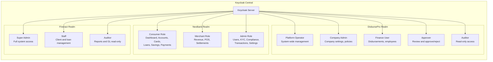
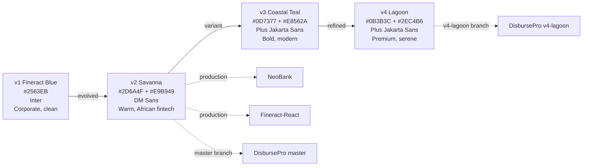
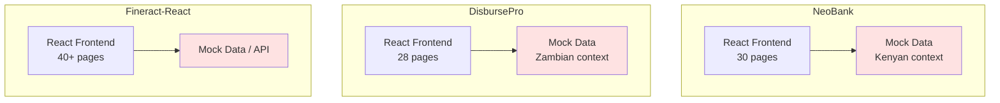
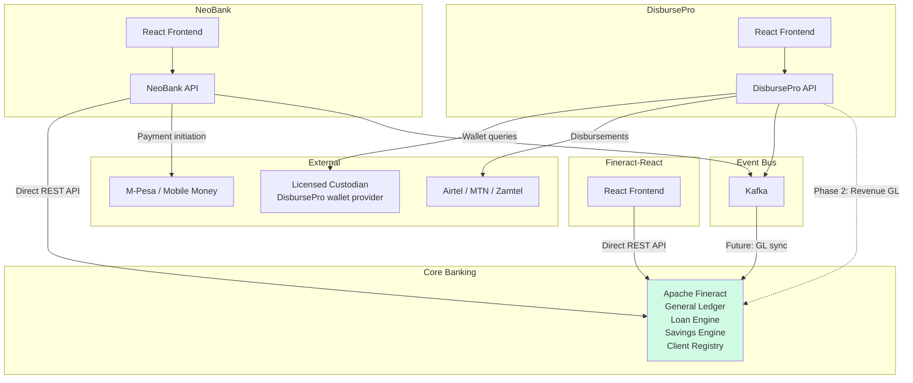
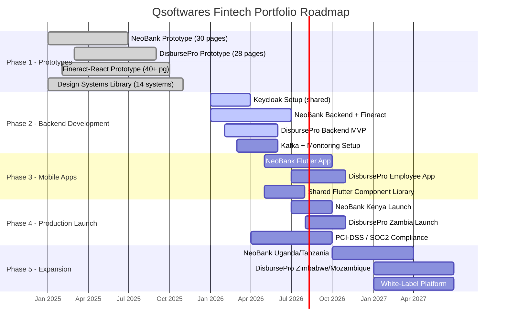
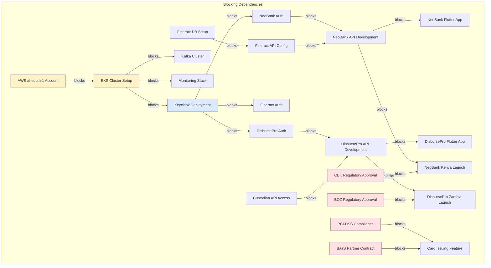

# Cross-Project Architecture Overview

## Qsoftwares Ltd — Fintech Platform Portfolio

**Document Version:** 1.1
**Last Updated:** 2026-04-09
**Author:** Architecture Team, Qsoftwares Ltd
**Classification:** Internal — Technical Reference

---

## Table of Contents

1. [Executive Summary](#1-executive-summary)
2. [Project Portfolio](#2-project-portfolio)
3. [Shared Technology Stack](#3-shared-technology-stack)
4. [Architecture Diagram](#4-architecture-diagram)
5. [Shared Infrastructure](#5-shared-infrastructure)
6. [Payment Orchestrator](#6-payment-orchestrator)
7. [Design System Lineage](#7-design-system-lineage)
8. [Data Flow Between Projects](#8-data-flow-between-projects)
9. [White-Label Potential](#9-white-label-potential)
10. [Team Structure and Ownership](#10-team-structure-and-ownership)
11. [Roadmap Alignment](#11-roadmap-alignment)
12. [Risk and Dependency Matrix](#12-risk-and-dependency-matrix)

---

## 1. Executive Summary

Qsoftwares Ltd operates three interconnected fintech projects targeting East and Southern Africa. Together, these projects form a comprehensive digital financial services ecosystem spanning consumer banking, enterprise disbursement, and core banking administration.

**NeoBank** serves the Kenyan market with a consumer-facing digital banking platform built on Apache Fineract. **DisbursePro** targets the Zambian enterprise market as a disbursement and expense management platform for companies with distributed workforces. **Fineract-React** provides the pan-African core banking administration interface that underpins the entire ecosystem.

> **Updated April 2026:** NeoBank now has two deployed projects:
> - **D:\neobank** (30 pages) — wired to Fineract API with `useApiQuery` hooks and Live/Demo badges, deployed at **https://neo.fineract.us**
> - **D:\neobank-app** (76 pages) — full prototype with extended features, deployed at **https://pro.fineract.us**
> - **Fineract REST API** available at **https://api.fineract.us**
> - All deployed via Docker Compose on Hostinger VPS (72.62.29.192) with nginx reverse proxy
> - Fineract backend stripped of 12 unused modules; custom NeoBank module at `custom/neobank/` with 9 sub-modules

All three projects share a common frontend technology stack (React 19, Vite 8, TypeScript 5, Tailwind CSS v4, shadcn/ui), a unified design system library (14 systems, with v2 Savanna as the primary production system), and shared backend infrastructure deployed on Hostinger VPS. This architectural alignment enables code reuse, consistent developer experience, and a clear path to white-label deployments across new African markets.

**Combined scope:**
- 106+ frontend pages across three projects (30 wired + 76 prototype + Fineract-React)
- 14 design systems in the shared library
- $60K NeoBank budget + $10K-$20K DisbursePro MVP budget
- Target markets: Kenya (KES), Zambia (ZMW), with pan-African expansion planned
- 3 live URLs: neo.fineract.us, pro.fineract.us, api.fineract.us

---

## 2. Project Portfolio

### Overview Table

| Attribute | NeoBank | DisbursePro | Fineract-React |
|-----------|---------|-------------|----------------|
| **Purpose** | Consumer digital banking | Enterprise disbursement and expense management | Core banking administration UI |
| **Target Market** | Kenya, East Africa | Zambia, Southern Africa | Pan-Africa |
| **Primary Currency** | KES (Kenyan Shilling) | ZMW (Zambian Kwacha) | Multi-currency |
| **Total Pages** | 30 | 28 | 40+ |
| **Design System** | v2 Savanna | v4 Lagoon (branch) / v2 Savanna (master) | v2 Savanna |
| **Status** | Deployed — neo.fineract.us (30p wired) + pro.fineract.us (76p prototype) | Prototype complete | Prototype + React build |
| **Budget** | $60K (6-phase, 20-week roadmap) | $10K-$20K MVP, $80K-$150K full build | Part of Fineract ecosystem |
| **Client** | Qsoftwares Ltd | Publicly traded technology company (competitive RFP) | Open-source community + clients |
| **Backend** | Apache Fineract (Java 21, Spring Boot) | Custodian API orchestration layer | Apache Fineract REST API |
| **Repository** | `D:\neobank` | `D:\disbursement-platform` | `D:\fineract-react` |
| **Phone Format** | +254 (Kenya) | +260 (Zambia) | Varies by deployment |

### NeoBank — Digital Banking Platform

NeoBank is a next-generation digital banking and payments platform targeting Kenya and East Africa. It provides consumer banking services including accounts, cards, loans, savings, P2P payments, bill payments, QR payments, and merchant services. The platform is built on Apache Fineract as the core banking backend.

**Page breakdown:**
- Auth: 3 pages (login, registration, KYC verification)
- Consumer: 15 pages (dashboard, accounts, cards, loans, savings, payments, reports)
- Merchant: 4 pages (dashboard, POS management, settlements, onboarding)
- Admin: 7 pages (dashboard, users, KYC review, transactions, compliance, settings, audit log)
- Settings: 1 page

**Key user:** Amina Wanjiku (+254 712 345 678), Nairobi

### DisbursePro — Enterprise Disbursement Platform

DisbursePro is an enterprise disbursement and expense management platform for the Zambian market. It serves as a control, visibility, and orchestration layer for enterprise money movement. Licensed custodians hold funds; the platform manages workflows, approvals, and audit trails. Modeled after Soldo/Pleo for emerging markets.

**Page breakdown:**
- Auth: 2 pages (login, company registration)
- Platform Operator: 5 pages (dashboard, companies, company detail, revenue, settings)
- Company Portal: 16 pages (dashboard, employees, disbursements, approvals, transactions, reports, settings, audit log)
- Phase 2 Previews: 5 pages (cards, deposits, mobile app, forex, integrations)

**Key user:** Mwamba Kapumba, Finance Director, Copperbelt Transport (+260)

**Custody model:** The platform does NOT hold funds. Customer funds sit in wallets managed by a licensed custodian. The platform connects via API to query balances, initiate disbursements, and receive confirmations.

### Fineract-React — Core Banking Administration

Fineract-React is a modern React frontend for Apache Fineract, the open-source core banking platform. It replaces the legacy Angular web-app with a modern stack and provides the administrative backbone for managing clients, loans, savings, accounting, and system configuration.

**Build pipeline:** HTML prototypes --> SpecKit specification --> React SPA (8 batches)

**Batch structure:**
1. Foundation (scaffolding, auth, layout shell)
2. Dashboard (KPI cards, charts, activity table)
3. Clients (list, detail, create, edit, tabs)
4. Loans (lifecycle: application, approval, disbursal, repayment)
5. Savings and Deposits (savings, fixed, recurring)
6. Accounting (GL accounts, journal entries, rules)
7. Organization and Admin (offices, staff, users, roles, system)
8. Reports and Advanced (reports, search, groups, products)

---

## 3. Shared Technology Stack

### Frontend Stack (Identical Across All Projects)

| Layer | Technology | Version | Notes |
|-------|-----------|---------|-------|
| **Framework** | React | 19 | Concurrent features, use hook |
| **Build Tool** | Vite | 8 | Fast HMR, optimized production builds |
| **Language** | TypeScript | 5 | Strict mode in Fineract-React |
| **CSS Framework** | Tailwind CSS | v4 | `@theme {}` token syntax, oklch colors |
| **Component Library** | shadcn/ui | base-ui primitives | NOT Radix — uses `render=` prop pattern |
| **Icons** | Lucide React | Latest | Consistent icon set across all projects |
| **Charts** | Recharts | Latest | Responsive, composable chart components |
| **Routing** | React Router | v7 | Lazy loading on all routes |
| **Font (NeoBank)** | Geist Variable | - | Via @fontsource-variable/geist |
| **Font (DisbursePro)** | Plus Jakarta Sans | - | Via @fontsource-variable/plus-jakarta-sans |
| **Font (Fineract)** | DM Sans / Inter | - | Varies by design system version |

### shadcn/ui Base-UI Differences

All three projects use shadcn/ui with base-ui primitives instead of Radix. This requires awareness of these differences:

- `DropdownMenuTrigger` uses the `render=` prop instead of `asChild`
- `Select.onValueChange` returns `(value: string | null)` — must wrap with `(val) => setState(val ?? "")`
- Import path is always `@/components/ui/*`
- DisbursePro adds a `cta` Button variant for coral action buttons

### Backend Stack

| Component | NeoBank | DisbursePro | Fineract-React |
|-----------|---------|-------------|----------------|
| **Core** | Apache Fineract (Java 21, Spring Boot) — **deployed** at api.fineract.us | Custom orchestration layer | Apache Fineract REST API |
| **Custom Module** | `custom/neobank/` — 9 sub-modules (mobilemoney, kyc, card, merchant, aml, auth, bills, savings-goals, notifications) | N/A | N/A |
| **Identity** | Keycloak (planned) | Keycloak (planned) | Keycloak (planned) |
| **Database** | PostgreSQL — **deployed** (Docker Compose on Hostinger VPS) | PostgreSQL | MySQL/PostgreSQL (Fineract) |
| **Messaging** | Kafka (planned) | Kafka (planned) | Kafka (planned) |
| **Cache** | Redis (planned) | Redis (planned) | Redis (planned) |
| **Deployment** | Docker Compose on Hostinger VPS (72.62.29.192), nginx reverse proxy | Not deployed | Not deployed |

### Design Systems Library

The shared design systems library at `D:\design-systems\` contains 14 complete design systems:

| Range | Systems | Status |
|-------|---------|--------|
| v1-v4 | Fineract Blue, Savanna, Coastal Teal, Lagoon | Spec + tokens, production-used |
| v5-v14 | Aurora, Terracotta, Midnight, Sakura, Ember, Frost, Saffron, Obsidian, Verdant, Dusk | Spec + tokens + 10 HTML prototypes each |

Each system provides:
- `design-system.md` — Human-readable full specification
- `tokens.css` — Machine-readable CSS custom properties for Tailwind v4
- `prototypes/` — 10 HTML pages covering all major UI patterns (v5-v14 only)

---

## 4. Architecture Diagram

### High-Level System Architecture

```mermaid
graph TB
    subgraph "Client Applications"
        NB[NeoBank<br/>React SPA<br/>Kenya / KES]
        DP[DisbursePro<br/>React SPA<br/>Zambia / ZMW]
        FR[Fineract-React<br/>React SPA<br/>Pan-Africa]
        MA[Mobile Apps<br/>Flutter<br/>Phase 3]
    end

    subgraph "CDN / Edge"
        CF1[CloudFront<br/>neobank.qsoftwares.com]
        CF2[CloudFront<br/>disburse.qsoftwares.com]
        CF3[CloudFront<br/>admin.qsoftwares.com]
    end

    subgraph "API Gateway"
        AG[Kong / AWS API Gateway<br/>Rate Limiting, Auth, Routing]
    end

    subgraph "Identity & Access"
        KC[Keycloak<br/>Central Identity Provider]
        KC_NB[NeoBank Realm<br/>Consumer + Merchant + Admin]
        KC_DP[DisbursePro Realm<br/>Platform Operator + Company + Finance + Approver + Auditor]
        KC_FR[Fineract Realm<br/>Admin + Staff + Auditor]
    end

    subgraph "Application Services"
        NB_API[NeoBank API<br/>Spring Boot<br/>Consumer Banking]
        DP_API[DisbursePro API<br/>Node.js/Spring<br/>Disbursement Orchestration]
        FN_API[Apache Fineract<br/>Java 21 / Spring Boot<br/>Core Banking Engine]
    end

    subgraph "Payment Orchestrator"
        PO[Payment Adapter Layer<br/>Common Interface]
        MP[M-Pesa<br/>Safaricom]
        AK[Airtel Money KE]
        FW[Flutterwave]
        PS[Paystack]
        CL[Cellulant]
        AZ[Airtel Money ZM]
        MTN[MTN MoMo ZM]
        ZT[Zamtel Kwacha]
        ST[Stripe]
        RZ[Razorpay]
        AT[Africa's Talking]
    end

    subgraph "Event Streaming"
        KF[Apache Kafka Cluster]
        KF_NB[neobank.* topics]
        KF_DP[disbursepro.* topics]
        KF_FR[fineract.* topics]
        KF_SHARED[shared.* topics<br/>notifications, audit]
    end

    subgraph "Data Stores"
        RDS_NB[RDS PostgreSQL<br/>NeoBank]
        RDS_DP[RDS PostgreSQL<br/>DisbursePro]
        RDS_FN[RDS MySQL/PostgreSQL<br/>Fineract Core]
        RD[Redis Cluster<br/>Namespace-isolated]
        S3_NB[S3: neobank-assets]
        S3_DP[S3: disbursepro-docs]
        S3_FR[S3: fineract-reports]
    end

    subgraph "Monitoring & Observability"
        GF[Grafana<br/>Dashboards]
        PM[Prometheus<br/>Metrics]
        LK[Loki<br/>Log Aggregation]
        JG[Jaeger<br/>Distributed Tracing]
    end

    NB --> CF1 --> AG
    DP --> CF2 --> AG
    FR --> CF3 --> AG
    MA --> AG

    AG --> KC
    KC --> KC_NB
    KC --> KC_DP
    KC --> KC_FR

    AG --> NB_API
    AG --> DP_API
    AG --> FN_API

    NB_API --> FN_API
    NB_API --> PO
    DP_API --> PO

    PO --> MP
    PO --> AK
    PO --> FW
    PO --> PS
    PO --> CL
    PO --> AZ
    PO --> MTN
    PO --> ZT
    PO --> ST
    PO --> RZ
    PO --> AT

    NB_API --> KF_NB
    DP_API --> KF_DP
    FN_API --> KF_FR
    KF_NB --> KF
    KF_DP --> KF
    KF_FR --> KF
    KF_SHARED --> KF

    NB_API --> RDS_NB
    DP_API --> RDS_DP
    FN_API --> RDS_FN
    NB_API --> RD
    DP_API --> RD

    NB_API --> S3_NB
    DP_API --> S3_DP
    FN_API --> S3_FR

    NB_API --> PM
    DP_API --> PM
    FN_API --> PM
    PM --> GF
    LK --> GF
    JG --> GF
```



### Keycloak Realm Architecture



---

## 5. Shared Infrastructure

### AWS Region Strategy

| Component | Region | Rationale |
|-----------|--------|-----------|
| **Primary EKS Cluster** | af-south-1 (Cape Town) | Closest AWS region to East/Southern Africa |
| **DR / Failover** | eu-west-1 (Ireland) | Low-latency fallback for African traffic |
| **CDN** | CloudFront Global | Edge caching for static assets |
| **DNS** | Route 53 | Latency-based routing between regions |

### VPC and Networking

```
VPC: 10.0.0.0/16 (qsoftwares-fintech-vpc)
├── Public Subnets (10.0.1.0/24, 10.0.2.0/24, 10.0.3.0/24)
│   ├── ALB (Application Load Balancer)
│   ├── NAT Gateways
│   └── Bastion Host
├── Private App Subnets (10.0.10.0/24, 10.0.11.0/24, 10.0.12.0/24)
│   ├── EKS Node Group: neobank-services
│   ├── EKS Node Group: disbursepro-services
│   ├── EKS Node Group: fineract-services
│   └── EKS Node Group: shared-services (Keycloak, Kafka Connect, monitoring)
└── Private Data Subnets (10.0.20.0/24, 10.0.21.0/24, 10.0.22.0/24)
    ├── RDS: neobank-db (PostgreSQL 16)
    ├── RDS: disbursepro-db (PostgreSQL 16)
    ├── RDS: fineract-db (MySQL 8 / PostgreSQL 16)
    ├── ElastiCache: shared-redis (Redis 7, namespace-isolated)
    └── MSK: shared-kafka (Apache Kafka 3.x)
```

### Database Strategy

| Database | Engine | Project | Contents |
|----------|--------|---------|----------|
| `neobank-db` | PostgreSQL 16 | NeoBank | User profiles, KYC data, card metadata, merchant data |
| `disbursepro-db` | PostgreSQL 16 | DisbursePro | Company data, employee registry, disbursement records, approval workflows |
| `fineract-db` | MySQL 8 / PostgreSQL 16 | Fineract Core | Chart of accounts, GL entries, loan portfolios, savings accounts, client records |

**Key principle:** Fineract is the system of record for all financial transactions. NeoBank reads/writes to Fineract for account balances, loan lifecycle, and savings. DisbursePro operates independently for MVP but will integrate Fineract GL for revenue tracking in Phase 2.

### Redis Cluster (Shared, Namespace-Isolated)

```
ElastiCache Redis 7 Cluster (3 shards, 2 replicas each)
├── neobank:sessions:*      — User session tokens
├── neobank:cache:*         — Account balance cache (TTL: 30s)
├── neobank:rate:*          — API rate limiting counters
├── disbursepro:sessions:*  — Company user sessions
├── disbursepro:cache:*     — Wallet balance cache (TTL: 60s)
├── disbursepro:locks:*     — Disbursement idempotency locks
├── fineract:cache:*        — GL account cache
└── shared:config:*         — Feature flags, system config
```

### Kafka Topics (Namespaced Per Project)

```
MSK Kafka Cluster (3 brokers, 3 AZs)
├── neobank.transactions.completed    — Completed NeoBank transactions
├── neobank.kyc.status-changed        — KYC verification events
├── neobank.notifications.push        — Push notification triggers
├── neobank.payments.initiated        — Payment initiation events
├── disbursepro.disbursements.created — New disbursement requests
├── disbursepro.disbursements.approved— Approved disbursements
├── disbursepro.disbursements.settled — Carrier settlement confirmations
├── disbursepro.wallets.credited      — Wallet top-up events
├── fineract.gl.entries.posted        — General ledger postings
├── fineract.loans.status-changed     — Loan lifecycle events
├── fineract.clients.updated          — Client profile changes
├── shared.audit.events               — Cross-project audit trail
├── shared.notifications.email        — Email dispatch queue
└── shared.notifications.sms          — SMS dispatch queue
```

### S3 Buckets (Per Project)

| Bucket | Project | Contents |
|--------|---------|----------|
| `qsoftwares-neobank-assets` | NeoBank | KYC documents (ID photos, selfies), card images, merchant logos |
| `qsoftwares-neobank-frontend` | NeoBank | React SPA build artifacts |
| `qsoftwares-disbursepro-docs` | DisbursePro | Company documents, CSV uploads, receipts |
| `qsoftwares-disbursepro-frontend` | DisbursePro | React SPA build artifacts |
| `qsoftwares-fineract-reports` | Fineract | Generated reports (PDF, CSV), statement exports |
| `qsoftwares-fineract-frontend` | Fineract | React SPA build artifacts |
| `qsoftwares-shared-backups` | All | Database backups, Kafka snapshots |

### CloudFront Distributions

| Distribution | Origin | Domain |
|-------------|--------|--------|
| NeoBank Consumer | S3: neobank-frontend | `app.neobank.co.ke` |
| NeoBank Admin | S3: neobank-frontend | `admin.neobank.co.ke` |
| DisbursePro | S3: disbursepro-frontend | `app.disbursepro.co.zm` |
| Fineract Admin | S3: fineract-frontend | `fineract.qsoftwares.com` |

---

## 6. Payment Orchestrator

### Common Adapter Interface

All payment integrations across NeoBank and DisbursePro implement a shared adapter interface. This enables consistent error handling, retry logic, and reconciliation regardless of the underlying provider.

```typescript
interface PaymentAdapter {
  // Provider identity
  readonly providerId: string;
  readonly providerName: string;
  readonly supportedCurrencies: string[];
  readonly supportedCountries: string[];

  // Core operations
  initiatePayment(request: PaymentRequest): Promise<PaymentResponse>;
  checkStatus(transactionId: string): Promise<TransactionStatus>;
  cancelPayment(transactionId: string): Promise<CancelResponse>;

  // Balance and account
  checkBalance(accountId: string): Promise<BalanceResponse>;
  validateAccount(accountId: string): Promise<ValidationResponse>;

  // Reconciliation
  getSettlementReport(dateRange: DateRange): Promise<SettlementReport>;
  reconcile(batch: ReconciliationBatch): Promise<ReconciliationResult>;

  // Health
  healthCheck(): Promise<HealthStatus>;
}
```

### NeoBank Payment Providers (Kenya / East Africa)

| Provider | Type | Use Case | Currency |
|----------|------|----------|----------|
| **M-Pesa (Safaricom)** | Mobile Money | P2P, bill pay, merchant payments | KES |
| **Airtel Money KE** | Mobile Money | P2P, airtime top-up | KES |
| **Flutterwave** | Payment Gateway | Card payments, bank transfers | KES, USD, Multi |
| **Paystack** | Payment Gateway | Online payments, subscriptions | KES, Multi |
| **Cellulant** | Payment Aggregator | Multi-carrier mobile money | KES, Multi |
| **Africa's Talking** | Communication + Payments | USSD, SMS, airtime | KES, Multi |
| **Stripe** | Payment Gateway | International card payments | USD, Multi |
| **Razorpay** | Payment Gateway | International payments | Multi |
| **MTN Mobile Money** | Mobile Money | East African expansion | UGX, TZS, RWF |

### DisbursePro Payment Providers (Zambia / Southern Africa)

| Provider | Type | Use Case | Currency |
|----------|------|----------|----------|
| **Airtel Money ZM** | Mobile Money | Employee disbursements | ZMW |
| **MTN MoMo ZM** | Mobile Money | Employee disbursements | ZMW |
| **Zamtel Kwacha** | Mobile Money | Employee disbursements | ZMW |

### DisbursePro Fee Model

DisbursePro implements a unique 3-tier fee hierarchy:

```
Network Limit (carrier-imposed)
  └── Platform Limit (DisbursePro-configured)
       └── Company Limit (company-configured)
            → Lowest limit wins
```

- **Carrier fee:** Varies by carrier and intent (withdrawal ~2.5%, purchase ~0.5%)
- **Platform fee:** 1% (minimum ZMW 2)
- Fee calculations use pure functions in `data/fee-config.ts`

### Shared Payment Patterns

All payment integrations across both projects implement these resilience patterns:

| Pattern | Implementation | Purpose |
|---------|---------------|---------|
| **Idempotency** | Unique request ID per transaction, Redis-backed dedup | Prevent duplicate disbursements/payments |
| **Retry with Backoff** | Exponential backoff (1s, 2s, 4s, 8s, max 3 retries) | Handle transient carrier failures |
| **Circuit Breaker** | Per-provider circuit (5 failures = open, 30s half-open) | Isolate failing providers |
| **Reconciliation** | Nightly batch reconciliation against carrier settlement files | Detect discrepancies |
| **Timeout** | 30s per provider call, 120s total transaction timeout | Prevent hanging transactions |
| **Fallback** | Provider priority list (e.g., M-Pesa primary, Flutterwave fallback) | Maintain availability |

---

## 7. Design System Lineage

### Evolution Timeline



### All 14 Design Systems

| Version | Name | Primary Color | Accent Color | Font | Character | Production Use |
|---------|------|--------------|-------------|------|-----------|---------------|
| v1 | Fineract Blue | `#2563EB` blue | - | Inter | Corporate, clean | Fineract legacy |
| v2 | **Savanna** | `#2D6A4F` green | `#E9B949` gold | DM Sans | Warm, African fintech | **NeoBank, Fineract-React, DisbursePro (master)** |
| v3 | Coastal Teal | `#0D7377` teal | `#E8562A` orange | Plus Jakarta Sans | Bold, modern | None (spec only) |
| v4 | **Lagoon** | `#0B3B3C` deep teal | `#2EC4B6` turquoise | Plus Jakarta Sans | Premium, serene | **DisbursePro (v4-lagoon branch)** |
| v5 | Aurora | `#4F46E5` indigo | `#A78BFA` violet | Space Grotesk | Cosmic, AI/tech | Available |
| v6 | Terracotta | `#9C4221` sienna | `#6B7F3B` olive | Libre Baskerville | Mediterranean | Available |
| v7 | Midnight | `#0F172A` navy | `#38BDF8` electric blue | Inter + JetBrains Mono | Dark-first, dev tools | Available |
| v8 | Sakura | `#BE185D` rose | `#F9A8D4` blossom | Outfit | Elegant, wellness | Available |
| v9 | Ember | `#C2410C` orange | `#FCD34D` amber | Bricolage Grotesque | Bold, startup | Available |
| v10 | Frost | `#0EA5E9` sky | `#E0F2FE` ice | Figtree | Clinical, minimal | Available |
| v11 | Saffron | `#7C3AED` violet | `#F59E0B` gold | Urbanist | Luxury commerce | Available |
| v12 | Obsidian | `#09090B` black | `#D4AF37` gold | Manrope | Dark luxury | Available |
| v13 | Verdant | `#15803D` emerald | `#86EFAC` mint | DM Sans | Eco-tech, fresh | Available |
| v14 | Dusk | `#6D28D9` purple | `#FB923C` sunset | Space Grotesk | Gradient, creative | Available |

### Token Architecture

All design systems use the same token structure, making swapping trivial:

```css
/* Tailwind v4 @theme syntax — identical structure across all 14 systems */
@theme {
  --color-primary: /* system-specific value */;
  --color-primary-foreground: /* system-specific value */;
  --color-accent: /* system-specific value */;
  --color-background: /* system-specific value */;
  --color-card: /* system-specific value */;
  --color-sidebar: /* system-specific value */;
  --color-sidebar-foreground: /* system-specific value */;
  /* ... 40+ tokens per system */
}
```

### Design System Selection Guide

| Use Case | Recommended System | Rationale |
|----------|-------------------|-----------|
| East African fintech | v2 Savanna | Warm, trustworthy, dark mode support |
| Enterprise SaaS | v4 Lagoon | Premium, professional, glassmorphic |
| Developer tools | v7 Midnight | Dark-first, monospace-friendly |
| Healthcare / clinical | v10 Frost | Clean, minimal, white sidebar |
| Luxury / premium | v12 Obsidian | Dark luxury, gold accents |
| Eco / sustainability | v13 Verdant | Fresh, natural, emerald tones |
| General consumer | v5 Aurora or v9 Ember | Modern, engaging |

### Swapping a Design System

To re-skin any project with a different design system:

1. Copy `tokens.css` from the desired `D:\design-systems\vN-name\` directory
2. Replace the `@theme {}` block in the project's `src/index.css`
3. Update font imports in `index.html` and `package.json`
4. Adjust any hardcoded color references (should be minimal if tokens are used consistently)
5. Rebuild and verify visual consistency

---

## 8. Data Flow Between Projects

### Current State (Prototype Phase)



All three projects currently use local mock data with no backend connections.

### Target State (Production)



### Integration Patterns

| Integration | Pattern | Timeline | Description |
|-------------|---------|----------|-------------|
| NeoBank --> Fineract | Direct REST API | Phase 2 (Backend) | NeoBank API calls Fineract for account operations, loan lifecycle, savings |
| Fineract-React --> Fineract | Direct REST API | Phase 2 (Backend) | Admin UI reads/writes all Fineract entities |
| DisbursePro --> Custodian | REST API | Phase 2 (Backend) | Wallet balance queries, disbursement initiation |
| DisbursePro --> Fineract | Event-driven (Kafka) | Phase 4+ | Revenue tracking, GL entries for platform fees |
| NeoBank --> DisbursePro | None (independent) | N/A | No direct integration planned |
| Cross-project audit | Kafka shared.audit.events | Phase 2 | Unified audit trail for compliance |
| Cross-project notifications | Kafka shared.notifications.* | Phase 2 | Shared email/SMS dispatch |

### Fineract as General Ledger Backbone

Apache Fineract serves as the system of record for all financial data in the NeoBank ecosystem:

- **Client Registry:** All NeoBank customers are Fineract clients
- **Chart of Accounts:** NeoBank GL structure defined in Fineract
- **Loan Engine:** Loan applications, approvals, disbursals, repayments all flow through Fineract
- **Savings Engine:** Savings goals, fixed deposits managed by Fineract
- **Journal Entries:** Every financial transaction posts to Fineract GL

DisbursePro operates independently for its MVP (custodian model), but Phase 2 will integrate Fineract GL for:
- Platform fee revenue recognition
- Company wallet reconciliation
- Regulatory reporting

---

## 9. White-Label Potential

### Architecture Advantages for White-Labeling

The shared technology stack and design system library create a strong foundation for white-label deployments:

| Advantage | Detail |
|-----------|--------|
| **Identical frontend stack** | Any developer can work across all three projects |
| **14 design systems ready** | Pick a design system, swap tokens, deploy |
| **Localized mock data patterns** | Each project demonstrates realistic local context |
| **Currency/phone abstraction** | Format utilities (`fmtZMW`, `fmtKES`) are isolated |
| **Feature flag ready** | Shared Redis config namespace for toggling features |
| **Keycloak multi-realm** | New market = new realm, same infrastructure |

### NeoBank White-Label Targets (East Africa)

| Market | Currency | Phone Prefix | Mobile Money | Regulatory Body | Adaptation Needed |
|--------|----------|-------------|-------------|-----------------|-------------------|
| **Kenya (current)** | KES | +254 | M-Pesa, Airtel | CBK | None (primary) |
| **Uganda** | UGX | +256 | MTN MoMo, Airtel | BOU | Currency, providers, KYC flow |
| **Tanzania** | TZS | +255 | M-Pesa TZ, Tigo, Airtel | BOT | Currency, providers, language (Swahili) |
| **Rwanda** | RWF | +250 | MTN MoMo, Airtel | BNR | Currency, providers, language (Kinyarwanda) |
| **Ethiopia** | ETB | +251 | Telebirr, M-Pesa | NBE | Currency, providers, Amharic support |

### DisbursePro White-Label Targets (Southern Africa)

| Market | Currency | Phone Prefix | Mobile Money | Regulatory Body | Adaptation Needed |
|--------|----------|-------------|-------------|-----------------|-------------------|
| **Zambia (current)** | ZMW | +260 | Airtel, MTN, Zamtel | BOZ | None (primary) |
| **Zimbabwe** | ZWL/USD | +263 | EcoCash, OneMoney | RBZ | Dual currency, new carriers |
| **Mozambique** | MZN | +258 | M-Pesa MZ, mKesh | BM | Currency, Portuguese language |
| **Malawi** | MWK | +265 | Airtel, TNM Mpamba | RBM | Currency, new carriers |
| **Botswana** | BWP | +267 | Orange, Mascom | BOB | Currency, new carriers |

### White-Label Deployment Checklist

For each new market deployment:

1. **Design System:** Choose from v1-v14 or create v15+ for brand differentiation
2. **Currency:** Add format utility (e.g., `fmtUGX`), update all display components
3. **Phone Validation:** Update prefix validation and formatting
4. **Payment Providers:** Implement new carrier adapters using shared interface
5. **KYC Flow:** Adapt to local ID types and verification requirements
6. **Language:** Add i18n translations (react-i18next in Fineract-React)
7. **Regulatory:** Update compliance rules per central bank requirements
8. **Keycloak Realm:** Create new realm with appropriate roles and policies
9. **Infrastructure:** Deploy to appropriate region (af-south-1 for Southern Africa)
10. **Mock Data:** Create realistic local context data for testing

---

## 10. Team Structure and Ownership

### Proposed Team Organization

```
Qsoftwares Engineering
├── Platform Team (Shared Infrastructure)
│   ├── DevOps Engineer — EKS, CI/CD, Terraform
│   ├── Security Engineer — Keycloak, PCI-DSS, SOC2
│   ├── SRE — Monitoring, incident response, Kafka
│   └── Design System Lead — Maintain D:\design-systems\
│
├── NeoBank Team
│   ├── Frontend Lead — React SPA, consumer UX
│   ├── Backend Lead — Spring Boot, Fineract integration
│   ├── Mobile Developer — Flutter app (Phase 3)
│   ├── Payment Integration Engineer — M-Pesa, Airtel, Flutterwave
│   └── QA Engineer — E2E testing, KYC flow testing
│
├── DisbursePro Team
│   ├── Frontend Lead — React SPA, enterprise UX
│   ├── Backend Lead — Orchestration layer, custodian API
│   ├── Carrier Integration Engineer — Airtel ZM, MTN, Zamtel
│   └── QA Engineer — Disbursement flow testing, approval workflows
│
└── Fineract Team
    ├── Core Banking Engineer — Fineract customization, GL config
    ├── Frontend Developer — Fineract-React admin UI
    └── Integration Engineer — API mapping, data migration
```

### Code Ownership Matrix

| Component | Primary Owner | Secondary Owner | Shared? |
|-----------|--------------|-----------------|---------|
| `D:\design-systems\` | Platform Team | All frontend leads | Yes |
| `D:\neobank\src\components\ui\` | NeoBank Frontend Lead | Platform Team | Per-project copies |
| `D:\disbursement-platform\src\components\ui\` | DisbursePro Frontend Lead | Platform Team | Per-project copies |
| Keycloak configuration | Security Engineer | All backend leads | Yes |
| Kafka topics and schemas | SRE | All backend leads | Yes |
| Payment adapter interface | Platform Team | Payment engineers | Yes |
| CI/CD pipelines | DevOps Engineer | Team leads | Per-project |
| Monitoring dashboards | SRE | All teams | Shared Grafana |

### Communication Channels

| Channel | Purpose | Participants |
|---------|---------|-------------|
| `#platform-engineering` | Shared infra, Keycloak, Kafka | Platform + all leads |
| `#neobank-dev` | NeoBank feature development | NeoBank team |
| `#disbursepro-dev` | DisbursePro feature development | DisbursePro team |
| `#design-systems` | Design system updates, new versions | All frontend developers |
| `#payments-integration` | Payment provider issues, new adapters | Payment engineers + backend leads |
| `#incidents` | Production incidents, shared infra | All engineers |

---

## 11. Roadmap Alignment

### Phase Overview



### Phase Details

#### Phase 1: Prototypes (COMPLETE)

| Deliverable | Status | Notes |
|-------------|--------|-------|
| NeoBank React SPA (30 pages) | Complete | All pages built, screenshots captured |
| DisbursePro React SPA (28 pages) | Complete | Both Savanna and Lagoon variants |
| Fineract-React (40+ pages, 8 batches) | Complete | Full admin UI with SpecKit pipeline |
| Design Systems Library (14 systems) | Complete | v1-v4 specs + v5-v14 with prototypes |
| Documentation (PRD, Tech Spec, Gap Analysis) | Complete | Comprehensive docs for all projects |
| Client Proposals | Complete | PDF/DOCX/PPTX deliverables |

#### Phase 2: Backend Development (ACTIVE)

| Deliverable | Target | Dependencies |
|-------------|--------|-------------|
| Keycloak deployment + realm configuration | Q1 2026 | AWS af-south-1 account |
| NeoBank API (Spring Boot) + Fineract integration | Q1-Q2 2026 | Keycloak, Fineract DB |
| DisbursePro API + custodian integration | Q1-Q2 2026 | Keycloak, custodian API access |
| Kafka cluster + topic configuration | Q1-Q2 2026 | EKS cluster |
| Monitoring stack (Grafana, Prometheus, Loki) | Q2 2026 | EKS cluster |
| KYC automation (Smile ID or Onfido) | Q2 2026 | NeoBank API |
| Card issuing BaaS partnership (Marqeta/Stripe) | Q2 2026 | PCI-DSS compliance |

#### Phase 3: Mobile Apps

| Deliverable | Target | Dependencies |
|-------------|--------|-------------|
| Shared Flutter component library | Q2-Q3 2026 | Design system tokens for Flutter |
| NeoBank consumer Flutter app | Q2-Q3 2026 | NeoBank API stable |
| DisbursePro employee Flutter app | Q3-Q4 2026 | DisbursePro API stable |

#### Phase 4: Production Launch

| Deliverable | Target | Dependencies |
|-------------|--------|-------------|
| NeoBank Kenya production launch | Q3 2026 | CBK regulatory approval |
| DisbursePro Zambia production launch | Q3-Q4 2026 | BOZ regulatory approval |
| PCI-DSS Level 1 compliance | Q2-Q3 2026 | BaaS partner, security audit |
| SOC2 Type II certification | Q3 2026 | 6-month observation period |

#### Phase 5: Expansion

| Deliverable | Target | Dependencies |
|-------------|--------|-------------|
| NeoBank Uganda/Tanzania white-label | Q4 2026 - Q1 2027 | Kenya launch stable |
| DisbursePro Zimbabwe/Mozambique | Q1-Q2 2027 | Zambia launch stable |
| White-label platform packaging | Q1-Q2 2027 | Template for new deployments |

---

## 12. Risk and Dependency Matrix

### Cross-Project Risk Register

| ID | Risk | Severity | Probability | Impact | Mitigation |
|----|------|----------|-------------|--------|------------|
| R-01 | Keycloak downtime affects all projects | Critical | Low | All auth fails across NeoBank, DisbursePro, Fineract | HA deployment (3 replicas), session caching in Redis, graceful degradation |
| R-02 | Fineract DB corruption | Critical | Very Low | NeoBank loses financial records | Multi-AZ RDS, automated backups (5-min RPO), read replicas |
| R-03 | Kafka cluster failure | High | Low | Cross-project events lost | Multi-AZ MSK, message persistence, consumer offset tracking, dead letter queues |
| R-04 | Design system breaking change | Medium | Medium | Visual inconsistency across projects | Versioned tokens, migration guide per version, visual regression tests |
| R-05 | Payment provider API changes | High | Medium | Transactions fail for affected provider | Adapter pattern isolates changes, multiple provider fallbacks, monitoring alerts |
| R-06 | Regulatory change in Kenya/Zambia | High | Medium | Feature must be modified or disabled | Compliance team monitoring, feature flags for quick disable, legal review process |
| R-07 | BaaS partner unavailable (card issuing) | Critical | Medium | NeoBank card features blocked | Evaluate multiple BaaS partners (Marqeta, Stripe Issuing, Paystack), parallel integration |
| R-08 | KYC provider downtime | High | Low | New user registration blocked | Dual KYC provider strategy (Smile ID primary, Onfido fallback) |
| R-09 | Mobile money carrier API instability | High | High | Payments/disbursements delayed | Circuit breakers, retry queues, multi-carrier fallback, status page monitoring |
| R-10 | Team knowledge silos | Medium | Medium | Single points of failure per project | Cross-team code reviews, shared documentation, rotation program |

### Dependency Map



### Critical Path

The critical path to production for each project:

**NeoBank:**
AWS Account --> EKS --> Keycloak --> Fineract DB --> Fineract API --> NeoBank API --> Kenya Launch

**DisbursePro:**
AWS Account --> EKS --> Keycloak --> Custodian API Access --> DisbursePro API --> Zambia Launch

**Shared blockers:**
- AWS af-south-1 account provisioning
- EKS cluster setup and networking
- Keycloak deployment and realm configuration

### Dependency Resolution Priority

| Priority | Dependency | Blocks | Target Resolution |
|----------|-----------|--------|-------------------|
| P0 | AWS af-south-1 account | Everything | Immediate |
| P0 | EKS cluster setup | All services | Week 1-2 |
| P0 | Keycloak deployment | All auth flows | Week 2-4 |
| P1 | Fineract DB + API | NeoBank backend | Week 3-6 |
| P1 | Custodian API access | DisbursePro backend | Week 4-8 |
| P1 | BaaS partner contract | Card issuing | Week 4-12 |
| P2 | Kafka cluster | Cross-project events | Week 6-10 |
| P2 | PCI-DSS audit | Card issuing go-live | Week 8-24 |
| P3 | CBK regulatory | Kenya launch | Week 16-24 |
| P3 | BOZ regulatory | Zambia launch | Week 20-28 |

---

## Appendix A: Repository Locations

| Repository | Path | Branch | Description |
|-----------|------|--------|-------------|
| NeoBank | `D:\neobank` | `master` | Digital banking React SPA |
| DisbursePro | `D:\disbursement-platform` | `master` (Savanna) / `v4-lagoon` (Lagoon) | Enterprise disbursement React SPA |
| Fineract-React | `D:\fineract-react` | `main` | Core banking admin React SPA |
| Design Systems | `D:\design-systems` | - | 14 design system specs, tokens, and prototypes |
| Design Systems (NeoBank copy) | `D:\neobank\design-systems` | - | Local archive within NeoBank repo |
| Fineract Origin | `D:\fineract` | `neobank/prototype` | Original repo (NeoBank extracted from here) |

## Appendix B: Port Assignments (Development)

| Project | Dev Server Port | API Port (Planned) |
|---------|----------------|-------------------|
| NeoBank | 5173 | 8443 |
| DisbursePro | 5174 | 8444 |
| Fineract-React | 5175 | 8443 (shared Fineract) |
| Keycloak | - | 8080 |
| Fineract Backend | - | 8443 |

## Appendix C: Shared NPM Dependencies

All three frontend projects share these core dependencies at identical versions:

```json
{
  "react": "^19.0.0",
  "react-dom": "^19.0.0",
  "react-router": "^7.0.0",
  "recharts": "^2.x",
  "lucide-react": "^0.4x",
  "tailwindcss": "^4.0.0",
  "typescript": "^5.x",
  "vite": "^8.0.0",
  "@base-ui-components/react": "latest",
  "class-variance-authority": "latest",
  "clsx": "latest",
  "tailwind-merge": "latest"
}
```

## Appendix D: Contact and Ownership

| Role | Responsibility | Scope |
|------|---------------|-------|
| Engineering Director | Cross-project architecture decisions | All projects |
| NeoBank Product Owner | Consumer banking features, Kenya market | NeoBank |
| DisbursePro Product Owner | Enterprise disbursement, Zambia market | DisbursePro |
| Fineract Lead | Core banking configuration, GL structure | Fineract-React |
| Platform Architect | Shared infrastructure, Keycloak, Kafka | Cross-project |
| Design System Lead | Design system library, visual consistency | Design Systems |
| Security Lead | PCI-DSS, SOC2, KYC/AML compliance | Cross-project |
