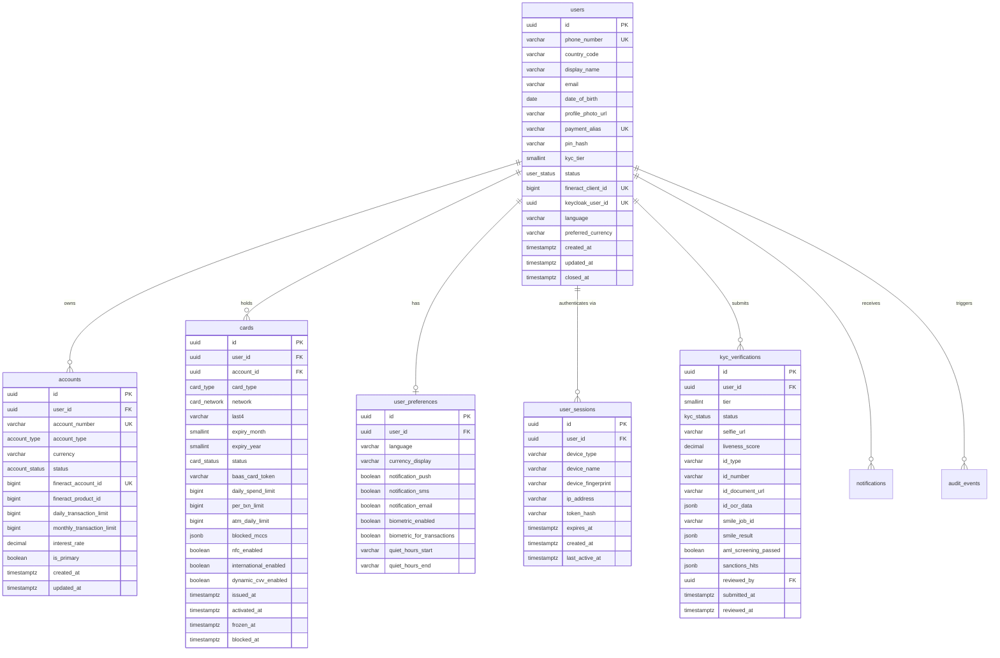
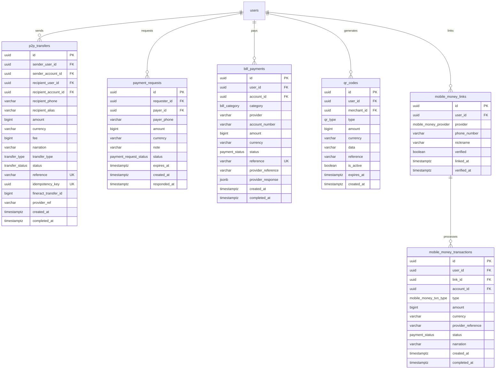
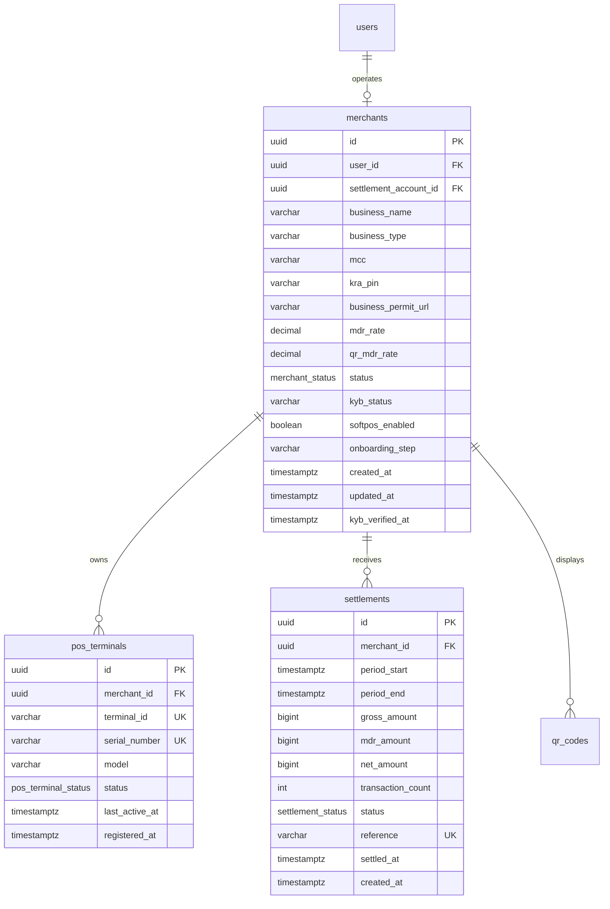
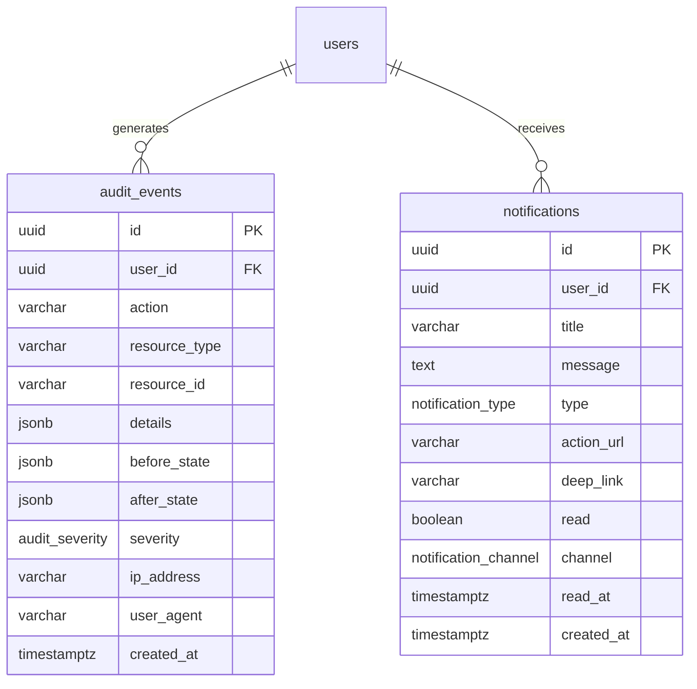

# NeoBank Database Schema

## Complete PostgreSQL Schema Reference

| Field | Detail |
|---|---|
| **Product** | NeoBank — Next-Gen Digital Banking & Payments Ecosystem |
| **Database** | PostgreSQL 16 |
| **Version** | 1.0 |
| **Date** | 2026-04-04 |
| **Status** | Draft |

---

## Table of Contents

1. [Overview](#1-overview)
2. [Entity Relationship Diagrams](#2-entity-relationship-diagrams)
3. [Enum Types](#3-enum-types)
4. [Custom Table DDL](#4-custom-table-ddl)
5. [Indexes](#5-indexes)
6. [Fineract FK Mappings](#6-fineract-fk-mappings)
7. [Partitioning Strategy](#7-partitioning-strategy)
8. [Flyway Migration Scripts](#8-flyway-migration-scripts)
9. [Seed Data](#9-seed-data)

---

## 1. Overview

### 1.1 Database Architecture

NeoBank uses a **dual-schema** architecture within PostgreSQL 16:

- **Fineract Schema** (`fineract_default`): Managed entirely by Apache Fineract. Contains the core banking ledger, savings accounts, loan products, chart of accounts, and journal entries. NeoBank **never writes directly** to these tables; all mutations go through the Fineract REST API.
- **NeoBank Schema** (`neobank`): Custom application tables for user profiles, cards, merchant services, KYC, notifications, sessions, payment links, and audit logging. These tables reference Fineract entities via **soft foreign keys** (BIGINT columns storing Fineract IDs without cross-schema FOREIGN KEY constraints).

### 1.2 Fineract Core Tables (Read-Only Reference)

| Fineract Table | Purpose | NeoBank Soft FK Column |
|---|---|---|
| `m_client` | Customer master record | `users.fineract_client_id` |
| `m_savings_account` | Savings/current accounts | `accounts.fineract_account_id`, `cards.fineract_savings_id`, `savings_goals.fineract_savings_id` |
| `m_savings_product` | Account tier products (Basic/Standard/Premium) | `accounts.fineract_product_id` |
| `m_savings_account_transaction` | Transaction ledger | `transactions.fineract_txn_id`, `p2p_transfers.fineract_transfer_id` |
| `m_loan` | Loan records | Referenced via API only |
| `acc_gl_account` | Chart of accounts | Referenced via API only |
| `acc_gl_journal_entry` | Double-entry journal | Referenced via API only |

### 1.3 NeoBank Custom Table Summary

| Subsystem | Tables | Description |
|---|---|---|
| User & Auth | `users`, `user_sessions`, `user_preferences` | Registration, authentication, device sessions, user settings |
| KYC | `kyc_verifications` | Tiered KYC with Smile ID integration, AML screening |
| Accounts | `accounts`, `account_nicknames` | Fineract account extensions, user-defined nicknames |
| Transactions | `transactions` | Partitioned transaction log (shadow of Fineract ledger) |
| Cards | `cards` | Virtual/physical card management via BaaS partner |
| Payments | `p2p_transfers`, `payment_requests`, `bill_payments`, `qr_codes` | P2P, bill pay, QR-based payments |
| Mobile Money | `mobile_money_links`, `mobile_money_transactions` | M-Pesa, Airtel Money linking and transaction history |
| Savings | `savings_goals` | Goal-based savings with auto-transfer rules |
| Merchant | `merchants`, `pos_terminals`, `settlements` | Merchant onboarding, POS management, settlement processing |
| Notifications | `notifications` | Push/SMS/email notification log |
| Audit | `audit_events` | Immutable admin audit trail (7-year retention) |

### 1.4 Conventions

- **Primary keys**: UUID v4 via `gen_random_uuid()`.
- **Money amounts**: Stored as `BIGINT` in **minor units** (KES cents). KES 1,000.00 = `100000`. Avoids floating-point rounding.
- **Timestamps**: All `TIMESTAMPTZ` (timezone-aware), defaulting to `NOW()`.
- **Soft deletes**: No rows are physically deleted. Status columns (`ACTIVE`, `CLOSED`, `SUSPENDED`) control visibility.
- **Naming**: `snake_case` for all tables and columns. Enum type names prefixed with the domain (e.g., `kyc_tier`, `card_type`).

---

## 2. Entity Relationship Diagrams

### 2.1 Core User & Account Subsystem



### 2.2 Payment Subsystem



### 2.3 Merchant Subsystem



### 2.4 Admin & Audit Subsystem



---

## 3. Enum Types

All custom PostgreSQL enum types used across the schema:

```sql
-- ============================================================
-- ENUM TYPE DEFINITIONS
-- ============================================================

-- User & Auth
CREATE TYPE user_status AS ENUM (
    'ACTIVE',
    'SUSPENDED',
    'FROZEN',
    'CLOSED'
);

-- Account
CREATE TYPE account_type AS ENUM (
    'BASIC',
    'STANDARD',
    'PREMIUM'
);

CREATE TYPE account_status AS ENUM (
    'ACTIVE',
    'DORMANT',
    'FROZEN',
    'CLOSED'
);

-- KYC
CREATE TYPE kyc_status AS ENUM (
    'PENDING',
    'UNDER_REVIEW',
    'APPROVED',
    'REJECTED',
    'EXPIRED'
);

CREATE TYPE kyc_id_type AS ENUM (
    'NATIONAL_ID',
    'PASSPORT',
    'ALIEN_ID',
    'DRIVING_LICENSE'
);

-- Cards
CREATE TYPE card_type AS ENUM (
    'VIRTUAL',
    'PHYSICAL'
);

CREATE TYPE card_network AS ENUM (
    'VISA',
    'MASTERCARD'
);

CREATE TYPE card_status AS ENUM (
    'PENDING',
    'ACTIVE',
    'FROZEN',
    'BLOCKED',
    'EXPIRED',
    'CANCELLED'
);

-- Transactions
CREATE TYPE transaction_direction AS ENUM (
    'CREDIT',
    'DEBIT'
);

CREATE TYPE transaction_category AS ENUM (
    'P2P_SEND',
    'P2P_RECEIVE',
    'CARD_PURCHASE',
    'MOBILE_MONEY_DEPOSIT',
    'MOBILE_MONEY_WITHDRAW',
    'MERCHANT_PAYMENT',
    'BILL_PAYMENT',
    'SALARY',
    'INTEREST',
    'FEE',
    'REFUND',
    'SUBSCRIPTION',
    'ATM_WITHDRAWAL'
);

CREATE TYPE payment_status AS ENUM (
    'PENDING',
    'PROCESSING',
    'COMPLETED',
    'FAILED',
    'REVERSED',
    'CANCELLED'
);

-- P2P Transfers
CREATE TYPE transfer_type AS ENUM (
    'INTERNAL',
    'MPESA_FALLBACK',
    'AIRTEL_FALLBACK'
);

-- Payment Requests
CREATE TYPE payment_request_status AS ENUM (
    'PENDING',
    'ACCEPTED',
    'DECLINED',
    'EXPIRED',
    'CANCELLED'
);

-- Bill Payments
CREATE TYPE bill_category AS ENUM (
    'ELECTRICITY',
    'WATER',
    'INTERNET',
    'TV',
    'AIRTIME',
    'INSURANCE',
    'EDUCATION',
    'GOVERNMENT',
    'OTHER'
);

-- QR Codes
CREATE TYPE qr_type AS ENUM (
    'STATIC',
    'DYNAMIC'
);

-- Mobile Money
CREATE TYPE mobile_money_provider AS ENUM (
    'MPESA',
    'AIRTEL_MONEY',
    'MTN_MOMO',
    'TKASH'
);

CREATE TYPE mobile_money_txn_type AS ENUM (
    'DEPOSIT',
    'WITHDRAWAL',
    'SEND'
);

-- Savings Goals
CREATE TYPE savings_goal_status AS ENUM (
    'ACTIVE',
    'COMPLETED',
    'PAUSED',
    'CANCELLED'
);

CREATE TYPE savings_frequency AS ENUM (
    'DAILY',
    'WEEKLY',
    'MONTHLY'
);

-- Merchant
CREATE TYPE merchant_status AS ENUM (
    'PENDING',
    'ACTIVE',
    'SUSPENDED',
    'CLOSED'
);

CREATE TYPE kyb_status AS ENUM (
    'PENDING',
    'UNDER_REVIEW',
    'VERIFIED',
    'REJECTED'
);

CREATE TYPE pos_terminal_status AS ENUM (
    'ACTIVE',
    'INACTIVE',
    'MAINTENANCE',
    'DECOMMISSIONED'
);

CREATE TYPE settlement_status AS ENUM (
    'PENDING',
    'PROCESSING',
    'SETTLED',
    'FAILED'
);

CREATE TYPE settlement_type AS ENUM (
    'INSTANT',
    'DAILY',
    'WEEKLY'
);

-- Notifications
CREATE TYPE notification_type AS ENUM (
    'TRANSACTION',
    'SECURITY',
    'CARD',
    'KYC',
    'PROMO',
    'SYSTEM',
    'MERCHANT'
);

CREATE TYPE notification_channel AS ENUM (
    'PUSH',
    'SMS',
    'EMAIL',
    'IN_APP'
);

-- Audit
CREATE TYPE audit_severity AS ENUM (
    'INFO',
    'WARNING',
    'CRITICAL'
);
```

---

## 4. Custom Table DDL

### 4.1 User & Auth Tables

#### `users`

```sql
CREATE TABLE users (
    id                  UUID PRIMARY KEY DEFAULT gen_random_uuid(),
    phone_number        VARCHAR(20) NOT NULL UNIQUE,
    country_code        VARCHAR(3) NOT NULL DEFAULT 'KE',
    display_name        VARCHAR(100),
    first_name          VARCHAR(50),
    last_name           VARCHAR(50),
    email               VARCHAR(255),
    date_of_birth       DATE,
    profile_photo_url   VARCHAR(500),
    payment_alias       VARCHAR(50) UNIQUE,
    pin_hash            VARCHAR(255) NOT NULL,
    kyc_tier            SMALLINT NOT NULL DEFAULT 0,
    status              user_status NOT NULL DEFAULT 'ACTIVE',
    fineract_client_id  BIGINT UNIQUE,
    keycloak_user_id    UUID UNIQUE,
    language            VARCHAR(5) DEFAULT 'en',
    preferred_currency  VARCHAR(3) DEFAULT 'KES',
    failed_login_count  SMALLINT DEFAULT 0,
    locked_until        TIMESTAMPTZ,
    last_login_at       TIMESTAMPTZ,
    created_at          TIMESTAMPTZ NOT NULL DEFAULT NOW(),
    updated_at          TIMESTAMPTZ NOT NULL DEFAULT NOW(),
    closed_at           TIMESTAMPTZ,

    CONSTRAINT chk_phone_format CHECK (phone_number ~ '^\+\d{10,15}$'),
    CONSTRAINT chk_kyc_tier CHECK (kyc_tier BETWEEN 0 AND 3),
    CONSTRAINT chk_country_code CHECK (country_code IN ('KE', 'UG', 'TZ', 'RW', 'ET'))
);

COMMENT ON TABLE users IS 'NeoBank user accounts. One-to-one mapping with Fineract m_client.';
COMMENT ON COLUMN users.pin_hash IS 'bcrypt hash of 6-digit transaction PIN.';
COMMENT ON COLUMN users.kyc_tier IS '0=NONE, 1=BASIC, 2=STANDARD, 3=PREMIUM.';
COMMENT ON COLUMN users.fineract_client_id IS 'Soft FK to Fineract m_client.id. No DB constraint (separate schema).';
COMMENT ON COLUMN users.payment_alias IS 'User-chosen alias for P2P, e.g. $amina.';
```

#### `user_sessions`

```sql
CREATE TABLE user_sessions (
    id                  UUID PRIMARY KEY DEFAULT gen_random_uuid(),
    user_id             UUID NOT NULL REFERENCES users(id) ON DELETE CASCADE,
    device_type         VARCHAR(20) NOT NULL,
    device_name         VARCHAR(100),
    device_fingerprint  VARCHAR(255),
    os_version          VARCHAR(50),
    app_version         VARCHAR(20),
    ip_address          INET NOT NULL,
    token_hash          VARCHAR(255) NOT NULL,
    refresh_token_hash  VARCHAR(255),
    is_active           BOOLEAN NOT NULL DEFAULT TRUE,
    expires_at          TIMESTAMPTZ NOT NULL,
    created_at          TIMESTAMPTZ NOT NULL DEFAULT NOW(),
    last_active_at      TIMESTAMPTZ NOT NULL DEFAULT NOW(),

    CONSTRAINT chk_device_type CHECK (device_type IN ('ANDROID', 'IOS', 'WEB'))
);

COMMENT ON TABLE user_sessions IS 'Active user sessions. Max 2 active per user (FR-109).';
```

#### `user_preferences`

```sql
CREATE TABLE user_preferences (
    id                          UUID PRIMARY KEY DEFAULT gen_random_uuid(),
    user_id                     UUID NOT NULL UNIQUE REFERENCES users(id) ON DELETE CASCADE,
    language                    VARCHAR(5) NOT NULL DEFAULT 'en',
    currency_display            VARCHAR(3) NOT NULL DEFAULT 'KES',
    notification_push           BOOLEAN NOT NULL DEFAULT TRUE,
    notification_sms            BOOLEAN NOT NULL DEFAULT TRUE,
    notification_email          BOOLEAN NOT NULL DEFAULT FALSE,
    biometric_enabled           BOOLEAN NOT NULL DEFAULT FALSE,
    biometric_for_transactions  BOOLEAN NOT NULL DEFAULT FALSE,
    quiet_hours_start           TIME,
    quiet_hours_end             TIME,
    theme                       VARCHAR(10) DEFAULT 'system',
    created_at                  TIMESTAMPTZ NOT NULL DEFAULT NOW(),
    updated_at                  TIMESTAMPTZ NOT NULL DEFAULT NOW(),

    CONSTRAINT chk_language CHECK (language IN ('en', 'sw', 'fr', 'am')),
    CONSTRAINT chk_theme CHECK (theme IN ('light', 'dark', 'system'))
);

COMMENT ON TABLE user_preferences IS 'Per-user settings. One row per user (UNIQUE on user_id).';
```

### 4.2 KYC Tables

#### `kyc_verifications`

```sql
CREATE TABLE kyc_verifications (
    id                      UUID PRIMARY KEY DEFAULT gen_random_uuid(),
    user_id                 UUID NOT NULL REFERENCES users(id),
    tier                    SMALLINT NOT NULL,

    status                  kyc_status NOT NULL DEFAULT 'PENDING',

    -- Tier 1: Basic (selfie + liveness)
    selfie_url              VARCHAR(500),
    liveness_score          DECIMAL(5,4),
    liveness_passed         BOOLEAN,

    -- Tier 2: Standard (ID document + proof of address)
    id_type                 kyc_id_type,
    id_number               VARCHAR(50),
    id_front_url            VARCHAR(500),
    id_back_url             VARCHAR(500),
    id_ocr_data             JSONB,
    proof_of_address_url    VARCHAR(500),

    -- Tier 3: Premium (bank statement + video selfie)
    bank_statement_url      VARCHAR(500),
    video_selfie_url        VARCHAR(500),

    -- Smile ID integration
    smile_job_id            VARCHAR(100),
    smile_result            JSONB,

    -- AML screening
    aml_screening_passed    BOOLEAN,
    aml_screening_result    JSONB,
    sanctions_hits          JSONB DEFAULT '[]',

    -- Review
    reviewed_by             UUID REFERENCES users(id),
    review_notes            TEXT,
    rejected_reason         VARCHAR(255),

    submitted_at            TIMESTAMPTZ NOT NULL DEFAULT NOW(),
    reviewed_at             TIMESTAMPTZ,
    expires_at              TIMESTAMPTZ,

    CONSTRAINT chk_tier CHECK (tier BETWEEN 1 AND 3)
);

COMMENT ON TABLE kyc_verifications IS 'KYC verification records per tier. Multiple rows per user (one per tier attempt).';
COMMENT ON COLUMN kyc_verifications.liveness_score IS 'Smile ID liveness confidence 0.0000 to 1.0000.';
COMMENT ON COLUMN kyc_verifications.id_ocr_data IS 'JSON: extracted OCR fields from national ID / passport.';
COMMENT ON COLUMN kyc_verifications.sanctions_hits IS 'JSON array of OFAC/UN/EU/Kenya gazette matches.';
```

### 4.3 Account Tables

#### `accounts`

```sql
CREATE TABLE accounts (
    id                          UUID PRIMARY KEY DEFAULT gen_random_uuid(),
    user_id                     UUID NOT NULL REFERENCES users(id),
    account_number              VARCHAR(20) NOT NULL UNIQUE,
    account_type                account_type NOT NULL,
    currency                    VARCHAR(3) NOT NULL DEFAULT 'KES',
    status                      account_status NOT NULL DEFAULT 'ACTIVE',
    fineract_account_id         BIGINT UNIQUE,
    fineract_product_id         BIGINT NOT NULL,
    daily_transaction_limit     BIGINT NOT NULL,
    monthly_transaction_limit   BIGINT NOT NULL,
    interest_rate               DECIMAL(5,2) DEFAULT 0.00,
    is_primary                  BOOLEAN DEFAULT FALSE,
    created_at                  TIMESTAMPTZ NOT NULL DEFAULT NOW(),
    updated_at                  TIMESTAMPTZ NOT NULL DEFAULT NOW(),

    CONSTRAINT chk_currency CHECK (currency IN ('KES', 'USD', 'EUR', 'GBP', 'UGX', 'TZS', 'RWF'))
);

COMMENT ON TABLE accounts IS 'NeoBank accounts. Each maps 1:1 to a Fineract m_savings_account.';
COMMENT ON COLUMN accounts.account_number IS 'Format: NB-254-XXXXXXXX (country code + 8-digit unique).';
COMMENT ON COLUMN accounts.daily_transaction_limit IS 'In minor units (KES cents). BASIC=5000000, STANDARD=30000000, PREMIUM=100000000.';
COMMENT ON COLUMN accounts.fineract_account_id IS 'Soft FK to Fineract m_savings_account.id.';
```

#### `account_nicknames`

```sql
CREATE TABLE account_nicknames (
    id                  UUID PRIMARY KEY DEFAULT gen_random_uuid(),
    user_id             UUID NOT NULL REFERENCES users(id) ON DELETE CASCADE,
    fineract_account_id BIGINT NOT NULL,
    nickname            VARCHAR(50) NOT NULL,
    icon                VARCHAR(50),
    display_order       SMALLINT NOT NULL DEFAULT 0,
    created_at          TIMESTAMPTZ NOT NULL DEFAULT NOW(),
    updated_at          TIMESTAMPTZ NOT NULL DEFAULT NOW(),

    CONSTRAINT uq_user_fineract_account UNIQUE (user_id, fineract_account_id)
);

COMMENT ON TABLE account_nicknames IS 'User-defined display names and ordering for their accounts.';
```

### 4.4 Transaction Table (Partitioned)

#### `transactions`

```sql
CREATE TABLE transactions (
    id                  UUID NOT NULL DEFAULT gen_random_uuid(),
    account_id          UUID NOT NULL,
    type                transaction_direction NOT NULL,
    category            transaction_category NOT NULL,
    amount              BIGINT NOT NULL,
    currency            VARCHAR(3) NOT NULL,
    fee                 BIGINT DEFAULT 0,
    balance_after       BIGINT NOT NULL,
    status              payment_status NOT NULL,
    reference           VARCHAR(50) NOT NULL,
    narration           VARCHAR(255),
    counterparty_name   VARCHAR(100),
    counterparty_ref    VARCHAR(100),
    payment_provider    VARCHAR(30),
    provider_ref        VARCHAR(100),
    fineract_txn_id     BIGINT,
    idempotency_key     UUID,
    metadata            JSONB DEFAULT '{}',
    created_at          TIMESTAMPTZ NOT NULL DEFAULT NOW(),
    completed_at        TIMESTAMPTZ,

    PRIMARY KEY (id, created_at),

    CONSTRAINT chk_amount_positive CHECK (amount > 0)
) PARTITION BY RANGE (created_at);

COMMENT ON TABLE transactions IS 'Shadow transaction ledger (mirrors Fineract). Partitioned monthly by created_at.';
COMMENT ON COLUMN transactions.amount IS 'Always positive, in minor units (KES cents). Direction is indicated by type column.';
COMMENT ON COLUMN transactions.balance_after IS 'Account balance in minor units after this transaction posted.';
COMMENT ON COLUMN transactions.metadata IS 'Flexible JSONB: MCC code, GPS location, device info, merchant details.';

-- Monthly partitions (auto-managed by pg_partman in production)
CREATE TABLE transactions_2026_01 PARTITION OF transactions
    FOR VALUES FROM ('2026-01-01') TO ('2026-02-01');
CREATE TABLE transactions_2026_02 PARTITION OF transactions
    FOR VALUES FROM ('2026-02-01') TO ('2026-03-01');
CREATE TABLE transactions_2026_03 PARTITION OF transactions
    FOR VALUES FROM ('2026-03-01') TO ('2026-04-01');
CREATE TABLE transactions_2026_04 PARTITION OF transactions
    FOR VALUES FROM ('2026-04-01') TO ('2026-05-01');
CREATE TABLE transactions_2026_05 PARTITION OF transactions
    FOR VALUES FROM ('2026-05-01') TO ('2026-06-01');
CREATE TABLE transactions_2026_06 PARTITION OF transactions
    FOR VALUES FROM ('2026-06-01') TO ('2026-07-01');
CREATE TABLE transactions_2026_07 PARTITION OF transactions
    FOR VALUES FROM ('2026-07-01') TO ('2026-08-01');
CREATE TABLE transactions_2026_08 PARTITION OF transactions
    FOR VALUES FROM ('2026-08-01') TO ('2026-09-01');
CREATE TABLE transactions_2026_09 PARTITION OF transactions
    FOR VALUES FROM ('2026-09-01') TO ('2026-10-01');
CREATE TABLE transactions_2026_10 PARTITION OF transactions
    FOR VALUES FROM ('2026-10-01') TO ('2026-11-01');
CREATE TABLE transactions_2026_11 PARTITION OF transactions
    FOR VALUES FROM ('2026-11-01') TO ('2026-12-01');
CREATE TABLE transactions_2026_12 PARTITION OF transactions
    FOR VALUES FROM ('2026-12-01') TO ('2027-01-01');
```

### 4.5 Card Tables

#### `cards`

```sql
CREATE TABLE cards (
    id                      UUID PRIMARY KEY DEFAULT gen_random_uuid(),
    user_id                 UUID NOT NULL REFERENCES users(id),
    account_id              UUID NOT NULL REFERENCES accounts(id),
    card_type               card_type NOT NULL,
    network                 card_network NOT NULL,
    last4                   VARCHAR(4) NOT NULL,
    cardholder_name         VARCHAR(100) NOT NULL,
    expiry_month            SMALLINT NOT NULL,
    expiry_year             SMALLINT NOT NULL,
    status                  card_status NOT NULL DEFAULT 'PENDING',
    baas_card_token         VARCHAR(255) NOT NULL,
    daily_spend_limit       BIGINT,
    per_txn_limit           BIGINT,
    atm_daily_limit         BIGINT DEFAULT 4000000,
    blocked_mccs            JSONB DEFAULT '[]',
    nfc_enabled             BOOLEAN DEFAULT TRUE,
    international_enabled   BOOLEAN DEFAULT FALSE,
    dynamic_cvv_enabled     BOOLEAN DEFAULT FALSE,
    color                   VARCHAR(20) DEFAULT 'primary',
    issued_at               TIMESTAMPTZ NOT NULL DEFAULT NOW(),
    activated_at            TIMESTAMPTZ,
    frozen_at               TIMESTAMPTZ,
    blocked_at              TIMESTAMPTZ,

    CONSTRAINT chk_expiry_month CHECK (expiry_month BETWEEN 1 AND 12),
    CONSTRAINT chk_expiry_year CHECK (expiry_year BETWEEN 2024 AND 2040),
    CONSTRAINT chk_last4 CHECK (LENGTH(last4) = 4 AND last4 ~ '^\d{4}$')
);

COMMENT ON TABLE cards IS 'Virtual and physical cards issued via BaaS partner (Marqeta/Stripe Issuing).';
COMMENT ON COLUMN cards.baas_card_token IS 'Tokenized card reference from BaaS provider. Raw PAN never stored.';
COMMENT ON COLUMN cards.blocked_mccs IS 'JSON array of blocked Merchant Category Codes (e.g., gambling 7800-7999).';
COMMENT ON COLUMN cards.atm_daily_limit IS 'Default KES 40,000 = 4000000 minor units.';
```

### 4.6 Payment Tables

#### `p2p_transfers`

```sql
CREATE TABLE p2p_transfers (
    id                      UUID PRIMARY KEY DEFAULT gen_random_uuid(),
    sender_user_id          UUID NOT NULL REFERENCES users(id),
    sender_account_id       UUID NOT NULL REFERENCES accounts(id),
    recipient_user_id       UUID REFERENCES users(id),
    recipient_account_id    UUID REFERENCES accounts(id),
    recipient_phone         VARCHAR(20) NOT NULL,
    recipient_alias         VARCHAR(50),
    amount                  BIGINT NOT NULL,
    currency                VARCHAR(3) NOT NULL DEFAULT 'KES',
    fee                     BIGINT DEFAULT 0,
    narration               VARCHAR(255),
    transfer_type           transfer_type NOT NULL,
    status                  payment_status NOT NULL DEFAULT 'PENDING',
    reference               VARCHAR(50) NOT NULL UNIQUE,
    idempotency_key         UUID NOT NULL,
    fineract_transfer_id    BIGINT,
    provider_ref            VARCHAR(100),
    created_at              TIMESTAMPTZ NOT NULL DEFAULT NOW(),
    completed_at            TIMESTAMPTZ,

    CONSTRAINT chk_amount_positive CHECK (amount > 0)
);

COMMENT ON TABLE p2p_transfers IS 'Person-to-person transfers. Internal (NeoBank-to-NeoBank) or M-Pesa fallback.';
COMMENT ON COLUMN p2p_transfers.recipient_user_id IS 'NULL if recipient is not a NeoBank user (M-Pesa fallback).';
COMMENT ON COLUMN p2p_transfers.fineract_transfer_id IS 'Soft FK to Fineract account transfer ID.';
```

#### `payment_requests`

```sql
CREATE TABLE payment_requests (
    id                  UUID PRIMARY KEY DEFAULT gen_random_uuid(),
    requester_id        UUID NOT NULL REFERENCES users(id),
    payer_id            UUID REFERENCES users(id),
    payer_phone         VARCHAR(20) NOT NULL,
    amount              BIGINT NOT NULL,
    currency            VARCHAR(3) NOT NULL DEFAULT 'KES',
    note                VARCHAR(255),
    status              payment_request_status NOT NULL DEFAULT 'PENDING',
    due_date            DATE,
    reminder_sent       BOOLEAN DEFAULT FALSE,
    transfer_id         UUID REFERENCES p2p_transfers(id),
    expires_at          TIMESTAMPTZ NOT NULL,
    created_at          TIMESTAMPTZ NOT NULL DEFAULT NOW(),
    responded_at        TIMESTAMPTZ,

    CONSTRAINT chk_amount_positive CHECK (amount > 0)
);

COMMENT ON TABLE payment_requests IS 'Money requests sent to other users. Auto-expire after deadline.';
COMMENT ON COLUMN payment_requests.transfer_id IS 'Links to the p2p_transfer created when request is accepted.';
```

#### `bill_payments`

```sql
CREATE TABLE bill_payments (
    id                      UUID PRIMARY KEY DEFAULT gen_random_uuid(),
    user_id                 UUID NOT NULL REFERENCES users(id),
    account_id              UUID NOT NULL REFERENCES accounts(id),
    category                bill_category NOT NULL,
    provider                VARCHAR(100) NOT NULL,
    account_number          VARCHAR(50) NOT NULL,
    amount                  BIGINT NOT NULL,
    currency                VARCHAR(3) NOT NULL DEFAULT 'KES',
    status                  payment_status NOT NULL DEFAULT 'PENDING',
    reference               VARCHAR(50) NOT NULL UNIQUE,
    provider_reference      VARCHAR(100),
    provider_response       JSONB,
    fineract_txn_id         BIGINT,
    created_at              TIMESTAMPTZ NOT NULL DEFAULT NOW(),
    completed_at            TIMESTAMPTZ,

    CONSTRAINT chk_amount_positive CHECK (amount > 0)
);

COMMENT ON TABLE bill_payments IS 'Utility and bill payments (KPLC, Water, DStv, Airtime, etc.).';
COMMENT ON COLUMN bill_payments.provider IS 'E.g., KPLC, Nairobi Water, Safaricom, DStv, Zuku.';
COMMENT ON COLUMN bill_payments.account_number IS 'Meter number, phone number, or subscriber account.';
```

#### `qr_codes`

```sql
CREATE TABLE qr_codes (
    id                  UUID PRIMARY KEY DEFAULT gen_random_uuid(),
    user_id             UUID REFERENCES users(id),
    merchant_id         UUID REFERENCES merchants(id),
    type                qr_type NOT NULL,
    amount              BIGINT,
    currency            VARCHAR(3) DEFAULT 'KES',
    data                TEXT NOT NULL,
    reference           VARCHAR(50),
    is_active           BOOLEAN NOT NULL DEFAULT TRUE,
    expires_at          TIMESTAMPTZ,
    scan_count          INTEGER DEFAULT 0,
    created_at          TIMESTAMPTZ NOT NULL DEFAULT NOW()
);

COMMENT ON TABLE qr_codes IS 'EMVCo-compliant QR codes for P2P and merchant payments.';
COMMENT ON COLUMN qr_codes.data IS 'Encoded QR payload (EMVCo format). Contains account ref, optional amount.';
COMMENT ON COLUMN qr_codes.amount IS 'NULL for static QR (payer enters amount). Set for dynamic QR.';
```

### 4.7 Mobile Money Tables

#### `mobile_money_links`

```sql
CREATE TABLE mobile_money_links (
    id                  UUID PRIMARY KEY DEFAULT gen_random_uuid(),
    user_id             UUID NOT NULL REFERENCES users(id),
    provider            mobile_money_provider NOT NULL,
    phone_number        VARCHAR(20) NOT NULL,
    nickname            VARCHAR(50),
    verified            BOOLEAN NOT NULL DEFAULT FALSE,
    is_primary          BOOLEAN DEFAULT FALSE,
    linked_at           TIMESTAMPTZ NOT NULL DEFAULT NOW(),
    verified_at         TIMESTAMPTZ,
    unlinked_at         TIMESTAMPTZ,

    CONSTRAINT uq_user_provider_phone UNIQUE (user_id, provider, phone_number),
    CONSTRAINT chk_phone_format CHECK (phone_number ~ '^\+\d{10,15}$')
);

COMMENT ON TABLE mobile_money_links IS 'User-linked mobile money wallets. Max 5 per user (FR-908).';
```

#### `mobile_money_transactions`

```sql
CREATE TABLE mobile_money_transactions (
    id                      UUID NOT NULL DEFAULT gen_random_uuid(),
    user_id                 UUID NOT NULL,
    link_id                 UUID NOT NULL,
    account_id              UUID NOT NULL,
    type                    mobile_money_txn_type NOT NULL,
    amount                  BIGINT NOT NULL,
    currency                VARCHAR(3) NOT NULL DEFAULT 'KES',
    fee                     BIGINT DEFAULT 0,
    provider_reference      VARCHAR(100),
    status                  payment_status NOT NULL DEFAULT 'PENDING',
    narration               VARCHAR(255),
    stk_push_checkout_id    VARCHAR(100),
    callback_received       BOOLEAN DEFAULT FALSE,
    callback_data           JSONB,
    created_at              TIMESTAMPTZ NOT NULL DEFAULT NOW(),
    completed_at            TIMESTAMPTZ,

    PRIMARY KEY (id, created_at),

    CONSTRAINT chk_amount_positive CHECK (amount > 0)
) PARTITION BY RANGE (created_at);

COMMENT ON TABLE mobile_money_transactions IS 'M-Pesa/Airtel Money deposit, withdrawal, and send transactions. Partitioned monthly.';
COMMENT ON COLUMN mobile_money_transactions.stk_push_checkout_id IS 'Safaricom Daraja STK Push CheckoutRequestID.';

-- Monthly partitions
CREATE TABLE mobile_money_transactions_2026_01 PARTITION OF mobile_money_transactions
    FOR VALUES FROM ('2026-01-01') TO ('2026-02-01');
CREATE TABLE mobile_money_transactions_2026_02 PARTITION OF mobile_money_transactions
    FOR VALUES FROM ('2026-02-01') TO ('2026-03-01');
CREATE TABLE mobile_money_transactions_2026_03 PARTITION OF mobile_money_transactions
    FOR VALUES FROM ('2026-03-01') TO ('2026-04-01');
CREATE TABLE mobile_money_transactions_2026_04 PARTITION OF mobile_money_transactions
    FOR VALUES FROM ('2026-04-01') TO ('2026-05-01');
CREATE TABLE mobile_money_transactions_2026_05 PARTITION OF mobile_money_transactions
    FOR VALUES FROM ('2026-05-01') TO ('2026-06-01');
CREATE TABLE mobile_money_transactions_2026_06 PARTITION OF mobile_money_transactions
    FOR VALUES FROM ('2026-06-01') TO ('2026-07-01');
```

### 4.8 Savings Goal Table

#### `savings_goals`

```sql
CREATE TABLE savings_goals (
    id                      UUID PRIMARY KEY DEFAULT gen_random_uuid(),
    user_id                 UUID NOT NULL REFERENCES users(id),
    account_id              UUID NOT NULL REFERENCES accounts(id),
    fineract_savings_id     BIGINT,
    name                    VARCHAR(100) NOT NULL,
    icon                    VARCHAR(50) DEFAULT 'piggy-bank',
    target_amount           BIGINT NOT NULL,
    current_amount          BIGINT NOT NULL DEFAULT 0,
    currency                VARCHAR(3) NOT NULL DEFAULT 'KES',
    frequency               savings_frequency,
    auto_transfer_amount    BIGINT,
    auto_transfer_enabled   BOOLEAN DEFAULT FALSE,
    is_locked               BOOLEAN DEFAULT FALSE,
    status                  savings_goal_status NOT NULL DEFAULT 'ACTIVE',
    target_date             DATE,
    completed_at            TIMESTAMPTZ,
    created_at              TIMESTAMPTZ NOT NULL DEFAULT NOW(),
    updated_at              TIMESTAMPTZ NOT NULL DEFAULT NOW(),

    CONSTRAINT chk_target_positive CHECK (target_amount > 0),
    CONSTRAINT chk_current_non_negative CHECK (current_amount >= 0)
);

COMMENT ON TABLE savings_goals IS 'Named savings goals with auto-save rules. Backed by Fineract fixed deposit sub-accounts.';
COMMENT ON COLUMN savings_goals.fineract_savings_id IS 'Soft FK to Fineract m_savings_account for the goal sub-account.';
COMMENT ON COLUMN savings_goals.is_locked IS 'If TRUE, user cannot withdraw before target_date.';
```

### 4.9 Merchant Tables

#### `merchants`

```sql
CREATE TABLE merchants (
    id                      UUID PRIMARY KEY DEFAULT gen_random_uuid(),
    user_id                 UUID NOT NULL UNIQUE REFERENCES users(id),
    settlement_account_id   UUID REFERENCES accounts(id),
    business_name           VARCHAR(200) NOT NULL,
    business_type           VARCHAR(50) NOT NULL,
    mcc                     VARCHAR(4) NOT NULL,
    kra_pin                 VARCHAR(20),
    business_permit_url     VARCHAR(500),
    logo_url                VARCHAR(500),
    location_name           VARCHAR(200),
    address                 TEXT,
    phone                   VARCHAR(20),
    latitude                DECIMAL(10,7),
    longitude               DECIMAL(10,7),
    mdr_rate                DECIMAL(5,4) NOT NULL DEFAULT 0.0150,
    qr_mdr_rate             DECIMAL(5,4) NOT NULL DEFAULT 0.0050,
    settlement_type         settlement_type NOT NULL DEFAULT 'INSTANT',
    status                  merchant_status NOT NULL DEFAULT 'PENDING',
    kyb_status              kyb_status NOT NULL DEFAULT 'PENDING',
    softpos_enabled         BOOLEAN DEFAULT FALSE,
    onboarding_step         SMALLINT DEFAULT 1,
    fineract_client_id      BIGINT,
    created_at              TIMESTAMPTZ NOT NULL DEFAULT NOW(),
    updated_at              TIMESTAMPTZ NOT NULL DEFAULT NOW(),
    kyb_verified_at         TIMESTAMPTZ,

    CONSTRAINT chk_business_type CHECK (business_type IN (
        'RETAIL', 'FOOD_BEVERAGE', 'TRANSPORT', 'SERVICES',
        'HEALTH', 'EDUCATION', 'OTHER'
    )),
    CONSTRAINT chk_mdr_rate CHECK (mdr_rate BETWEEN 0.0000 AND 0.1000),
    CONSTRAINT chk_onboarding_step CHECK (onboarding_step BETWEEN 1 AND 5)
);

COMMENT ON TABLE merchants IS 'Merchant profiles for businesses accepting NeoBank payments.';
COMMENT ON COLUMN merchants.mcc IS 'Merchant Category Code (4-digit ISO 18245).';
COMMENT ON COLUMN merchants.mdr_rate IS 'Merchant Discount Rate for card-present. Default 1.50%.';
COMMENT ON COLUMN merchants.qr_mdr_rate IS 'MDR for QR payments. Default 0.50%.';
```

#### `pos_terminals`

```sql
CREATE TABLE pos_terminals (
    id                  UUID PRIMARY KEY DEFAULT gen_random_uuid(),
    merchant_id         UUID NOT NULL REFERENCES merchants(id),
    terminal_id         VARCHAR(50) NOT NULL UNIQUE,
    serial_number       VARCHAR(100) NOT NULL UNIQUE,
    model               VARCHAR(50) NOT NULL,
    firmware_version    VARCHAR(20),
    status              pos_terminal_status NOT NULL DEFAULT 'ACTIVE',
    last_active_at      TIMESTAMPTZ,
    registered_at       TIMESTAMPTZ NOT NULL DEFAULT NOW(),

    CONSTRAINT chk_model CHECK (model IN ('PAX_A920_PRO', 'SUNMI_V2_PRO', 'SOFTPOS', 'OTHER'))
);

COMMENT ON TABLE pos_terminals IS 'Physical POS terminals and SoftPOS registrations paired to merchants.';
```

#### `settlements`

```sql
CREATE TABLE settlements (
    id                  UUID PRIMARY KEY DEFAULT gen_random_uuid(),
    merchant_id         UUID NOT NULL REFERENCES merchants(id),
    period_start        TIMESTAMPTZ NOT NULL,
    period_end          TIMESTAMPTZ NOT NULL,
    gross_amount        BIGINT NOT NULL,
    mdr_amount          BIGINT NOT NULL,
    net_amount          BIGINT NOT NULL,
    transaction_count   INTEGER NOT NULL,
    status              settlement_status NOT NULL DEFAULT 'PENDING',
    reference           VARCHAR(50) NOT NULL UNIQUE,
    fineract_journal_id BIGINT,
    settled_at          TIMESTAMPTZ,
    created_at          TIMESTAMPTZ NOT NULL DEFAULT NOW(),

    CONSTRAINT chk_amounts CHECK (net_amount = gross_amount - mdr_amount),
    CONSTRAINT chk_period CHECK (period_end > period_start)
);

COMMENT ON TABLE settlements IS 'Merchant settlement batches. Instant, daily, or weekly per merchant config.';
COMMENT ON COLUMN settlements.fineract_journal_id IS 'Soft FK to Fineract acc_gl_journal_entry for settlement posting.';
```

### 4.10 Notification Table

#### `notifications`

```sql
CREATE TABLE notifications (
    id                  UUID NOT NULL DEFAULT gen_random_uuid(),
    user_id             UUID NOT NULL,
    title               VARCHAR(200) NOT NULL,
    message             TEXT NOT NULL,
    type                notification_type NOT NULL,
    channel             notification_channel NOT NULL DEFAULT 'IN_APP',
    action_url          VARCHAR(500),
    deep_link           VARCHAR(200),
    read                BOOLEAN NOT NULL DEFAULT FALSE,
    read_at             TIMESTAMPTZ,
    delivered           BOOLEAN NOT NULL DEFAULT FALSE,
    delivered_at        TIMESTAMPTZ,
    fcm_message_id      VARCHAR(100),
    created_at          TIMESTAMPTZ NOT NULL DEFAULT NOW(),

    PRIMARY KEY (id, created_at)
) PARTITION BY RANGE (created_at);

COMMENT ON TABLE notifications IS 'User notifications across all channels. Partitioned monthly, 90-day retention.';
COMMENT ON COLUMN notifications.deep_link IS 'In-app navigation target, e.g., /transactions/TXN-001.';

-- Monthly partitions
CREATE TABLE notifications_2026_01 PARTITION OF notifications
    FOR VALUES FROM ('2026-01-01') TO ('2026-02-01');
CREATE TABLE notifications_2026_02 PARTITION OF notifications
    FOR VALUES FROM ('2026-02-01') TO ('2026-03-01');
CREATE TABLE notifications_2026_03 PARTITION OF notifications
    FOR VALUES FROM ('2026-03-01') TO ('2026-04-01');
CREATE TABLE notifications_2026_04 PARTITION OF notifications
    FOR VALUES FROM ('2026-04-01') TO ('2026-05-01');
CREATE TABLE notifications_2026_05 PARTITION OF notifications
    FOR VALUES FROM ('2026-05-01') TO ('2026-06-01');
CREATE TABLE notifications_2026_06 PARTITION OF notifications
    FOR VALUES FROM ('2026-06-01') TO ('2026-07-01');
```

### 4.11 Audit Table

#### `audit_events`

```sql
CREATE TABLE audit_events (
    id                  UUID NOT NULL DEFAULT gen_random_uuid(),
    user_id             UUID,
    action              VARCHAR(100) NOT NULL,
    resource_type       VARCHAR(50) NOT NULL,
    resource_id         VARCHAR(100),
    details             JSONB,
    before_state        JSONB,
    after_state         JSONB,
    severity            audit_severity NOT NULL DEFAULT 'INFO',
    ip_address          INET,
    user_agent          VARCHAR(500),
    session_id          UUID,
    created_at          TIMESTAMPTZ NOT NULL DEFAULT NOW(),

    PRIMARY KEY (id, created_at)
) PARTITION BY RANGE (created_at);

COMMENT ON TABLE audit_events IS 'Immutable admin audit log. 7-year retention per CBK requirements (FR-807).';
COMMENT ON COLUMN audit_events.action IS 'E.g., USER_SUSPEND, KYC_APPROVE, LIMIT_OVERRIDE, CONFIG_CHANGE.';
COMMENT ON COLUMN audit_events.before_state IS 'Snapshot of resource state before the action.';
COMMENT ON COLUMN audit_events.after_state IS 'Snapshot of resource state after the action.';

-- Monthly partitions (7-year retention -- never drop partitions automatically)
CREATE TABLE audit_events_2026_01 PARTITION OF audit_events
    FOR VALUES FROM ('2026-01-01') TO ('2026-02-01');
CREATE TABLE audit_events_2026_02 PARTITION OF audit_events
    FOR VALUES FROM ('2026-02-01') TO ('2026-03-01');
CREATE TABLE audit_events_2026_03 PARTITION OF audit_events
    FOR VALUES FROM ('2026-03-01') TO ('2026-04-01');
CREATE TABLE audit_events_2026_04 PARTITION OF audit_events
    FOR VALUES FROM ('2026-04-01') TO ('2026-05-01');
CREATE TABLE audit_events_2026_05 PARTITION OF audit_events
    FOR VALUES FROM ('2026-05-01') TO ('2026-06-01');
CREATE TABLE audit_events_2026_06 PARTITION OF audit_events
    FOR VALUES FROM ('2026-06-01') TO ('2026-07-01');
```

---

## 5. Indexes

### 5.1 User & Auth Indexes

```sql
-- users
CREATE INDEX idx_users_phone ON users(phone_number);
CREATE INDEX idx_users_fineract ON users(fineract_client_id) WHERE fineract_client_id IS NOT NULL;
CREATE INDEX idx_users_keycloak ON users(keycloak_user_id) WHERE keycloak_user_id IS NOT NULL;
CREATE INDEX idx_users_alias ON users(payment_alias) WHERE payment_alias IS NOT NULL;
CREATE INDEX idx_users_status ON users(status);
CREATE INDEX idx_users_kyc_tier ON users(kyc_tier);
CREATE INDEX idx_users_created_at ON users(created_at);

-- user_sessions
CREATE INDEX idx_sessions_user ON user_sessions(user_id);
CREATE INDEX idx_sessions_token ON user_sessions(token_hash);
CREATE INDEX idx_sessions_active ON user_sessions(user_id, is_active) WHERE is_active = TRUE;
CREATE INDEX idx_sessions_expires ON user_sessions(expires_at);

-- user_preferences (user_id already UNIQUE)
```

### 5.2 KYC Indexes

```sql
CREATE INDEX idx_kyc_user ON kyc_verifications(user_id);
CREATE INDEX idx_kyc_status_pending ON kyc_verifications(status) WHERE status IN ('PENDING', 'UNDER_REVIEW');
CREATE INDEX idx_kyc_smile_job ON kyc_verifications(smile_job_id) WHERE smile_job_id IS NOT NULL;
CREATE INDEX idx_kyc_submitted ON kyc_verifications(submitted_at DESC);
CREATE INDEX idx_kyc_reviewer ON kyc_verifications(reviewed_by) WHERE reviewed_by IS NOT NULL;
```

### 5.3 Account Indexes

```sql
-- accounts
CREATE INDEX idx_accounts_user ON accounts(user_id);
CREATE INDEX idx_accounts_number ON accounts(account_number);
CREATE INDEX idx_accounts_fineract ON accounts(fineract_account_id) WHERE fineract_account_id IS NOT NULL;
CREATE INDEX idx_accounts_status ON accounts(status);
CREATE INDEX idx_accounts_primary ON accounts(user_id, is_primary) WHERE is_primary = TRUE;

-- account_nicknames
CREATE INDEX idx_nicknames_user ON account_nicknames(user_id);
```

### 5.4 Transaction Indexes

```sql
-- transactions (applied to each partition automatically)
CREATE INDEX idx_txn_account_date ON transactions(account_id, created_at DESC);
CREATE INDEX idx_txn_reference ON transactions(reference);
CREATE INDEX idx_txn_status ON transactions(status) WHERE status IN ('PENDING', 'PROCESSING');
CREATE INDEX idx_txn_provider_ref ON transactions(provider_ref) WHERE provider_ref IS NOT NULL;
CREATE INDEX idx_txn_idempotency ON transactions(idempotency_key) WHERE idempotency_key IS NOT NULL;
CREATE INDEX idx_txn_category ON transactions(category, created_at DESC);
CREATE INDEX idx_txn_fineract ON transactions(fineract_txn_id) WHERE fineract_txn_id IS NOT NULL;
```

### 5.5 Card Indexes

```sql
CREATE INDEX idx_cards_user ON cards(user_id);
CREATE INDEX idx_cards_account ON cards(account_id);
CREATE INDEX idx_cards_baas_token ON cards(baas_card_token);
CREATE INDEX idx_cards_status ON cards(status);
CREATE INDEX idx_cards_active ON cards(user_id, status) WHERE status = 'ACTIVE';
```

### 5.6 Payment Indexes

```sql
-- p2p_transfers
CREATE INDEX idx_p2p_sender ON p2p_transfers(sender_user_id, created_at DESC);
CREATE INDEX idx_p2p_recipient ON p2p_transfers(recipient_user_id, created_at DESC)
    WHERE recipient_user_id IS NOT NULL;
CREATE INDEX idx_p2p_idempotency ON p2p_transfers(idempotency_key);
CREATE INDEX idx_p2p_reference ON p2p_transfers(reference);
CREATE INDEX idx_p2p_status ON p2p_transfers(status) WHERE status = 'PENDING';

-- payment_requests
CREATE INDEX idx_payreq_requester ON payment_requests(requester_id, created_at DESC);
CREATE INDEX idx_payreq_payer ON payment_requests(payer_id, created_at DESC) WHERE payer_id IS NOT NULL;
CREATE INDEX idx_payreq_status ON payment_requests(status) WHERE status = 'PENDING';
CREATE INDEX idx_payreq_expires ON payment_requests(expires_at) WHERE status = 'PENDING';

-- bill_payments
CREATE INDEX idx_bill_user ON bill_payments(user_id, created_at DESC);
CREATE INDEX idx_bill_reference ON bill_payments(reference);
CREATE INDEX idx_bill_category ON bill_payments(category);
CREATE INDEX idx_bill_status ON bill_payments(status) WHERE status = 'PENDING';

-- qr_codes
CREATE INDEX idx_qr_user ON qr_codes(user_id) WHERE user_id IS NOT NULL;
CREATE INDEX idx_qr_merchant ON qr_codes(merchant_id) WHERE merchant_id IS NOT NULL;
CREATE INDEX idx_qr_active ON qr_codes(is_active) WHERE is_active = TRUE;
```

### 5.7 Mobile Money Indexes

```sql
-- mobile_money_links
CREATE INDEX idx_mmlink_user ON mobile_money_links(user_id);
CREATE INDEX idx_mmlink_phone ON mobile_money_links(phone_number);
CREATE INDEX idx_mmlink_verified ON mobile_money_links(user_id, verified) WHERE verified = TRUE;

-- mobile_money_transactions (applied per partition)
CREATE INDEX idx_mmtxn_user ON mobile_money_transactions(user_id, created_at DESC);
CREATE INDEX idx_mmtxn_link ON mobile_money_transactions(link_id, created_at DESC);
CREATE INDEX idx_mmtxn_provider_ref ON mobile_money_transactions(provider_reference)
    WHERE provider_reference IS NOT NULL;
CREATE INDEX idx_mmtxn_status ON mobile_money_transactions(status) WHERE status = 'PENDING';
CREATE INDEX idx_mmtxn_stk ON mobile_money_transactions(stk_push_checkout_id)
    WHERE stk_push_checkout_id IS NOT NULL;
```

### 5.8 Savings Goal Indexes

```sql
CREATE INDEX idx_goals_user ON savings_goals(user_id);
CREATE INDEX idx_goals_status ON savings_goals(status) WHERE status = 'ACTIVE';
CREATE INDEX idx_goals_fineract ON savings_goals(fineract_savings_id) WHERE fineract_savings_id IS NOT NULL;
CREATE INDEX idx_goals_target_date ON savings_goals(target_date) WHERE status = 'ACTIVE';
```

### 5.9 Merchant Indexes

```sql
-- merchants
CREATE INDEX idx_merchants_user ON merchants(user_id);
CREATE INDEX idx_merchants_status ON merchants(status);
CREATE INDEX idx_merchants_kyb ON merchants(kyb_status) WHERE kyb_status IN ('PENDING', 'UNDER_REVIEW');
CREATE INDEX idx_merchants_fineract ON merchants(fineract_client_id) WHERE fineract_client_id IS NOT NULL;
CREATE INDEX idx_merchants_mcc ON merchants(mcc);

-- pos_terminals
CREATE INDEX idx_pos_merchant ON pos_terminals(merchant_id);
CREATE INDEX idx_pos_terminal_id ON pos_terminals(terminal_id);
CREATE INDEX idx_pos_status ON pos_terminals(status) WHERE status = 'ACTIVE';

-- settlements
CREATE INDEX idx_settlement_merchant ON settlements(merchant_id, created_at DESC);
CREATE INDEX idx_settlement_status ON settlements(status) WHERE status IN ('PENDING', 'PROCESSING');
CREATE INDEX idx_settlement_period ON settlements(period_start, period_end);
CREATE INDEX idx_settlement_reference ON settlements(reference);
```

### 5.10 Notification Indexes

```sql
-- notifications (applied per partition)
CREATE INDEX idx_notif_user ON notifications(user_id, created_at DESC);
CREATE INDEX idx_notif_unread ON notifications(user_id, read) WHERE read = FALSE;
CREATE INDEX idx_notif_type ON notifications(user_id, type);
```

### 5.11 Audit Indexes

```sql
-- audit_events (applied per partition)
CREATE INDEX idx_audit_user ON audit_events(user_id, created_at DESC);
CREATE INDEX idx_audit_action ON audit_events(action, created_at DESC);
CREATE INDEX idx_audit_resource ON audit_events(resource_type, resource_id);
CREATE INDEX idx_audit_severity ON audit_events(severity) WHERE severity IN ('WARNING', 'CRITICAL');
CREATE INDEX idx_audit_session ON audit_events(session_id) WHERE session_id IS NOT NULL;
```

---

## 6. Fineract FK Mappings

### 6.1 Why Soft Foreign Keys?

NeoBank custom tables and Fineract tables may live in **separate PostgreSQL schemas** (or even separate database instances in some deployments). Standard `FOREIGN KEY` constraints cannot span schemas/databases. Instead, NeoBank uses **soft foreign keys**: BIGINT or UUID columns that store the Fineract entity ID without a database-enforced constraint.

**Data integrity** is maintained through:

1. **Application-layer validation**: The NeoBank API verifies the Fineract entity exists via REST API before writing the reference.
2. **Reconciliation jobs**: Scheduled jobs compare NeoBank references against Fineract to detect orphans.
3. **Immutable IDs**: Fineract entity IDs (auto-increment BIGINT) are never reused or changed.

### 6.2 Mapping Table

| NeoBank Table | NeoBank Column | Fineract Table | Fineract Column | Notes |
|---|---|---|---|---|
| `users` | `fineract_client_id` | `m_client` | `id` | Created via `POST /fineract-provider/api/v1/clients`. One-to-one. |
| `accounts` | `fineract_account_id` | `m_savings_account` | `id` | Created via `POST /fineract-provider/api/v1/savingsaccounts`. One-to-one. |
| `accounts` | `fineract_product_id` | `m_savings_product` | `id` | Maps account tier to Fineract savings product (Basic/Standard/Premium). |
| `transactions` | `fineract_txn_id` | `m_savings_account_transaction` | `id` | Shadow ledger reference. May be NULL for pending transactions. |
| `cards` | (via `account_id`) | `m_savings_account` | `id` | Card linked to account; account maps to Fineract. Indirect reference. |
| `savings_goals` | `fineract_savings_id` | `m_savings_account` | `id` | Goal backed by Fineract fixed deposit sub-account. |
| `p2p_transfers` | `fineract_transfer_id` | `m_savings_account_transaction` | `id` | Set after Fineract account transfer completes. |
| `merchants` | `fineract_client_id` | `m_client` | `id` | Merchant created as Fineract client with `clientType: MERCHANT`. |
| `settlements` | `fineract_journal_id` | `acc_gl_journal_entry` | `id` | Settlement posted as GL journal entry in Fineract. |
| `bill_payments` | `fineract_txn_id` | `m_savings_account_transaction` | `id` | Debit transaction posted to Fineract on bill payment. |

### 6.3 Fineract Product ID Reference

| Account Tier | Fineract Product Name | Expected `m_savings_product.id` |
|---|---|---|
| BASIC | `neobank-basic-savings` | Assigned at deployment |
| STANDARD | `neobank-standard-savings` | Assigned at deployment |
| PREMIUM | `neobank-premium-savings` | Assigned at deployment |

---

## 7. Partitioning Strategy

### 7.1 Partitioned Tables

Three tables use `RANGE` partitioning on `created_at` for query performance and data lifecycle management:

| Table | Partition Period | Retention | Auto-Create | Auto-Drop |
|---|---|---|---|---|
| `transactions` | Monthly | 7 years (CBK requirement) | Yes (pg_partman) | No |
| `mobile_money_transactions` | Monthly | 7 years | Yes (pg_partman) | No |
| `notifications` | Monthly | 90 days | Yes (pg_partman) | Yes (auto-cleanup) |
| `audit_events` | Monthly | 7 years (CBK requirement) | Yes (pg_partman) | No |

### 7.2 pg_partman Configuration

```sql
-- Install pg_partman extension
CREATE EXTENSION IF NOT EXISTS pg_partman;

-- Configure automatic partition management
SELECT partman.create_parent(
    p_parent_table := 'neobank.transactions',
    p_control := 'created_at',
    p_type := 'range',
    p_interval := '1 month',
    p_premake := 3
);

SELECT partman.create_parent(
    p_parent_table := 'neobank.mobile_money_transactions',
    p_control := 'created_at',
    p_type := 'range',
    p_interval := '1 month',
    p_premake := 3
);

SELECT partman.create_parent(
    p_parent_table := 'neobank.notifications',
    p_control := 'created_at',
    p_type := 'range',
    p_interval := '1 month',
    p_premake := 3,
    p_retention := '90 days',
    p_retention_keep_table := FALSE
);

SELECT partman.create_parent(
    p_parent_table := 'neobank.audit_events',
    p_control := 'created_at',
    p_type := 'range',
    p_interval := '1 month',
    p_premake := 3
);

-- Schedule pg_partman maintenance (run daily via pg_cron)
SELECT cron.schedule('partman-maintenance', '0 3 * * *',
    $$SELECT partman.run_maintenance()$$
);
```

### 7.3 Notification Auto-Cleanup

Notifications older than 90 days are automatically dropped by pg_partman's retention policy. This keeps the notification table lean for query performance while preserving the 7-year retention for financial and audit data.

```sql
-- Manual cleanup (if pg_partman retention is not configured)
-- Run monthly via pg_cron:
SELECT cron.schedule('cleanup-old-notifications', '0 4 1 * *',
    $$DROP TABLE IF EXISTS neobank.notifications_$$ ||
    to_char(NOW() - INTERVAL '3 months', 'YYYY_MM')
);
```

---

## 8. Flyway Migration Scripts

### 8.1 Naming Convention

```
V{NNN}__{description}.sql
```

- **V** prefix: Versioned migration (applied once, never modified).
- **NNN**: Zero-padded 3-digit sequence number.
- **Double underscore** (`__`): Separator between version and description.
- **Description**: `snake_case` summary of the migration.

### 8.2 Migration Order

| Version | Filename | Description |
|---|---|---|
| V001 | `V001__create_enum_types.sql` | All custom PostgreSQL enum types |
| V002 | `V002__create_users_table.sql` | `users` table with constraints and indexes |
| V003 | `V003__create_user_sessions_table.sql` | `user_sessions` table |
| V004 | `V004__create_user_preferences_table.sql` | `user_preferences` table |
| V005 | `V005__create_kyc_verifications_table.sql` | `kyc_verifications` table |
| V006 | `V006__create_accounts_table.sql` | `accounts` table |
| V007 | `V007__create_account_nicknames_table.sql` | `account_nicknames` table |
| V008 | `V008__create_transactions_table.sql` | `transactions` partitioned table + initial partitions |
| V009 | `V009__create_cards_table.sql` | `cards` table |
| V010 | `V010__create_p2p_transfers_table.sql` | `p2p_transfers` table |
| V011 | `V011__create_payment_requests_table.sql` | `payment_requests` table |
| V012 | `V012__create_bill_payments_table.sql` | `bill_payments` table |
| V013 | `V013__create_qr_codes_table.sql` | `qr_codes` table |
| V014 | `V014__create_mobile_money_links_table.sql` | `mobile_money_links` table |
| V015 | `V015__create_mobile_money_transactions_table.sql` | `mobile_money_transactions` partitioned table |
| V016 | `V016__create_savings_goals_table.sql` | `savings_goals` table |
| V017 | `V017__create_merchants_table.sql` | `merchants` table |
| V018 | `V018__create_pos_terminals_table.sql` | `pos_terminals` table |
| V019 | `V019__create_settlements_table.sql` | `settlements` table |
| V020 | `V020__create_notifications_table.sql` | `notifications` partitioned table |
| V021 | `V021__create_audit_events_table.sql` | `audit_events` partitioned table |
| V022 | `V022__configure_partman.sql` | pg_partman auto-partition setup |
| V023 | `V023__create_updated_at_trigger.sql` | Trigger function for auto-updating `updated_at` |
| V024 | `V024__seed_dev_data.sql` | Development seed data (only in dev profile) |

### 8.3 Example Migration Scripts

#### V001__create_enum_types.sql

```sql
-- =============================================================
-- V001: Create all custom enum types for NeoBank schema
-- =============================================================

CREATE SCHEMA IF NOT EXISTS neobank;
SET search_path TO neobank, public;

-- User & Auth
CREATE TYPE user_status AS ENUM ('ACTIVE', 'SUSPENDED', 'FROZEN', 'CLOSED');

-- Account
CREATE TYPE account_type AS ENUM ('BASIC', 'STANDARD', 'PREMIUM');
CREATE TYPE account_status AS ENUM ('ACTIVE', 'DORMANT', 'FROZEN', 'CLOSED');

-- KYC
CREATE TYPE kyc_status AS ENUM ('PENDING', 'UNDER_REVIEW', 'APPROVED', 'REJECTED', 'EXPIRED');
CREATE TYPE kyc_id_type AS ENUM ('NATIONAL_ID', 'PASSPORT', 'ALIEN_ID', 'DRIVING_LICENSE');

-- Cards
CREATE TYPE card_type AS ENUM ('VIRTUAL', 'PHYSICAL');
CREATE TYPE card_network AS ENUM ('VISA', 'MASTERCARD');
CREATE TYPE card_status AS ENUM ('PENDING', 'ACTIVE', 'FROZEN', 'BLOCKED', 'EXPIRED', 'CANCELLED');

-- Transactions & Payments
CREATE TYPE transaction_direction AS ENUM ('CREDIT', 'DEBIT');
CREATE TYPE transaction_category AS ENUM (
    'P2P_SEND', 'P2P_RECEIVE', 'CARD_PURCHASE', 'MOBILE_MONEY_DEPOSIT',
    'MOBILE_MONEY_WITHDRAW', 'MERCHANT_PAYMENT', 'BILL_PAYMENT', 'SALARY',
    'INTEREST', 'FEE', 'REFUND', 'SUBSCRIPTION', 'ATM_WITHDRAWAL'
);
CREATE TYPE payment_status AS ENUM ('PENDING', 'PROCESSING', 'COMPLETED', 'FAILED', 'REVERSED', 'CANCELLED');
CREATE TYPE transfer_type AS ENUM ('INTERNAL', 'MPESA_FALLBACK', 'AIRTEL_FALLBACK');
CREATE TYPE payment_request_status AS ENUM ('PENDING', 'ACCEPTED', 'DECLINED', 'EXPIRED', 'CANCELLED');
CREATE TYPE bill_category AS ENUM (
    'ELECTRICITY', 'WATER', 'INTERNET', 'TV', 'AIRTIME',
    'INSURANCE', 'EDUCATION', 'GOVERNMENT', 'OTHER'
);
CREATE TYPE qr_type AS ENUM ('STATIC', 'DYNAMIC');

-- Mobile Money
CREATE TYPE mobile_money_provider AS ENUM ('MPESA', 'AIRTEL_MONEY', 'MTN_MOMO', 'TKASH');
CREATE TYPE mobile_money_txn_type AS ENUM ('DEPOSIT', 'WITHDRAWAL', 'SEND');

-- Savings Goals
CREATE TYPE savings_goal_status AS ENUM ('ACTIVE', 'COMPLETED', 'PAUSED', 'CANCELLED');
CREATE TYPE savings_frequency AS ENUM ('DAILY', 'WEEKLY', 'MONTHLY');

-- Merchant
CREATE TYPE merchant_status AS ENUM ('PENDING', 'ACTIVE', 'SUSPENDED', 'CLOSED');
CREATE TYPE kyb_status AS ENUM ('PENDING', 'UNDER_REVIEW', 'VERIFIED', 'REJECTED');
CREATE TYPE pos_terminal_status AS ENUM ('ACTIVE', 'INACTIVE', 'MAINTENANCE', 'DECOMMISSIONED');
CREATE TYPE settlement_status AS ENUM ('PENDING', 'PROCESSING', 'SETTLED', 'FAILED');
CREATE TYPE settlement_type AS ENUM ('INSTANT', 'DAILY', 'WEEKLY');

-- Notifications & Audit
CREATE TYPE notification_type AS ENUM ('TRANSACTION', 'SECURITY', 'CARD', 'KYC', 'PROMO', 'SYSTEM', 'MERCHANT');
CREATE TYPE notification_channel AS ENUM ('PUSH', 'SMS', 'EMAIL', 'IN_APP');
CREATE TYPE audit_severity AS ENUM ('INFO', 'WARNING', 'CRITICAL');
```

#### V002__create_users_table.sql

```sql
-- =============================================================
-- V002: Create users table
-- =============================================================

SET search_path TO neobank, public;

CREATE TABLE users (
    id                  UUID PRIMARY KEY DEFAULT gen_random_uuid(),
    phone_number        VARCHAR(20) NOT NULL UNIQUE,
    country_code        VARCHAR(3) NOT NULL DEFAULT 'KE',
    display_name        VARCHAR(100),
    first_name          VARCHAR(50),
    last_name           VARCHAR(50),
    email               VARCHAR(255),
    date_of_birth       DATE,
    profile_photo_url   VARCHAR(500),
    payment_alias       VARCHAR(50) UNIQUE,
    pin_hash            VARCHAR(255) NOT NULL,
    kyc_tier            SMALLINT NOT NULL DEFAULT 0,
    status              user_status NOT NULL DEFAULT 'ACTIVE',
    fineract_client_id  BIGINT UNIQUE,
    keycloak_user_id    UUID UNIQUE,
    language            VARCHAR(5) DEFAULT 'en',
    preferred_currency  VARCHAR(3) DEFAULT 'KES',
    failed_login_count  SMALLINT DEFAULT 0,
    locked_until        TIMESTAMPTZ,
    last_login_at       TIMESTAMPTZ,
    created_at          TIMESTAMPTZ NOT NULL DEFAULT NOW(),
    updated_at          TIMESTAMPTZ NOT NULL DEFAULT NOW(),
    closed_at           TIMESTAMPTZ,

    CONSTRAINT chk_phone_format CHECK (phone_number ~ '^\+\d{10,15}$'),
    CONSTRAINT chk_kyc_tier CHECK (kyc_tier BETWEEN 0 AND 3),
    CONSTRAINT chk_country_code CHECK (country_code IN ('KE', 'UG', 'TZ', 'RW', 'ET'))
);

CREATE INDEX idx_users_phone ON users(phone_number);
CREATE INDEX idx_users_fineract ON users(fineract_client_id) WHERE fineract_client_id IS NOT NULL;
CREATE INDEX idx_users_keycloak ON users(keycloak_user_id) WHERE keycloak_user_id IS NOT NULL;
CREATE INDEX idx_users_alias ON users(payment_alias) WHERE payment_alias IS NOT NULL;
CREATE INDEX idx_users_status ON users(status);
CREATE INDEX idx_users_kyc_tier ON users(kyc_tier);
CREATE INDEX idx_users_created_at ON users(created_at);
```

#### V003__create_user_sessions_table.sql

```sql
-- =============================================================
-- V003: Create user_sessions table
-- =============================================================

SET search_path TO neobank, public;

CREATE TABLE user_sessions (
    id                  UUID PRIMARY KEY DEFAULT gen_random_uuid(),
    user_id             UUID NOT NULL REFERENCES users(id) ON DELETE CASCADE,
    device_type         VARCHAR(20) NOT NULL,
    device_name         VARCHAR(100),
    device_fingerprint  VARCHAR(255),
    os_version          VARCHAR(50),
    app_version         VARCHAR(20),
    ip_address          INET NOT NULL,
    token_hash          VARCHAR(255) NOT NULL,
    refresh_token_hash  VARCHAR(255),
    is_active           BOOLEAN NOT NULL DEFAULT TRUE,
    expires_at          TIMESTAMPTZ NOT NULL,
    created_at          TIMESTAMPTZ NOT NULL DEFAULT NOW(),
    last_active_at      TIMESTAMPTZ NOT NULL DEFAULT NOW(),

    CONSTRAINT chk_device_type CHECK (device_type IN ('ANDROID', 'IOS', 'WEB'))
);

CREATE INDEX idx_sessions_user ON user_sessions(user_id);
CREATE INDEX idx_sessions_token ON user_sessions(token_hash);
CREATE INDEX idx_sessions_active ON user_sessions(user_id, is_active) WHERE is_active = TRUE;
CREATE INDEX idx_sessions_expires ON user_sessions(expires_at);
```

#### V023__create_updated_at_trigger.sql

```sql
-- =============================================================
-- V023: Auto-update updated_at timestamp trigger
-- =============================================================

SET search_path TO neobank, public;

CREATE OR REPLACE FUNCTION trigger_set_updated_at()
RETURNS TRIGGER AS $$
BEGIN
    NEW.updated_at = NOW();
    RETURN NEW;
END;
$$ LANGUAGE plpgsql;

-- Apply to all tables with updated_at column
CREATE TRIGGER set_updated_at BEFORE UPDATE ON users
    FOR EACH ROW EXECUTE FUNCTION trigger_set_updated_at();

CREATE TRIGGER set_updated_at BEFORE UPDATE ON user_preferences
    FOR EACH ROW EXECUTE FUNCTION trigger_set_updated_at();

CREATE TRIGGER set_updated_at BEFORE UPDATE ON accounts
    FOR EACH ROW EXECUTE FUNCTION trigger_set_updated_at();

CREATE TRIGGER set_updated_at BEFORE UPDATE ON account_nicknames
    FOR EACH ROW EXECUTE FUNCTION trigger_set_updated_at();

CREATE TRIGGER set_updated_at BEFORE UPDATE ON savings_goals
    FOR EACH ROW EXECUTE FUNCTION trigger_set_updated_at();

CREATE TRIGGER set_updated_at BEFORE UPDATE ON merchants
    FOR EACH ROW EXECUTE FUNCTION trigger_set_updated_at();
```

---

## 9. Seed Data

Development seed data matching `src/data/mock.ts`. All values use realistic Kenyan context.

```sql
-- =============================================================
-- V024: Development seed data (dev profile only)
-- =============================================================

SET search_path TO neobank, public;

-- ── Primary Test User: Amina Wanjiku ────────────────────────

INSERT INTO users (
    id, phone_number, country_code, display_name, first_name, last_name,
    email, date_of_birth, pin_hash, kyc_tier, status,
    fineract_client_id, language, preferred_currency, created_at
) VALUES (
    'a1b2c3d4-e5f6-7890-abcd-ef1234567890',
    '+254712345678',
    'KE',
    'Amina Wanjiku',
    'Amina',
    'Wanjiku',
    'amina.wanjiku@gmail.com',
    '1999-03-15',
    '$2b$12$LJ3m4kC5V8nZ9QwR1tXuYeABCDEFGHIJKLMNOPQRSTUVWXYZ012',  -- placeholder bcrypt
    2,  -- STANDARD tier
    'ACTIVE',
    1001,
    'en',
    'KES',
    '2025-11-15T10:00:00+03:00'
);

INSERT INTO user_preferences (
    user_id, language, currency_display,
    notification_push, notification_sms, notification_email,
    biometric_enabled, theme
) VALUES (
    'a1b2c3d4-e5f6-7890-abcd-ef1234567890',
    'en', 'KES',
    TRUE, TRUE, FALSE,
    TRUE, 'system'
);

-- ── User Sessions ───────────────────────────────────────────

INSERT INTO user_sessions (
    user_id, device_type, device_name, ip_address,
    token_hash, is_active, expires_at
) VALUES (
    'a1b2c3d4-e5f6-7890-abcd-ef1234567890',
    'WEB',
    'Chrome on Windows',
    '197.248.12.45',
    'sha256$session_token_hash_placeholder_001',
    TRUE,
    NOW() + INTERVAL '30 days'
);

-- ── KYC Verification ────────────────────────────────────────

INSERT INTO kyc_verifications (
    user_id, tier, status, selfie_url, liveness_score, liveness_passed,
    id_type, id_number, id_front_url, id_back_url,
    aml_screening_passed, submitted_at, reviewed_at
) VALUES (
    'a1b2c3d4-e5f6-7890-abcd-ef1234567890',
    2, 'APPROVED',
    '/uploads/kyc/amina-selfie.jpg',
    0.9850, TRUE,
    'NATIONAL_ID', '32456789',
    '/uploads/kyc/amina-id-front.jpg',
    '/uploads/kyc/amina-id-back.jpg',
    TRUE,
    '2025-11-15T10:05:00+03:00',
    '2025-11-15T12:30:00+03:00'
);

-- ── Accounts (3 accounts matching mock.ts) ──────────────────

INSERT INTO accounts (
    id, user_id, account_number, account_type, currency, status,
    fineract_account_id, fineract_product_id,
    daily_transaction_limit, monthly_transaction_limit,
    interest_rate, is_primary
) VALUES
-- Main Account (KES)
(
    'b1000001-0000-0000-0000-000000000001',
    'a1b2c3d4-e5f6-7890-abcd-ef1234567890',
    'NB-254-00007891',
    'STANDARD',
    'KES',
    'ACTIVE',
    2001, 2,
    30000000,   -- KES 300,000
    150000000,  -- KES 1,500,000
    3.50,
    TRUE
),
-- Business Account (KES)
(
    'b1000001-0000-0000-0000-000000000002',
    'a1b2c3d4-e5f6-7890-abcd-ef1234567890',
    'NB-254-00003456',
    'STANDARD',
    'KES',
    'ACTIVE',
    2002, 2,
    30000000,
    150000000,
    3.50,
    FALSE
),
-- USD Account
(
    'b1000001-0000-0000-0000-000000000003',
    'a1b2c3d4-e5f6-7890-abcd-ef1234567890',
    'NB-254-00009012',
    'STANDARD',
    'USD',
    'ACTIVE',
    2003, 2,
    30000000,
    150000000,
    3.50,
    FALSE
);

-- ── Cards (2 cards matching mock.ts) ────────────────────────

INSERT INTO cards (
    id, user_id, account_id, card_type, network, last4,
    cardholder_name, expiry_month, expiry_year, status,
    baas_card_token, daily_spend_limit, color
) VALUES
-- Virtual Visa (linked to Main Account)
(
    'c1000001-0000-0000-0000-000000000001',
    'a1b2c3d4-e5f6-7890-abcd-ef1234567890',
    'b1000001-0000-0000-0000-000000000001',
    'VIRTUAL', 'VISA', '4523',
    'Amina Wanjiku', 12, 2028, 'ACTIVE',
    'baas_tok_virtual_001',
    50000000,  -- KES 500,000
    'primary'
),
-- Physical Mastercard (linked to Business Account)
(
    'c1000001-0000-0000-0000-000000000002',
    'a1b2c3d4-e5f6-7890-abcd-ef1234567890',
    'b1000001-0000-0000-0000-000000000002',
    'PHYSICAL', 'MASTERCARD', '8917',
    'Amina Wanjiku', 6, 2029, 'ACTIVE',
    'baas_tok_physical_002',
    100000000,  -- KES 1,000,000
    'gold'
);

-- ── Transactions (10 transactions matching mock.ts) ─────────

INSERT INTO transactions (
    id, account_id, type, category, amount, currency, fee,
    balance_after, status, reference, narration,
    counterparty_name, counterparty_ref, created_at, completed_at
) VALUES
(
    'd1000001-0000-0000-0000-000000000001',
    'b1000001-0000-0000-0000-000000000001',
    'CREDIT', 'P2P_RECEIVE', 500000, 'KES', 0,
    14752000, 'COMPLETED', 'P2P-2026040310300001',
    'From James Ochieng', 'James Ochieng', '+254722111222',
    '2026-04-03T10:30:00+03:00', '2026-04-03T10:30:02+03:00'
),
(
    'd1000001-0000-0000-0000-000000000002',
    'b1000001-0000-0000-0000-000000000001',
    'DEBIT', 'MERCHANT_PAYMENT', 345000, 'KES', 0,
    14407000, 'COMPLETED', 'MRC-2026040309150002',
    'Naivas Supermarket - Westlands', 'Naivas Supermarket', 'NAIVAS-WL-001',
    '2026-04-03T09:15:00+03:00', '2026-04-03T09:15:01+03:00'
),
(
    'd1000001-0000-0000-0000-000000000003',
    'b1000001-0000-0000-0000-000000000001',
    'DEBIT', 'MOBILE_MONEY_WITHDRAW', 1000000, 'KES', 0,
    13407000, 'COMPLETED', 'MPE-2026040216450003',
    'M-Pesa Top Up', NULL, 'MPESA-STK-003',
    '2026-04-02T16:45:00+03:00', '2026-04-02T16:45:03+03:00'
),
(
    'd1000001-0000-0000-0000-000000000004',
    'b1000001-0000-0000-0000-000000000001',
    'CREDIT', 'SALARY', 12500000, 'KES', 0,
    25907000, 'COMPLETED', 'SAL-2026040108000004',
    'Salary - Qsoftwares Ltd', 'Qsoftwares Ltd', 'QSOFT-PAY-APR',
    '2026-04-01T08:00:00+03:00', '2026-04-01T08:00:01+03:00'
),
(
    'd1000001-0000-0000-0000-000000000005',
    'b1000001-0000-0000-0000-000000000001',
    'DEBIT', 'CARD_PURCHASE', 78000, 'KES', 0,
    25829000, 'COMPLETED', 'CRD-2026040118300005',
    'Bolt Ride - CBD to Kilimani', 'Bolt', 'BOLT-NBO-005',
    '2026-04-01T18:30:00+03:00', '2026-04-01T18:30:02+03:00'
),
(
    'd1000001-0000-0000-0000-000000000006',
    'b1000001-0000-0000-0000-000000000001',
    'DEBIT', 'BILL_PAYMENT', 250000, 'KES', 0,
    25579000, 'COMPLETED', 'BIL-2026033112000006',
    'KPLC Electricity - Token', 'KPLC', 'KPLC-TOKEN-006',
    '2026-03-31T12:00:00+03:00', '2026-03-31T12:00:05+03:00'
),
(
    'd1000001-0000-0000-0000-000000000007',
    'b1000001-0000-0000-0000-000000000001',
    'DEBIT', 'P2P_SEND', 1500000, 'KES', 0,
    24079000, 'COMPLETED', 'P2P-2026033014200007',
    'To Faith Njeri', 'Faith Njeri', '+254733222333',
    '2026-03-30T14:20:00+03:00', '2026-03-30T14:20:01+03:00'
),
(
    'd1000001-0000-0000-0000-000000000008',
    'b1000001-0000-0000-0000-000000000001',
    'DEBIT', 'MERCHANT_PAYMENT', 120000, 'KES', 0,
    23959000, 'COMPLETED', 'MRC-2026033008450008',
    'Java House - Kenyatta Ave', 'Java House', 'JAVA-KAV-008',
    '2026-03-30T08:45:00+03:00', '2026-03-30T08:45:01+03:00'
),
(
    'd1000001-0000-0000-0000-000000000009',
    'b1000001-0000-0000-0000-000000000001',
    'CREDIT', 'REFUND', 430000, 'KES', 0,
    24389000, 'PENDING', 'REF-2026032911000009',
    'Refund - Jumia Kenya', 'Jumia Kenya', 'JUMIA-REF-009',
    '2026-03-29T11:00:00+03:00', NULL
),
(
    'd1000001-0000-0000-0000-000000000010',
    'b1000001-0000-0000-0000-000000000001',
    'DEBIT', 'SUBSCRIPTION', 110000, 'KES', 0,
    24279000, 'COMPLETED', 'SUB-2026032800000010',
    'Netflix Subscription', 'Netflix', 'NFLX-SUB-010',
    '2026-03-28T00:00:00+03:00', '2026-03-28T00:00:05+03:00'
);

-- ── Contacts as Users (for P2P testing) ─────────────────────

INSERT INTO users (
    id, phone_number, country_code, display_name, first_name, last_name,
    pin_hash, kyc_tier, status, fineract_client_id, created_at
) VALUES
(
    'a2000001-0000-0000-0000-000000000001',
    '+254722111222', 'KE', 'James Ochieng', 'James', 'Ochieng',
    '$2b$12$placeholder_hash_james_ochieng_00000000000000000000',
    2, 'ACTIVE', 1002, '2025-10-20T09:00:00+03:00'
),
(
    'a2000001-0000-0000-0000-000000000002',
    '+254733222333', 'KE', 'Faith Njeri', 'Faith', 'Njeri',
    '$2b$12$placeholder_hash_faith_njeri_000000000000000000000',
    1, 'ACTIVE', 1003, '2025-12-01T14:00:00+03:00'
),
(
    'a2000001-0000-0000-0000-000000000003',
    '+254712333444', 'KE', 'David Kamau', 'David', 'Kamau',
    '$2b$12$placeholder_hash_david_kamau_000000000000000000000',
    2, 'ACTIVE', 1004, '2025-09-15T11:00:00+03:00'
),
(
    'a2000001-0000-0000-0000-000000000004',
    '+254700444555', 'KE', 'Grace Akinyi', 'Grace', 'Akinyi',
    '$2b$12$placeholder_hash_grace_akinyi_00000000000000000000',
    2, 'ACTIVE', 1005, '2025-11-01T08:00:00+03:00'
),
(
    'a2000001-0000-0000-0000-000000000005',
    '+254791555666', 'KE', 'Peter Mwangi', 'Peter', 'Mwangi',
    '$2b$12$placeholder_hash_peter_mwangi_00000000000000000000',
    1, 'ACTIVE', 1006, '2026-01-10T16:00:00+03:00'
);

-- ── Savings Goals ───────────────────────────────────────────

INSERT INTO savings_goals (
    user_id, account_id, name, icon, target_amount, current_amount,
    currency, frequency, auto_transfer_amount, auto_transfer_enabled,
    is_locked, status, target_date
) VALUES
(
    'a1b2c3d4-e5f6-7890-abcd-ef1234567890',
    'b1000001-0000-0000-0000-000000000001',
    'Emergency Fund',
    'shield',
    10000000,  -- KES 100,000
    6500000,   -- KES 65,000
    'KES', 'MONTHLY', 500000, TRUE,
    FALSE, 'ACTIVE', '2026-12-31'
),
(
    'a1b2c3d4-e5f6-7890-abcd-ef1234567890',
    'b1000001-0000-0000-0000-000000000001',
    'Holiday to Zanzibar',
    'plane',
    15000000,  -- KES 150,000
    3200000,   -- KES 32,000
    'KES', 'WEEKLY', 250000, TRUE,
    TRUE, 'ACTIVE', '2026-08-15'
);

-- ── Merchant: Mama Njeri's Kitchen ──────────────────────────

INSERT INTO merchants (
    id, user_id, settlement_account_id,
    business_name, business_type, mcc, kra_pin,
    location_name, address, phone,
    mdr_rate, qr_mdr_rate, settlement_type,
    status, kyb_status, softpos_enabled, onboarding_step
) VALUES (
    'e1000001-0000-0000-0000-000000000001',
    'a1b2c3d4-e5f6-7890-abcd-ef1234567890',
    'b1000001-0000-0000-0000-000000000002',
    'Mama Njeri''s Kitchen',
    'FOOD_BEVERAGE',
    '5812',
    'A012345678B',
    'Tom Mboya Street, Nairobi CBD',
    'Shop 14, Tom Mboya Street, Nairobi CBD, Kenya',
    '+254722987654',
    0.0150, 0.0050, 'INSTANT',
    'ACTIVE', 'VERIFIED', TRUE, 5
);

INSERT INTO pos_terminals (
    merchant_id, terminal_id, serial_number, model, status
) VALUES
(
    'e1000001-0000-0000-0000-000000000001',
    'TRM-001', 'SN-PAX-920-00001', 'PAX_A920_PRO', 'ACTIVE'
),
(
    'e1000001-0000-0000-0000-000000000001',
    'TRM-002', 'SN-SOFTPOS-00001', 'SOFTPOS', 'ACTIVE'
);

-- ── Settlements ─────────────────────────────────────────────

INSERT INTO settlements (
    merchant_id, period_start, period_end,
    gross_amount, mdr_amount, net_amount, transaction_count,
    status, reference, settled_at
) VALUES (
    'e1000001-0000-0000-0000-000000000001',
    '2026-04-03T00:00:00+03:00', '2026-04-03T23:59:59+03:00',
    3450000, 51750, 3398250, 47,
    'SETTLED', 'STL-20260403-001', '2026-04-04T00:05:00+03:00'
);

-- ── Mobile Money Link ───────────────────────────────────────

INSERT INTO mobile_money_links (
    user_id, provider, phone_number, nickname, verified, is_primary
) VALUES (
    'a1b2c3d4-e5f6-7890-abcd-ef1234567890',
    'MPESA', '+254712345678', 'My M-Pesa', TRUE, TRUE
);

-- ── Notifications (matching mock.ts) ────────────────────────

INSERT INTO notifications (
    user_id, title, message, type, channel, read, created_at
) VALUES
(
    'a1b2c3d4-e5f6-7890-abcd-ef1234567890',
    'Payment Received',
    'KES 5,000 from James Ochieng',
    'TRANSACTION', 'IN_APP', FALSE,
    '2026-04-03T10:30:00+03:00'
),
(
    'a1b2c3d4-e5f6-7890-abcd-ef1234567890',
    'New Login Detected',
    'Login from Chrome on Windows',
    'SECURITY', 'IN_APP', FALSE,
    '2026-04-03T09:30:00+03:00'
),
(
    'a1b2c3d4-e5f6-7890-abcd-ef1234567890',
    'Card Transaction',
    'KES 3,450 at Naivas Supermarket',
    'CARD', 'IN_APP', TRUE,
    '2026-04-03T08:30:00+03:00'
),
(
    'a1b2c3d4-e5f6-7890-abcd-ef1234567890',
    'Earn Cashback!',
    'Get 2% cashback on all card payments this week',
    'PROMO', 'IN_APP', TRUE,
    '2026-04-02T10:00:00+03:00'
);

-- ── KYC Review Queue (admin test data) ──────────────────────

INSERT INTO kyc_verifications (
    user_id, tier, status, id_type, id_number,
    id_front_url, selfie_url, submitted_at
) VALUES
(
    'a2000001-0000-0000-0000-000000000001',
    2, 'PENDING', 'NATIONAL_ID', '34567890',
    '/uploads/kyc/james-id-front.jpg',
    '/uploads/kyc/james-selfie.jpg',
    '2026-04-03T09:00:00+03:00'
),
(
    'a2000001-0000-0000-0000-000000000005',
    2, 'PENDING', 'NATIONAL_ID', '45678901',
    '/uploads/kyc/peter-id-front.jpg',
    '/uploads/kyc/peter-selfie.jpg',
    '2026-04-02T10:00:00+03:00'
);

-- ── Audit Events ────────────────────────────────────────────

INSERT INTO audit_events (
    user_id, action, resource_type, resource_id,
    details, severity, ip_address, created_at
) VALUES
(
    'a1b2c3d4-e5f6-7890-abcd-ef1234567890',
    'USER_LOGIN', 'USER', 'a1b2c3d4-e5f6-7890-abcd-ef1234567890',
    '{"device": "Chrome on Windows", "method": "PIN"}'::JSONB,
    'INFO', '197.248.12.45',
    '2026-04-03T08:00:00+03:00'
),
(
    'a1b2c3d4-e5f6-7890-abcd-ef1234567890',
    'P2P_TRANSFER', 'P2P_TRANSFER', 'd1000001-0000-0000-0000-000000000007',
    '{"amount": 1500000, "currency": "KES", "recipient": "Faith Njeri"}'::JSONB,
    'INFO', '197.248.12.45',
    '2026-03-30T14:20:00+03:00'
);
```

---

## Appendix A: Redis Data Structures (Companion)

While not part of the PostgreSQL schema, these Redis structures work alongside the database as the shadow ledger and cache layer:

| Key Pattern | Type | TTL | Purpose |
|---|---|---|---|
| `balance:{accountId}` | HASH | 30s | Available, ledger, hold balances |
| `txns:{accountId}` | SORTED SET | 5min | Recent 20 transactions |
| `session:{userId}:{deviceId}` | HASH | 30d | Active session tokens |
| `ratelimit:{userId}:{endpoint}` | STRING | 60s | API rate limiting counter |
| `otp:{phoneNumber}` | HASH | 5min | OTP code + attempt count |
| `idem:{userId}:{key}` | STRING | 24h | Idempotency response cache |

## Appendix B: Table Counts Summary

| Category | Table Count | Partitioned |
|---|---|---|
| User & Auth | 3 | No |
| KYC | 1 | No |
| Accounts | 2 | No |
| Transactions | 1 | Yes (monthly) |
| Cards | 1 | No |
| Payments | 4 | No |
| Mobile Money | 2 | 1 partitioned |
| Savings | 1 | No |
| Merchant | 3 | No |
| Notifications | 1 | Yes (monthly) |
| Audit | 1 | Yes (monthly) |
| **Total** | **20** | **4** |
