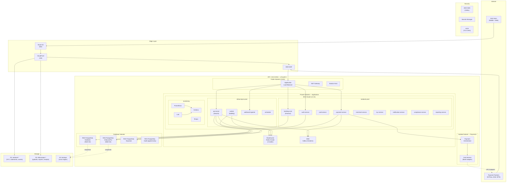

# Deployment Architecture — NeoBank + DisbursePro

**Version:** 1.0
**Last Updated:** 2026-04-04
**Author:** Platform Engineering
**Status:** Production-Ready Specification

---

## Table of Contents

1. [Overview](#1-overview)
2. [Local Development](#2-local-development)
3. [AWS Cloud Architecture](#3-aws-cloud-architecture)
4. [Kubernetes](#4-kubernetes)
5. [CI/CD](#5-cicd)
6. [Terraform IaC](#6-terraform-iac)
7. [Monitoring](#7-monitoring)
8. [Disaster Recovery](#8-disaster-recovery)
9. [Cost Estimation](#9-cost-estimation)

---

## 1. Overview

### 1.1 Multi-Project Topology

NeoBank and DisbursePro are two distinct financial products deployed into a shared AWS infrastructure footprint. They share foundational services (IAM, monitoring, networking) while maintaining strict data isolation at the application and database layers.

| Aspect | NeoBank | DisbursePro |
|---|---|---|
| **Domain** | Digital banking (B2C) | Bulk disbursements (B2B) |
| **Backend** | Java 21 / Spring Boot (Apache Fineract) | Node.js 22 / NestJS 10 |
| **Frontend** | React 19 + Vite + TypeScript | React 19 + Vite + TypeScript |
| **Database** | PostgreSQL 16 (dedicated RDS) | PostgreSQL 16 (dedicated RDS) |
| **Target Region** | Kenya / East Africa | Zambia / Southern Africa |
| **Primary Domain** | `neobank.co.ke` | `disbursepro.com` |

### 1.2 Shared vs. Per-Project Infrastructure

```
Shared Infrastructure (managed once)
├── VPC (10.0.0.0/16) — single VPC, isolated by subnets + security groups
├── EKS Cluster (v1.31) — shared control plane, namespaced workloads
├── Keycloak (shared IAM) — separate realms per project
├── MSK (Kafka) — shared cluster, separate topics per project
├── ElastiCache (Redis) — shared cluster, key-prefix isolation
├── CloudFront — separate distributions per project
├── WAF — shared WebACL with per-project rule groups
├── Route 53 — shared hosted zones
├── Monitoring namespace (Prometheus, Grafana, Loki, Tempo)
└── Bastion Host + NAT Gateway

Per-Project Infrastructure
├── RDS PostgreSQL — dedicated instance per project (hard isolation)
├── S3 Buckets — dedicated buckets per project
├── EKS Namespaces — neobank-prod, neobank-staging, disbursepro-prod, disbursepro-staging
├── ECR Repositories — separate image repos per service
├── Secrets Manager — prefixed paths (neobank/*, disbursepro/*)
└── CloudFront Distributions — separate per project
```

### 1.3 Network Topology Summary

```
Internet
    │
    ▼
┌─────────────────────────────┐
│  CloudFront (CDN)           │──── S3 (static assets)
│  ├── app.neobank.co.ke      │
│  ├── admin.neobank.co.ke    │
│  └── app.disbursepro.com    │
└─────────────┬───────────────┘
              │ HTTPS (443)
              ▼
┌─────────────────────────────┐
│  AWS WAF                    │
│  ├── OWASP Core Rules       │
│  ├── Rate Limiting          │
│  └── Geo-Restrictions       │
└─────────────┬───────────────┘
              │
              ▼
┌─────────────────────────────┐
│  ALB (Public Subnet)        │──── TLS Termination (ACM)
└─────────────┬───────────────┘
              │ HTTP (8080)
              ▼
┌─────────────────────────────┐
│  EKS (Private Subnet)       │
│  ├── neobank-prod namespace  │
│  ├── disbursepro-prod ns     │
│  └── monitoring namespace    │
└─────────┬───────┬───────────┘
          │       │
          ▼       ▼
   ┌──────────┐ ┌──────────┐
   │ RDS (DB) │ │ Redis    │
   │ Subnet   │ │ + Kafka  │
   └──────────┘ └──────────┘
```

---

## 2. Local Development

### 2.1 Docker Compose — Full Stack

```yaml
# docker-compose.yml
# NeoBank + DisbursePro — Local Development Stack
# Usage: docker compose up -d

version: "3.9"

x-common-env: &common-env
  TZ: Africa/Nairobi

networks:
  platform-net:
    driver: bridge

volumes:
  postgres-neobank-data:
  postgres-disbursepro-data:
  postgres-keycloak-data:
  redis-data:
  kafka-data:
  zookeeper-data:
  minio-data:
  fineract-data:

services:
  # ============================================================
  # SHARED INFRASTRUCTURE
  # ============================================================

  # --- PostgreSQL: NeoBank ---
  postgres-neobank:
    image: postgres:16-alpine
    container_name: postgres-neobank
    environment:
      <<: *common-env
      POSTGRES_DB: neobank
      POSTGRES_USER: neobank_user
      POSTGRES_PASSWORD: ${NEOBANK_DB_PASSWORD:-neobank_local_pass}
      POSTGRES_INITDB_ARGS: "--encoding=UTF8 --locale=en_US.UTF-8"
    ports:
      - "5432:5432"
    volumes:
      - postgres-neobank-data:/var/lib/postgresql/data
      - ./scripts/db/neobank-init.sql:/docker-entrypoint-initdb.d/01-init.sql
    healthcheck:
      test: ["CMD-SHELL", "pg_isready -U neobank_user -d neobank"]
      interval: 10s
      timeout: 5s
      retries: 5
    networks:
      - platform-net

  # --- PostgreSQL: DisbursePro ---
  postgres-disbursepro:
    image: postgres:16-alpine
    container_name: postgres-disbursepro
    environment:
      <<: *common-env
      POSTGRES_DB: disbursepro
      POSTGRES_USER: disbursepro_user
      POSTGRES_PASSWORD: ${DISBURSEPRO_DB_PASSWORD:-disbursepro_local_pass}
      POSTGRES_INITDB_ARGS: "--encoding=UTF8 --locale=en_US.UTF-8"
    ports:
      - "5433:5432"
    volumes:
      - postgres-disbursepro-data:/var/lib/postgresql/data
      - ./scripts/db/disbursepro-init.sql:/docker-entrypoint-initdb.d/01-init.sql
    healthcheck:
      test: ["CMD-SHELL", "pg_isready -U disbursepro_user -d disbursepro"]
      interval: 10s
      timeout: 5s
      retries: 5
    networks:
      - platform-net

  # --- PostgreSQL: Keycloak ---
  postgres-keycloak:
    image: postgres:16-alpine
    container_name: postgres-keycloak
    environment:
      <<: *common-env
      POSTGRES_DB: keycloak
      POSTGRES_USER: keycloak_user
      POSTGRES_PASSWORD: ${KEYCLOAK_DB_PASSWORD:-keycloak_local_pass}
    ports:
      - "5434:5432"
    volumes:
      - postgres-keycloak-data:/var/lib/postgresql/data
    healthcheck:
      test: ["CMD-SHELL", "pg_isready -U keycloak_user -d keycloak"]
      interval: 10s
      timeout: 5s
      retries: 5
    networks:
      - platform-net

  # --- Redis ---
  redis:
    image: redis:7-alpine
    container_name: redis
    command: >
      redis-server
      --requirepass ${REDIS_PASSWORD:-redis_local_pass}
      --maxmemory 256mb
      --maxmemory-policy allkeys-lru
      --appendonly yes
    ports:
      - "6379:6379"
    volumes:
      - redis-data:/data
    healthcheck:
      test: ["CMD", "redis-cli", "-a", "${REDIS_PASSWORD:-redis_local_pass}", "ping"]
      interval: 10s
      timeout: 5s
      retries: 5
    networks:
      - platform-net

  # --- Zookeeper (for Kafka) ---
  zookeeper:
    image: confluentinc/cp-zookeeper:7.6.0
    container_name: zookeeper
    environment:
      ZOOKEEPER_CLIENT_PORT: 2181
      ZOOKEEPER_TICK_TIME: 2000
    volumes:
      - zookeeper-data:/var/lib/zookeeper/data
    networks:
      - platform-net

  # --- Kafka ---
  kafka:
    image: confluentinc/cp-kafka:7.6.0
    container_name: kafka
    depends_on:
      zookeeper:
        condition: service_started
    environment:
      KAFKA_BROKER_ID: 1
      KAFKA_ZOOKEEPER_CONNECT: zookeeper:2181
      KAFKA_ADVERTISED_LISTENERS: PLAINTEXT://kafka:9092,HOST://localhost:9093
      KAFKA_LISTENER_SECURITY_PROTOCOL_MAP: PLAINTEXT:PLAINTEXT,HOST:PLAINTEXT
      KAFKA_INTER_BROKER_LISTENER_NAME: PLAINTEXT
      KAFKA_OFFSETS_TOPIC_REPLICATION_FACTOR: 1
      KAFKA_AUTO_CREATE_TOPICS_ENABLE: "true"
      KAFKA_LOG_RETENTION_HOURS: 168
    ports:
      - "9093:9093"
    volumes:
      - kafka-data:/var/lib/kafka/data
    healthcheck:
      test: ["CMD", "kafka-broker-api-versions", "--bootstrap-server", "localhost:9092"]
      interval: 15s
      timeout: 10s
      retries: 5
    networks:
      - platform-net

  # --- Keycloak (Shared IAM) ---
  keycloak:
    image: quay.io/keycloak/keycloak:25.0
    container_name: keycloak
    command: start-dev --import-realm
    environment:
      <<: *common-env
      KC_DB: postgres
      KC_DB_URL: jdbc:postgresql://postgres-keycloak:5432/keycloak
      KC_DB_USERNAME: keycloak_user
      KC_DB_PASSWORD: ${KEYCLOAK_DB_PASSWORD:-keycloak_local_pass}
      KEYCLOAK_ADMIN: admin
      KEYCLOAK_ADMIN_PASSWORD: ${KEYCLOAK_ADMIN_PASSWORD:-admin}
      KC_HEALTH_ENABLED: "true"
      KC_METRICS_ENABLED: "true"
      KC_HTTP_PORT: 8080
    ports:
      - "8180:8080"
    volumes:
      - ./config/keycloak/realms:/opt/keycloak/data/import
    depends_on:
      postgres-keycloak:
        condition: service_healthy
    healthcheck:
      test: ["CMD-SHELL", "exec 3<>/dev/tcp/localhost/8080 && echo -e 'GET /health/ready HTTP/1.1\r\nHost: localhost\r\n\r\n' >&3 && cat <&3 | grep -q '200'"]
      interval: 15s
      timeout: 5s
      retries: 10
      start_period: 60s
    networks:
      - platform-net

  # --- MinIO (S3-compatible local storage) ---
  minio:
    image: minio/minio:latest
    container_name: minio
    command: server /data --console-address ":9001"
    environment:
      MINIO_ROOT_USER: ${MINIO_ACCESS_KEY:-minioadmin}
      MINIO_ROOT_PASSWORD: ${MINIO_SECRET_KEY:-minioadmin123}
    ports:
      - "9000:9000"
      - "9001:9001"
    volumes:
      - minio-data:/data
    healthcheck:
      test: ["CMD", "mc", "ready", "local"]
      interval: 10s
      timeout: 5s
      retries: 5
    networks:
      - platform-net

  # --- MinIO bucket init ---
  minio-init:
    image: minio/mc:latest
    container_name: minio-init
    depends_on:
      minio:
        condition: service_healthy
    entrypoint: >
      /bin/sh -c "
        mc alias set local http://minio:9000 minioadmin minioadmin123;
        mc mb --ignore-existing local/neobank-kyc-documents;
        mc mb --ignore-existing local/neobank-statements;
        mc mb --ignore-existing local/neobank-app-assets;
        mc mb --ignore-existing local/disbursepro-uploads;
        mc mb --ignore-existing local/disbursepro-exports;
        mc mb --ignore-existing local/disbursepro-receipts;
        echo 'Buckets created successfully';
      "
    networks:
      - platform-net

  # ============================================================
  # NEOBANK SERVICES
  # ============================================================

  # --- Apache Fineract (Core Banking Engine) ---
  fineract:
    image: apache/fineract:1.9.0
    container_name: fineract
    environment:
      <<: *common-env
      FINERACT_HIKARI_JDBC_URL: jdbc:postgresql://postgres-neobank:5432/neobank
      FINERACT_HIKARI_USERNAME: neobank_user
      FINERACT_HIKARI_PASSWORD: ${NEOBANK_DB_PASSWORD:-neobank_local_pass}
      FINERACT_DEFAULT_TENANTDB_HOSTNAME: postgres-neobank
      FINERACT_DEFAULT_TENANTDB_PORT: 5432
      FINERACT_DEFAULT_TENANTDB_UID: neobank_user
      FINERACT_DEFAULT_TENANTDB_PWD: ${NEOBANK_DB_PASSWORD:-neobank_local_pass}
      JAVA_OPTS: "-Xms512m -Xmx1024m"
    ports:
      - "8443:8443"
    depends_on:
      postgres-neobank:
        condition: service_healthy
    healthcheck:
      test: ["CMD-SHELL", "curl -sf http://localhost:8443/fineract-provider/actuator/health || exit 1"]
      interval: 30s
      timeout: 10s
      retries: 10
      start_period: 120s
    networks:
      - platform-net

  # --- NeoBank API (Spring Boot) ---
  neobank-api:
    build:
      context: ../neobank-backend
      dockerfile: Dockerfile
    container_name: neobank-api
    environment:
      <<: *common-env
      APP_ENV: development
      APP_PORT: 8080
      DB_HOST: postgres-neobank
      DB_PORT: 5432
      DB_NAME: neobank
      DB_USER: neobank_user
      DB_PASSWORD: ${NEOBANK_DB_PASSWORD:-neobank_local_pass}
      DB_SSL: "false"
      FINERACT_BASE_URL: http://fineract:8443/fineract-provider/api/v1
      FINERACT_TENANT: default
      FINERACT_USERNAME: mifos
      FINERACT_PASSWORD: password
      KEYCLOAK_BASE_URL: http://keycloak:8080
      KEYCLOAK_REALM: neobank
      KEYCLOAK_CLIENT_ID: neobank-backend
      KEYCLOAK_CLIENT_SECRET: ${NEOBANK_KC_SECRET:-neobank-dev-secret}
      REDIS_HOST: redis
      REDIS_PORT: 6379
      REDIS_PASSWORD: ${REDIS_PASSWORD:-redis_local_pass}
      KAFKA_BROKERS: kafka:9092
      KAFKA_SECURITY_PROTOCOL: PLAINTEXT
      S3_ENDPOINT: http://minio:9000
      S3_ACCESS_KEY: ${MINIO_ACCESS_KEY:-minioadmin}
      S3_SECRET_KEY: ${MINIO_SECRET_KEY:-minioadmin123}
      S3_REGION: us-east-1
      S3_BUCKET_KYC: neobank-kyc-documents
      S3_BUCKET_STATEMENTS: neobank-statements
    ports:
      - "8080:8080"
    depends_on:
      postgres-neobank:
        condition: service_healthy
      redis:
        condition: service_healthy
      kafka:
        condition: service_healthy
      keycloak:
        condition: service_healthy
      fineract:
        condition: service_healthy
    healthcheck:
      test: ["CMD-SHELL", "curl -sf http://localhost:8080/actuator/health || exit 1"]
      interval: 15s
      timeout: 5s
      retries: 5
    networks:
      - platform-net

  # --- NeoBank Frontend (React + Vite) ---
  neobank-frontend:
    build:
      context: .
      dockerfile: Dockerfile.dev
    container_name: neobank-frontend
    environment:
      VITE_API_BASE_URL: http://localhost:8080
      VITE_KEYCLOAK_URL: http://localhost:8180
      VITE_KEYCLOAK_REALM: neobank
      VITE_KEYCLOAK_CLIENT_ID: neobank-web
    ports:
      - "3000:5173"
    volumes:
      - ./src:/app/src
      - ./public:/app/public
    depends_on:
      - neobank-api
    networks:
      - platform-net

  # ============================================================
  # DISBURSEPRO SERVICES
  # ============================================================

  # --- DisbursePro API (NestJS) ---
  disbursepro-api:
    build:
      context: ../disbursement-platform/backend
      dockerfile: Dockerfile
    container_name: disbursepro-api
    environment:
      <<: *common-env
      NODE_ENV: development
      PORT: 8081
      DATABASE_URL: postgresql://disbursepro_user:${DISBURSEPRO_DB_PASSWORD:-disbursepro_local_pass}@postgres-disbursepro:5432/disbursepro
      REDIS_HOST: redis
      REDIS_PORT: 6379
      REDIS_PASSWORD: ${REDIS_PASSWORD:-redis_local_pass}
      REDIS_KEY_PREFIX: "dp:"
      KAFKA_BROKERS: kafka:9092
      KAFKA_SECURITY_PROTOCOL: PLAINTEXT
      KEYCLOAK_BASE_URL: http://keycloak:8080
      KEYCLOAK_REALM: disbursepro
      KEYCLOAK_CLIENT_ID: disbursepro-backend
      KEYCLOAK_CLIENT_SECRET: ${DISBURSEPRO_KC_SECRET:-disbursepro-dev-secret}
      S3_ENDPOINT: http://minio:9000
      S3_ACCESS_KEY: ${MINIO_ACCESS_KEY:-minioadmin}
      S3_SECRET_KEY: ${MINIO_SECRET_KEY:-minioadmin123}
      S3_BUCKET_UPLOADS: disbursepro-uploads
      S3_BUCKET_EXPORTS: disbursepro-exports
      BULL_REDIS_HOST: redis
      BULL_REDIS_PORT: 6379
      BULL_REDIS_PASSWORD: ${REDIS_PASSWORD:-redis_local_pass}
    ports:
      - "8081:8081"
    depends_on:
      postgres-disbursepro:
        condition: service_healthy
      redis:
        condition: service_healthy
      kafka:
        condition: service_healthy
      keycloak:
        condition: service_healthy
    healthcheck:
      test: ["CMD-SHELL", "curl -sf http://localhost:8081/health || exit 1"]
      interval: 15s
      timeout: 5s
      retries: 5
    networks:
      - platform-net

  # --- DisbursePro Worker (BullMQ Processor) ---
  disbursepro-worker:
    build:
      context: ../disbursement-platform/backend
      dockerfile: Dockerfile
    container_name: disbursepro-worker
    command: ["node", "dist/worker.js"]
    environment:
      <<: *common-env
      NODE_ENV: development
      DATABASE_URL: postgresql://disbursepro_user:${DISBURSEPRO_DB_PASSWORD:-disbursepro_local_pass}@postgres-disbursepro:5432/disbursepro
      REDIS_HOST: redis
      REDIS_PORT: 6379
      REDIS_PASSWORD: ${REDIS_PASSWORD:-redis_local_pass}
      REDIS_KEY_PREFIX: "dp:"
      KAFKA_BROKERS: kafka:9092
      S3_ENDPOINT: http://minio:9000
      S3_ACCESS_KEY: ${MINIO_ACCESS_KEY:-minioadmin}
      S3_SECRET_KEY: ${MINIO_SECRET_KEY:-minioadmin123}
    depends_on:
      postgres-disbursepro:
        condition: service_healthy
      redis:
        condition: service_healthy
    networks:
      - platform-net

  # --- DisbursePro Frontend (React + Vite) ---
  disbursepro-frontend:
    build:
      context: ../disbursement-platform/frontend
      dockerfile: Dockerfile.dev
    container_name: disbursepro-frontend
    environment:
      VITE_API_BASE_URL: http://localhost:8081
      VITE_KEYCLOAK_URL: http://localhost:8180
      VITE_KEYCLOAK_REALM: disbursepro
      VITE_KEYCLOAK_CLIENT_ID: disbursepro-web
    ports:
      - "3001:5173"
    volumes:
      - ../disbursement-platform/frontend/src:/app/src
      - ../disbursement-platform/frontend/public:/app/public
    depends_on:
      - disbursepro-api
    networks:
      - platform-net

  # ============================================================
  # OBSERVABILITY (LOCAL)
  # ============================================================

  # --- Kafka UI ---
  kafka-ui:
    image: provectuslabs/kafka-ui:latest
    container_name: kafka-ui
    environment:
      KAFKA_CLUSTERS_0_NAME: local
      KAFKA_CLUSTERS_0_BOOTSTRAPSERVERS: kafka:9092
    ports:
      - "8090:8080"
    depends_on:
      kafka:
        condition: service_healthy
    networks:
      - platform-net

  # --- pgAdmin ---
  pgadmin:
    image: dpage/pgadmin4:latest
    container_name: pgadmin
    environment:
      PGADMIN_DEFAULT_EMAIL: admin@qsoftwares.com
      PGADMIN_DEFAULT_PASSWORD: admin
      PGADMIN_CONFIG_SERVER_MODE: "False"
    ports:
      - "5050:80"
    networks:
      - platform-net
```

### 2.2 Environment Variables

```bash
# .env.example — Copy to .env and fill in values
# ================================================

# --- Database Passwords ---
NEOBANK_DB_PASSWORD=neobank_local_pass
DISBURSEPRO_DB_PASSWORD=disbursepro_local_pass
KEYCLOAK_DB_PASSWORD=keycloak_local_pass

# --- Redis ---
REDIS_PASSWORD=redis_local_pass

# --- Keycloak Admin ---
KEYCLOAK_ADMIN_PASSWORD=admin

# --- Keycloak Client Secrets (local dev) ---
NEOBANK_KC_SECRET=neobank-dev-secret
DISBURSEPRO_KC_SECRET=disbursepro-dev-secret

# --- MinIO (S3-compatible) ---
MINIO_ACCESS_KEY=minioadmin
MINIO_SECRET_KEY=minioadmin123

# --- M-Pesa Sandbox (NeoBank) ---
MPESA_CONSUMER_KEY=
MPESA_CONSUMER_SECRET=
MPESA_SHORTCODE=174379
MPESA_PASSKEY=
MPESA_CALLBACK_URL=http://localhost:8080/webhooks/mpesa

# --- Flutterwave Test (NeoBank) ---
FLUTTERWAVE_SECRET_KEY=
FLUTTERWAVE_PUBLIC_KEY=

# --- MTN MoMo Sandbox (DisbursePro) ---
MTN_SUBSCRIPTION_KEY=
MTN_API_USER=
MTN_API_KEY=

# --- Airtel Money Sandbox (DisbursePro) ---
AIRTEL_CLIENT_ID=
AIRTEL_CLIENT_SECRET=

# --- Sentry (optional for local) ---
SENTRY_DSN=
```

### 2.3 Local Setup Instructions

```bash
# 1. Clone both repositories
git clone git@github.com:qsoftwares/neobank.git
git clone git@github.com:qsoftwares/disbursement-platform.git

# 2. Set up environment
cd neobank
cp .env.example .env
# Edit .env with your sandbox API keys

# 3. Start all infrastructure services
docker compose up -d postgres-neobank postgres-disbursepro postgres-keycloak redis zookeeper kafka minio keycloak
docker compose up -d minio-init  # Create S3 buckets

# 4. Wait for Keycloak to be healthy (takes ~60s on first run)
docker compose logs -f keycloak  # Wait for "Running the server in development mode"

# 5. Start Fineract (takes ~2 minutes for initial schema creation)
docker compose up -d fineract
docker compose logs -f fineract  # Wait for "Started FineractApplication"

# 6. Run database migrations
# NeoBank (Flyway — runs automatically with Spring Boot)
# DisbursePro (Prisma)
cd ../disbursement-platform/backend
npx prisma migrate dev

# 7. Start application services
cd ../../neobank
docker compose up -d neobank-api disbursepro-api disbursepro-worker

# 8. Start frontends (with hot reload)
docker compose up -d neobank-frontend disbursepro-frontend

# 9. (Optional) Start observability tools
docker compose up -d kafka-ui pgadmin

# 10. Verify all services
docker compose ps
```

**Service URLs (local development):**

| Service | URL |
|---|---|
| NeoBank Frontend | http://localhost:3000 |
| DisbursePro Frontend | http://localhost:3001 |
| NeoBank API | http://localhost:8080 |
| DisbursePro API | http://localhost:8081 |
| Fineract API | http://localhost:8443 |
| Keycloak Admin | http://localhost:8180 |
| MinIO Console | http://localhost:9001 |
| Kafka UI | http://localhost:8090 |
| pgAdmin | http://localhost:5050 |

---

## 3. AWS Cloud Architecture

### 3.1 Region Strategy

| Tier | Region | Purpose |
|---|---|---|
| **Primary** | af-south-1 (Cape Town) | All workloads, primary databases, data residency compliance |
| **DR / Backup** | eu-west-1 (Ireland) | S3 cross-region replication, RDS snapshots, Terraform state for region rebuild |
| **CDN Edge** | CloudFront global (200+ PoPs) | Static assets, API caching (non-sensitive) |

**Latency Profile (from af-south-1):**
- Nairobi, Kenya: ~40ms | Lusaka, Zambia: ~15ms
- Kampala, Uganda: ~55ms | Johannesburg, SA: ~5ms
- Dar es Salaam, TZ: ~50ms | Kigali, Rwanda: ~45ms

### 3.2 Architecture Diagram



### 3.3 VPC Design

```
VPC CIDR: 10.0.0.0/16 (65,536 addresses)

┌─────────────────────────────────────────────────────────────────┐
│  Availability Zone A        AZ B                AZ C            │
│  (af-south-1a)             (af-south-1b)       (af-south-1c)   │
│                                                                  │
│  Public:    10.0.1.0/24    10.0.2.0/24         10.0.3.0/24     │
│  Private:   10.0.10.0/24   10.0.20.0/24        10.0.30.0/24    │
│  Isolated:  10.0.40.0/24   10.0.50.0/24        10.0.60.0/24    │
│  Database:  10.0.100.0/24  10.0.200.0/24       10.0.201.0/24   │
└─────────────────────────────────────────────────────────────────┘

Subnet Purposes:
- Public:    ALB, NAT Gateway, Bastion Host
- Private:   EKS worker nodes, ElastiCache, MSK
- Isolated:  Payment services (no internet — VPC endpoints only)
- Database:  RDS instances (no internet, no NAT)
```

### 3.4 S3 Bucket Strategy

| Bucket | Project | Encryption | Versioning | Lifecycle | Replication |
|---|---|---|---|---|---|
| `neobank-kyc-documents` | NeoBank | SSE-KMS (CMK) | Enabled | 7 years | eu-west-1 |
| `neobank-statements` | NeoBank | SSE-KMS (CMK) | Disabled | 7 years | eu-west-1 |
| `neobank-app-assets` | NeoBank | SSE-S3 | Disabled | None | None |
| `neobank-backups` | NeoBank | SSE-KMS (CMK) | Enabled | 90 days | eu-west-1 |
| `disbursepro-uploads` | DisbursePro | SSE-KMS (CMK) | Disabled | 90 days | eu-west-1 |
| `disbursepro-exports` | DisbursePro | SSE-KMS (CMK) | Disabled | 30 days | None |
| `disbursepro-receipts` | DisbursePro | SSE-KMS (CMK) | Enabled | 7 years | eu-west-1 |
| `disbursepro-app-assets` | DisbursePro | SSE-S3 | Disabled | None | None |
| `platform-terraform-state` | Shared | SSE-KMS (CMK) | Enabled | None | eu-west-1 |

### 3.5 CloudFront Distributions

| Distribution | Origin | Domain | Cache Behavior |
|---|---|---|---|
| NeoBank Web App | `neobank-app-assets` S3 | `app.neobank.co.ke` | Cache 24hr, SPA fallback to index.html |
| NeoBank Admin | `neobank-app-assets` S3 | `admin.neobank.co.ke` | Cache 24hr, SPA fallback |
| NeoBank API | ALB | `api.neobank.co.ke` | No cache, forward all headers |
| DisbursePro App | `disbursepro-app-assets` S3 | `app.disbursepro.com` | Cache 24hr, SPA fallback |
| DisbursePro API | ALB | `api.disbursepro.com` | No cache, forward all headers |

---

## 4. Kubernetes

### 4.1 Namespace Strategy

```
EKS Cluster: qsoftwares-platform
├── neobank-prod          # NeoBank production workloads
├── neobank-staging       # NeoBank staging (1 replica each)
├── disbursepro-prod      # DisbursePro production workloads
├── disbursepro-staging   # DisbursePro staging (1 replica each)
├── keycloak              # Shared Keycloak (2 replicas)
├── monitoring            # Prometheus, Grafana, Loki, Tempo
├── cert-manager          # TLS certificate management
├── ingress-nginx         # NGINX Ingress Controller
└── external-secrets      # External Secrets Operator (AWS SM sync)
```

### 4.2 NeoBank Deployment — Banking Core (Fineract)

```yaml
# k8s/neobank/deployments/banking-core.yaml
apiVersion: apps/v1
kind: Deployment
metadata:
  name: banking-core
  namespace: neobank-prod
  labels:
    app: banking-core
    project: neobank
    tier: backend
spec:
  replicas: 3
  strategy:
    type: RollingUpdate
    rollingUpdate:
      maxSurge: 1
      maxUnavailable: 0
  selector:
    matchLabels:
      app: banking-core
  template:
    metadata:
      labels:
        app: banking-core
        project: neobank
        tier: backend
      annotations:
        prometheus.io/scrape: "true"
        prometheus.io/port: "8080"
        prometheus.io/path: "/actuator/prometheus"
    spec:
      serviceAccountName: neobank-sa
      securityContext:
        runAsNonRoot: true
        runAsUser: 65534
        fsGroup: 65534
        seccompProfile:
          type: RuntimeDefault
      topologySpreadConstraints:
        - maxSkew: 1
          topologyKey: topology.kubernetes.io/zone
          whenUnsatisfiable: DoNotSchedule
          labelSelector:
            matchLabels:
              app: banking-core
      containers:
        - name: banking-core
          image: 123456789012.dkr.ecr.af-south-1.amazonaws.com/neobank/banking-core:latest
          ports:
            - containerPort: 8080
              protocol: TCP
          envFrom:
            - configMapRef:
                name: neobank-config
            - secretRef:
                name: neobank-secrets
          env:
            - name: JAVA_OPTS
              value: "-Xms1g -Xmx2g -XX:+UseG1GC -XX:MaxGCPauseMillis=200"
            - name: SPRING_PROFILES_ACTIVE
              value: "production"
          resources:
            requests:
              cpu: "500m"
              memory: "1Gi"
            limits:
              cpu: "2000m"
              memory: "3Gi"
          readinessProbe:
            httpGet:
              path: /actuator/health/readiness
              port: 8080
            initialDelaySeconds: 30
            periodSeconds: 10
            timeoutSeconds: 5
            failureThreshold: 3
          livenessProbe:
            httpGet:
              path: /actuator/health/liveness
              port: 8080
            initialDelaySeconds: 60
            periodSeconds: 15
            timeoutSeconds: 5
            failureThreshold: 3
          startupProbe:
            httpGet:
              path: /actuator/health
              port: 8080
            initialDelaySeconds: 30
            periodSeconds: 10
            failureThreshold: 30
          securityContext:
            allowPrivilegeEscalation: false
            readOnlyRootFilesystem: true
            capabilities:
              drop: ["ALL"]
          volumeMounts:
            - name: tmp
              mountPath: /tmp
      volumes:
        - name: tmp
          emptyDir:
            sizeLimit: 200Mi
```

### 4.3 NeoBank Payment Service Deployment

```yaml
# k8s/neobank/deployments/payment-service.yaml
apiVersion: apps/v1
kind: Deployment
metadata:
  name: payment-service
  namespace: neobank-prod
  labels:
    app: payment-service
    project: neobank
    tier: backend
spec:
  replicas: 3
  strategy:
    type: RollingUpdate
    rollingUpdate:
      maxSurge: 1
      maxUnavailable: 0
  selector:
    matchLabels:
      app: payment-service
  template:
    metadata:
      labels:
        app: payment-service
        project: neobank
        tier: backend
    spec:
      serviceAccountName: neobank-sa
      securityContext:
        runAsNonRoot: true
        runAsUser: 65534
        fsGroup: 65534
        seccompProfile:
          type: RuntimeDefault
      containers:
        - name: payment-service
          image: 123456789012.dkr.ecr.af-south-1.amazonaws.com/neobank/payment-service:latest
          ports:
            - containerPort: 8080
          envFrom:
            - configMapRef:
                name: neobank-config
            - secretRef:
                name: neobank-secrets
          env:
            - name: JAVA_OPTS
              value: "-Xms512m -Xmx1536m -XX:+UseG1GC"
          resources:
            requests:
              cpu: "500m"
              memory: "768Mi"
            limits:
              cpu: "1500m"
              memory: "2Gi"
          readinessProbe:
            httpGet:
              path: /actuator/health/readiness
              port: 8080
            initialDelaySeconds: 20
            periodSeconds: 10
          livenessProbe:
            httpGet:
              path: /actuator/health/liveness
              port: 8080
            initialDelaySeconds: 45
            periodSeconds: 15
          securityContext:
            allowPrivilegeEscalation: false
            readOnlyRootFilesystem: true
            capabilities:
              drop: ["ALL"]
          volumeMounts:
            - name: tmp
              mountPath: /tmp
      volumes:
        - name: tmp
          emptyDir:
            sizeLimit: 100Mi
```

### 4.4 DisbursePro API Server Deployment

```yaml
# k8s/disbursepro/deployments/api-server.yaml
apiVersion: apps/v1
kind: Deployment
metadata:
  name: api-server
  namespace: disbursepro-prod
  labels:
    app: api-server
    project: disbursepro
    tier: backend
spec:
  replicas: 3
  strategy:
    type: RollingUpdate
    rollingUpdate:
      maxSurge: 1
      maxUnavailable: 0
  selector:
    matchLabels:
      app: api-server
  template:
    metadata:
      labels:
        app: api-server
        project: disbursepro
        tier: backend
      annotations:
        prometheus.io/scrape: "true"
        prometheus.io/port: "8081"
        prometheus.io/path: "/metrics"
    spec:
      serviceAccountName: disbursepro-sa
      securityContext:
        runAsNonRoot: true
        runAsUser: 1001
        fsGroup: 1001
        seccompProfile:
          type: RuntimeDefault
      topologySpreadConstraints:
        - maxSkew: 1
          topologyKey: topology.kubernetes.io/zone
          whenUnsatisfiable: DoNotSchedule
          labelSelector:
            matchLabels:
              app: api-server
      containers:
        - name: api-server
          image: 123456789012.dkr.ecr.af-south-1.amazonaws.com/disbursepro/api-server:latest
          ports:
            - containerPort: 8081
              protocol: TCP
          envFrom:
            - configMapRef:
                name: disbursepro-config
            - secretRef:
                name: disbursepro-secrets
          env:
            - name: NODE_ENV
              value: "production"
            - name: NODE_OPTIONS
              value: "--max-old-space-size=1536"
          resources:
            requests:
              cpu: "250m"
              memory: "512Mi"
            limits:
              cpu: "1000m"
              memory: "2Gi"
          readinessProbe:
            httpGet:
              path: /health/ready
              port: 8081
            initialDelaySeconds: 10
            periodSeconds: 10
            failureThreshold: 3
          livenessProbe:
            httpGet:
              path: /health/live
              port: 8081
            initialDelaySeconds: 15
            periodSeconds: 15
            failureThreshold: 3
          securityContext:
            allowPrivilegeEscalation: false
            readOnlyRootFilesystem: true
            capabilities:
              drop: ["ALL"]
          volumeMounts:
            - name: tmp
              mountPath: /tmp
      volumes:
        - name: tmp
          emptyDir:
            sizeLimit: 100Mi
```

### 4.5 DisbursePro Worker Deployment

```yaml
# k8s/disbursepro/deployments/worker.yaml
apiVersion: apps/v1
kind: Deployment
metadata:
  name: worker
  namespace: disbursepro-prod
  labels:
    app: worker
    project: disbursepro
    tier: backend
spec:
  replicas: 2
  selector:
    matchLabels:
      app: worker
  template:
    metadata:
      labels:
        app: worker
        project: disbursepro
        tier: backend
    spec:
      serviceAccountName: disbursepro-sa
      securityContext:
        runAsNonRoot: true
        runAsUser: 1001
        fsGroup: 1001
        seccompProfile:
          type: RuntimeDefault
      containers:
        - name: worker
          image: 123456789012.dkr.ecr.af-south-1.amazonaws.com/disbursepro/api-server:latest
          command: ["node", "dist/worker.js"]
          envFrom:
            - configMapRef:
                name: disbursepro-config
            - secretRef:
                name: disbursepro-secrets
          env:
            - name: NODE_ENV
              value: "production"
            - name: NODE_OPTIONS
              value: "--max-old-space-size=2048"
          resources:
            requests:
              cpu: "500m"
              memory: "1Gi"
            limits:
              cpu: "2000m"
              memory: "3Gi"
          livenessProbe:
            exec:
              command: ["node", "-e", "require('http').get('http://localhost:9090/health', r => process.exit(r.statusCode === 200 ? 0 : 1))"]
            initialDelaySeconds: 15
            periodSeconds: 30
          securityContext:
            allowPrivilegeEscalation: false
            readOnlyRootFilesystem: true
            capabilities:
              drop: ["ALL"]
          volumeMounts:
            - name: tmp
              mountPath: /tmp
      volumes:
        - name: tmp
          emptyDir:
            sizeLimit: 200Mi
```

### 4.6 Services

```yaml
# k8s/neobank/services/banking-core-svc.yaml
apiVersion: v1
kind: Service
metadata:
  name: banking-core
  namespace: neobank-prod
  labels:
    app: banking-core
spec:
  type: ClusterIP
  ports:
    - port: 8080
      targetPort: 8080
      protocol: TCP
      name: http
  selector:
    app: banking-core

---
# k8s/neobank/services/payment-service-svc.yaml
apiVersion: v1
kind: Service
metadata:
  name: payment-service
  namespace: neobank-prod
spec:
  type: ClusterIP
  ports:
    - port: 8080
      targetPort: 8080
      protocol: TCP
      name: http
  selector:
    app: payment-service

---
# k8s/disbursepro/services/api-server-svc.yaml
apiVersion: v1
kind: Service
metadata:
  name: api-server
  namespace: disbursepro-prod
spec:
  type: ClusterIP
  ports:
    - port: 8081
      targetPort: 8081
      protocol: TCP
      name: http
  selector:
    app: api-server
```

### 4.7 Ingress

```yaml
# k8s/shared/ingress.yaml
apiVersion: networking.k8s.io/v1
kind: Ingress
metadata:
  name: platform-ingress
  namespace: neobank-prod
  annotations:
    kubernetes.io/ingress.class: "alb"
    alb.ingress.kubernetes.io/scheme: "internet-facing"
    alb.ingress.kubernetes.io/certificate-arn: "arn:aws:acm:af-south-1:123456789012:certificate/xxx"
    alb.ingress.kubernetes.io/listen-ports: '[{"HTTPS": 443}]'
    alb.ingress.kubernetes.io/ssl-redirect: "443"
    alb.ingress.kubernetes.io/target-type: "ip"
    alb.ingress.kubernetes.io/healthcheck-path: "/actuator/health"
    alb.ingress.kubernetes.io/wafv2-acl-arn: "arn:aws:wafv2:af-south-1:123456789012:regional/webacl/platform-waf/xxx"
spec:
  rules:
    - host: api.neobank.co.ke
      http:
        paths:
          - path: /auth
            pathType: Prefix
            backend:
              service:
                name: auth-service
                port:
                  number: 8080
          - path: /banking
            pathType: Prefix
            backend:
              service:
                name: banking-core
                port:
                  number: 8080
          - path: /payments
            pathType: Prefix
            backend:
              service:
                name: payment-service
                port:
                  number: 8080
          - path: /merchant
            pathType: Prefix
            backend:
              service:
                name: merchant-service
                port:
                  number: 8080
          - path: /kyc
            pathType: Prefix
            backend:
              service:
                name: kyc-service
                port:
                  number: 8080
          - path: /
            pathType: Prefix
            backend:
              service:
                name: banking-core
                port:
                  number: 8080

---
apiVersion: networking.k8s.io/v1
kind: Ingress
metadata:
  name: disbursepro-ingress
  namespace: disbursepro-prod
  annotations:
    kubernetes.io/ingress.class: "alb"
    alb.ingress.kubernetes.io/scheme: "internet-facing"
    alb.ingress.kubernetes.io/certificate-arn: "arn:aws:acm:af-south-1:123456789012:certificate/yyy"
    alb.ingress.kubernetes.io/listen-ports: '[{"HTTPS": 443}]'
    alb.ingress.kubernetes.io/ssl-redirect: "443"
    alb.ingress.kubernetes.io/target-type: "ip"
    alb.ingress.kubernetes.io/healthcheck-path: "/health"
spec:
  rules:
    - host: api.disbursepro.com
      http:
        paths:
          - path: /
            pathType: Prefix
            backend:
              service:
                name: api-server
                port:
                  number: 8081
```

### 4.8 ConfigMaps

```yaml
# k8s/neobank/configmaps/neobank-config.yaml
apiVersion: v1
kind: ConfigMap
metadata:
  name: neobank-config
  namespace: neobank-prod
data:
  APP_ENV: "production"
  APP_PORT: "8080"
  APP_BASE_URL: "https://api.neobank.co.ke"
  DB_HOST: "neobank-prod.cluster-xxxxx.af-south-1.rds.amazonaws.com"
  DB_PORT: "5432"
  DB_NAME: "neobank"
  DB_SSL: "true"
  FINERACT_BASE_URL: "http://banking-core:8080/fineract-provider/api/v1"
  FINERACT_TENANT: "default"
  KEYCLOAK_BASE_URL: "http://keycloak.keycloak.svc.cluster.local:8080"
  KEYCLOAK_REALM: "neobank"
  KEYCLOAK_CLIENT_ID: "neobank-backend"
  REDIS_HOST: "neobank-redis.xxxxx.af-south-1.cache.amazonaws.com"
  REDIS_PORT: "6379"
  KAFKA_BROKERS: "b-1.platform-kafka.xxxxx.kafka.af-south-1.amazonaws.com:9092,b-2.platform-kafka.xxxxx.kafka.af-south-1.amazonaws.com:9092,b-3.platform-kafka.xxxxx.kafka.af-south-1.amazonaws.com:9092"
  KAFKA_SECURITY_PROTOCOL: "SASL_SSL"
  S3_REGION: "af-south-1"
  S3_BUCKET_KYC: "neobank-kyc-documents"
  S3_BUCKET_STATEMENTS: "neobank-statements"
  SENTRY_ENVIRONMENT: "production"

---
# k8s/disbursepro/configmaps/disbursepro-config.yaml
apiVersion: v1
kind: ConfigMap
metadata:
  name: disbursepro-config
  namespace: disbursepro-prod
data:
  NODE_ENV: "production"
  PORT: "8081"
  DB_HOST: "disbursepro-prod.cluster-xxxxx.af-south-1.rds.amazonaws.com"
  DB_PORT: "5432"
  DB_NAME: "disbursepro"
  DB_SSL: "true"
  KEYCLOAK_BASE_URL: "http://keycloak.keycloak.svc.cluster.local:8080"
  KEYCLOAK_REALM: "disbursepro"
  KEYCLOAK_CLIENT_ID: "disbursepro-backend"
  REDIS_HOST: "neobank-redis.xxxxx.af-south-1.cache.amazonaws.com"
  REDIS_PORT: "6379"
  REDIS_KEY_PREFIX: "dp:"
  KAFKA_BROKERS: "b-1.platform-kafka.xxxxx.kafka.af-south-1.amazonaws.com:9092,b-2.platform-kafka.xxxxx.kafka.af-south-1.amazonaws.com:9092,b-3.platform-kafka.xxxxx.kafka.af-south-1.amazonaws.com:9092"
  S3_REGION: "af-south-1"
  S3_BUCKET_UPLOADS: "disbursepro-uploads"
  S3_BUCKET_EXPORTS: "disbursepro-exports"
  SENTRY_ENVIRONMENT: "production"
```

### 4.9 External Secrets (AWS Secrets Manager Sync)

```yaml
# k8s/neobank/secrets/external-secret.yaml
apiVersion: external-secrets.io/v1beta1
kind: ExternalSecret
metadata:
  name: neobank-secrets
  namespace: neobank-prod
spec:
  refreshInterval: 1h
  secretStoreRef:
    name: aws-secrets-manager
    kind: ClusterSecretStore
  target:
    name: neobank-secrets
    creationPolicy: Owner
  data:
    - secretKey: DB_USER
      remoteRef:
        key: neobank/prod/db-credentials
        property: username
    - secretKey: DB_PASSWORD
      remoteRef:
        key: neobank/prod/db-credentials
        property: password
    - secretKey: KEYCLOAK_CLIENT_SECRET
      remoteRef:
        key: neobank/prod/keycloak-client
        property: secret
    - secretKey: REDIS_PASSWORD
      remoteRef:
        key: neobank/prod/redis
        property: password
    - secretKey: MPESA_CONSUMER_KEY
      remoteRef:
        key: neobank/prod/mpesa
        property: consumer_key
    - secretKey: MPESA_CONSUMER_SECRET
      remoteRef:
        key: neobank/prod/mpesa
        property: consumer_secret
    - secretKey: MPESA_PASSKEY
      remoteRef:
        key: neobank/prod/mpesa
        property: passkey
    - secretKey: FLUTTERWAVE_SECRET_KEY
      remoteRef:
        key: neobank/prod/flutterwave
        property: secret_key
    - secretKey: MARQETA_APP_TOKEN
      remoteRef:
        key: neobank/prod/marqeta
        property: app_token
    - secretKey: MARQETA_ADMIN_TOKEN
      remoteRef:
        key: neobank/prod/marqeta
        property: admin_token
    - secretKey: SMILE_API_KEY
      remoteRef:
        key: neobank/prod/smile-id
        property: api_key

---
# k8s/disbursepro/secrets/external-secret.yaml
apiVersion: external-secrets.io/v1beta1
kind: ExternalSecret
metadata:
  name: disbursepro-secrets
  namespace: disbursepro-prod
spec:
  refreshInterval: 1h
  secretStoreRef:
    name: aws-secrets-manager
    kind: ClusterSecretStore
  target:
    name: disbursepro-secrets
    creationPolicy: Owner
  data:
    - secretKey: DATABASE_URL
      remoteRef:
        key: disbursepro/prod/db-credentials
        property: url
    - secretKey: KEYCLOAK_CLIENT_SECRET
      remoteRef:
        key: disbursepro/prod/keycloak-client
        property: secret
    - secretKey: REDIS_PASSWORD
      remoteRef:
        key: disbursepro/prod/redis
        property: password
    - secretKey: MTN_SUBSCRIPTION_KEY
      remoteRef:
        key: disbursepro/prod/mtn-momo
        property: subscription_key
    - secretKey: MTN_API_KEY
      remoteRef:
        key: disbursepro/prod/mtn-momo
        property: api_key
    - secretKey: AIRTEL_CLIENT_SECRET
      remoteRef:
        key: disbursepro/prod/airtel-money
        property: client_secret
```

### 4.10 Horizontal Pod Autoscaler

```yaml
# k8s/neobank/hpa/banking-core-hpa.yaml
apiVersion: autoscaling/v2
kind: HorizontalPodAutoscaler
metadata:
  name: banking-core-hpa
  namespace: neobank-prod
spec:
  scaleTargetRef:
    apiVersion: apps/v1
    kind: Deployment
    name: banking-core
  minReplicas: 3
  maxReplicas: 10
  metrics:
    - type: Resource
      resource:
        name: cpu
        target:
          type: Utilization
          averageUtilization: 70
    - type: Resource
      resource:
        name: memory
        target:
          type: Utilization
          averageUtilization: 80
  behavior:
    scaleUp:
      stabilizationWindowSeconds: 60
      policies:
        - type: Pods
          value: 2
          periodSeconds: 60
    scaleDown:
      stabilizationWindowSeconds: 300
      policies:
        - type: Pods
          value: 1
          periodSeconds: 120

---
# k8s/neobank/hpa/payment-service-hpa.yaml
apiVersion: autoscaling/v2
kind: HorizontalPodAutoscaler
metadata:
  name: payment-service-hpa
  namespace: neobank-prod
spec:
  scaleTargetRef:
    apiVersion: apps/v1
    kind: Deployment
    name: payment-service
  minReplicas: 3
  maxReplicas: 12
  metrics:
    - type: Resource
      resource:
        name: cpu
        target:
          type: Utilization
          averageUtilization: 65
    - type: Pods
      pods:
        metric:
          name: http_requests_per_second
        target:
          type: AverageValue
          averageValue: "100"
  behavior:
    scaleUp:
      stabilizationWindowSeconds: 30
      policies:
        - type: Pods
          value: 3
          periodSeconds: 60
    scaleDown:
      stabilizationWindowSeconds: 300

---
# k8s/disbursepro/hpa/api-server-hpa.yaml
apiVersion: autoscaling/v2
kind: HorizontalPodAutoscaler
metadata:
  name: api-server-hpa
  namespace: disbursepro-prod
spec:
  scaleTargetRef:
    apiVersion: apps/v1
    kind: Deployment
    name: api-server
  minReplicas: 3
  maxReplicas: 8
  metrics:
    - type: Resource
      resource:
        name: cpu
        target:
          type: Utilization
          averageUtilization: 70
    - type: Resource
      resource:
        name: memory
        target:
          type: Utilization
          averageUtilization: 80
  behavior:
    scaleUp:
      stabilizationWindowSeconds: 60
      policies:
        - type: Pods
          value: 2
          periodSeconds: 60
    scaleDown:
      stabilizationWindowSeconds: 300

---
# k8s/disbursepro/hpa/worker-hpa.yaml
apiVersion: autoscaling/v2
kind: HorizontalPodAutoscaler
metadata:
  name: worker-hpa
  namespace: disbursepro-prod
spec:
  scaleTargetRef:
    apiVersion: apps/v1
    kind: Deployment
    name: worker
  minReplicas: 2
  maxReplicas: 6
  metrics:
    - type: Resource
      resource:
        name: cpu
        target:
          type: Utilization
          averageUtilization: 75
  behavior:
    scaleUp:
      stabilizationWindowSeconds: 30
      policies:
        - type: Pods
          value: 2
          periodSeconds: 60
    scaleDown:
      stabilizationWindowSeconds: 300
```

### 4.11 Network Policies

```yaml
# k8s/neobank/network-policies/default-deny.yaml
apiVersion: networking.k8s.io/v1
kind: NetworkPolicy
metadata:
  name: default-deny-all
  namespace: neobank-prod
spec:
  podSelector: {}
  policyTypes:
    - Ingress
    - Egress

---
# Allow banking-core ingress from ALB only
apiVersion: networking.k8s.io/v1
kind: NetworkPolicy
metadata:
  name: allow-banking-core-ingress
  namespace: neobank-prod
spec:
  podSelector:
    matchLabels:
      app: banking-core
  policyTypes:
    - Ingress
  ingress:
    - from:
        - namespaceSelector:
            matchLabels:
              name: ingress-nginx
      ports:
        - protocol: TCP
          port: 8080

---
# Allow banking-core egress to DB, Redis, Kafka
apiVersion: networking.k8s.io/v1
kind: NetworkPolicy
metadata:
  name: allow-banking-core-egress
  namespace: neobank-prod
spec:
  podSelector:
    matchLabels:
      app: banking-core
  policyTypes:
    - Egress
  egress:
    # PostgreSQL RDS
    - to:
        - ipBlock:
            cidr: 10.0.100.0/24
      ports:
        - protocol: TCP
          port: 5432
    - to:
        - ipBlock:
            cidr: 10.0.200.0/24
      ports:
        - protocol: TCP
          port: 5432
    # Redis (ElastiCache)
    - to:
        - ipBlock:
            cidr: 10.0.10.0/24
      ports:
        - protocol: TCP
          port: 6379
    # Kafka (MSK)
    - to:
        - ipBlock:
            cidr: 10.0.10.0/24
      ports:
        - protocol: TCP
          port: 9092
    # Keycloak
    - to:
        - namespaceSelector:
            matchLabels:
              name: keycloak
      ports:
        - protocol: TCP
          port: 8080
    # DNS
    - to: []
      ports:
        - protocol: UDP
          port: 53
        - protocol: TCP
          port: 53
```

---

## 5. CI/CD

### 5.1 Pipeline Architecture

```
Developer Push
    │
    ├── PR to develop ───► PR Validation ───► Merge to develop ───► Staging Deploy
    │
    └── PR to main ──────► PR Validation ───► Manual Approval ───► Production Deploy
                                                                         │
                                                                         ├── Flyway Migrations
                                                                         ├── Rolling Update
                                                                         ├── Smoke Tests
                                                                         └── Slack Notification
```

### 5.2 NeoBank — PR Validation Workflow

```yaml
# .github/workflows/neobank-pr.yml
name: "NeoBank — PR Validation"

on:
  pull_request:
    branches: [main, develop]
    paths:
      - "neobank-backend/**"
      - "neobank-frontend/**"

concurrency:
  group: neobank-pr-${{ github.head_ref }}
  cancel-in-progress: true

env:
  JAVA_VERSION: "21"
  NODE_VERSION: "22"
  GRADLE_OPTS: "-Dorg.gradle.daemon=false"

jobs:
  # ---- Backend Tests ----
  backend-test:
    name: "Backend — Test & Scan"
    runs-on: ubuntu-latest
    services:
      postgres:
        image: postgres:16-alpine
        env:
          POSTGRES_DB: neobank_test
          POSTGRES_USER: test_user
          POSTGRES_PASSWORD: test_pass
        ports: ["5432:5432"]
        options: >-
          --health-cmd pg_isready
          --health-interval 10s
          --health-timeout 5s
          --health-retries 5
      redis:
        image: redis:7-alpine
        ports: ["6379:6379"]
        options: >-
          --health-cmd "redis-cli ping"
          --health-interval 10s
          --health-timeout 5s
          --health-retries 5
    steps:
      - uses: actions/checkout@v4

      - name: Set up JDK ${{ env.JAVA_VERSION }}
        uses: actions/setup-java@v4
        with:
          java-version: ${{ env.JAVA_VERSION }}
          distribution: "temurin"
          cache: "gradle"

      - name: Run unit tests
        working-directory: neobank-backend
        run: ./gradlew test --no-daemon
        env:
          SPRING_PROFILES_ACTIVE: test

      - name: Run integration tests
        working-directory: neobank-backend
        run: ./gradlew integrationTest --no-daemon
        env:
          DB_HOST: localhost
          DB_PORT: 5432
          DB_NAME: neobank_test
          DB_USER: test_user
          DB_PASSWORD: test_pass
          REDIS_HOST: localhost
          REDIS_PORT: 6379

      - name: Check test coverage
        working-directory: neobank-backend
        run: |
          ./gradlew jacocoTestReport --no-daemon
          COVERAGE=$(cat build/reports/jacoco/test/html/index.html | grep -oP 'Total.*?(\d+)%' | grep -oP '\d+' | head -1)
          echo "Coverage: ${COVERAGE}%"
          if [ "$COVERAGE" -lt 80 ]; then
            echo "::error::Coverage ${COVERAGE}% is below 80% threshold"
            exit 1
          fi

      - name: SAST scan (SonarQube)
        working-directory: neobank-backend
        run: ./gradlew sonarqube --no-daemon
        env:
          SONAR_TOKEN: ${{ secrets.SONAR_TOKEN }}

      - name: Dependency scan (Snyk)
        uses: snyk/actions/gradle@master
        with:
          args: --severity-threshold=high --project-name=neobank-backend
        env:
          SNYK_TOKEN: ${{ secrets.SNYK_TOKEN }}

  # ---- Frontend Tests ----
  frontend-test:
    name: "Frontend — Lint, Test & Build"
    runs-on: ubuntu-latest
    steps:
      - uses: actions/checkout@v4

      - name: Set up Node.js ${{ env.NODE_VERSION }}
        uses: actions/setup-node@v4
        with:
          node-version: ${{ env.NODE_VERSION }}
          cache: "npm"
          cache-dependency-path: neobank-frontend/package-lock.json

      - name: Install dependencies
        working-directory: neobank-frontend
        run: npm ci

      - name: Lint
        working-directory: neobank-frontend
        run: npm run lint

      - name: Type check
        working-directory: neobank-frontend
        run: npx tsc --noEmit

      - name: Unit tests
        working-directory: neobank-frontend
        run: npm run test -- --coverage --reporter=verbose

      - name: Build
        working-directory: neobank-frontend
        run: npm run build

      - name: Bundle size check
        working-directory: neobank-frontend
        run: |
          SIZE=$(du -sb dist | cut -f1)
          MAX_SIZE=$((5 * 1024 * 1024))  # 5MB
          if [ "$SIZE" -gt "$MAX_SIZE" ]; then
            echo "::error::Bundle size $(($SIZE / 1024))KB exceeds 5MB limit"
            exit 1
          fi
          echo "Bundle size: $(($SIZE / 1024))KB"
```

### 5.3 NeoBank — Production Deploy Workflow

```yaml
# .github/workflows/neobank-deploy-prod.yml
name: "NeoBank — Production Deploy"

on:
  push:
    branches: [main]
    paths:
      - "neobank-backend/**"
      - "neobank-frontend/**"

permissions:
  id-token: write
  contents: read

env:
  AWS_REGION: af-south-1
  ECR_REGISTRY: 123456789012.dkr.ecr.af-south-1.amazonaws.com
  EKS_CLUSTER: qsoftwares-platform
  NAMESPACE: neobank-prod

jobs:
  build-backend:
    name: "Build & Push Backend Image"
    runs-on: ubuntu-latest
    outputs:
      image_tag: ${{ steps.meta.outputs.version }}
    steps:
      - uses: actions/checkout@v4

      - name: Configure AWS credentials
        uses: aws-actions/configure-aws-credentials@v4
        with:
          role-to-assume: arn:aws:iam::123456789012:role/github-actions-deploy
          aws-region: ${{ env.AWS_REGION }}

      - name: Login to ECR
        uses: aws-actions/amazon-ecr-login@v2

      - name: Docker meta
        id: meta
        uses: docker/metadata-action@v5
        with:
          images: ${{ env.ECR_REGISTRY }}/neobank/banking-core
          tags: |
            type=sha,prefix=
            type=raw,value=latest

      - name: Build and push
        uses: docker/build-push-action@v5
        with:
          context: neobank-backend
          push: true
          tags: ${{ steps.meta.outputs.tags }}
          cache-from: type=gha
          cache-to: type=gha,mode=max

      - name: Trivy container scan
        uses: aquasecurity/trivy-action@master
        with:
          image-ref: ${{ env.ECR_REGISTRY }}/neobank/banking-core:${{ github.sha }}
          format: "sarif"
          output: "trivy-results.sarif"
          severity: "CRITICAL,HIGH"
          exit-code: "1"

  build-frontend:
    name: "Build & Deploy Frontend to S3"
    runs-on: ubuntu-latest
    steps:
      - uses: actions/checkout@v4

      - uses: actions/setup-node@v4
        with:
          node-version: 22
          cache: "npm"
          cache-dependency-path: neobank-frontend/package-lock.json

      - name: Install and build
        working-directory: neobank-frontend
        run: |
          npm ci
          npm run build
        env:
          VITE_API_BASE_URL: https://api.neobank.co.ke
          VITE_KEYCLOAK_URL: https://auth.neobank.co.ke
          VITE_KEYCLOAK_REALM: neobank
          VITE_SENTRY_DSN: ${{ secrets.SENTRY_DSN }}

      - name: Configure AWS credentials
        uses: aws-actions/configure-aws-credentials@v4
        with:
          role-to-assume: arn:aws:iam::123456789012:role/github-actions-deploy
          aws-region: ${{ env.AWS_REGION }}

      - name: Deploy to S3
        working-directory: neobank-frontend
        run: |
          aws s3 sync dist/ s3://neobank-app-assets/ \
            --delete \
            --cache-control "public, max-age=31536000, immutable" \
            --exclude "index.html" \
            --exclude "*.json"
          aws s3 cp dist/index.html s3://neobank-app-assets/index.html \
            --cache-control "no-cache, no-store, must-revalidate"

      - name: Invalidate CloudFront cache
        run: |
          aws cloudfront create-invalidation \
            --distribution-id ${{ secrets.NEOBANK_CF_DISTRIBUTION_ID }} \
            --paths "/*"

  run-migrations:
    name: "Run Database Migrations"
    runs-on: ubuntu-latest
    needs: [build-backend]
    environment: production
    steps:
      - uses: actions/checkout@v4

      - name: Configure AWS credentials
        uses: aws-actions/configure-aws-credentials@v4
        with:
          role-to-assume: arn:aws:iam::123456789012:role/github-actions-deploy
          aws-region: ${{ env.AWS_REGION }}

      - name: Update kubeconfig
        run: aws eks update-kubeconfig --name ${{ env.EKS_CLUSTER }} --region ${{ env.AWS_REGION }}

      - name: Run Flyway migrations
        run: |
          kubectl run flyway-migrate-${{ github.sha }} \
            --namespace=${{ env.NAMESPACE }} \
            --image=${{ env.ECR_REGISTRY }}/neobank/banking-core:${{ github.sha }} \
            --restart=Never \
            --rm \
            --wait \
            --timeout=300s \
            --env="SPRING_PROFILES_ACTIVE=migration" \
            --command -- java -cp app.jar org.flywaydb.commandline.Main migrate

  deploy-backend:
    name: "Deploy Backend to EKS"
    runs-on: ubuntu-latest
    needs: [build-backend, run-migrations]
    environment: production
    steps:
      - uses: actions/checkout@v4

      - name: Configure AWS credentials
        uses: aws-actions/configure-aws-credentials@v4
        with:
          role-to-assume: arn:aws:iam::123456789012:role/github-actions-deploy
          aws-region: ${{ env.AWS_REGION }}

      - name: Update kubeconfig
        run: aws eks update-kubeconfig --name ${{ env.EKS_CLUSTER }} --region ${{ env.AWS_REGION }}

      - name: Deploy services (rolling update)
        run: |
          IMAGE_TAG=${{ github.sha }}
          SERVICES=("banking-core" "auth-service" "payment-service" "merchant-service" "kyc-service" "notification-service" "compliance-service" "reporting-service" "card-service")

          for SERVICE in "${SERVICES[@]}"; do
            echo "Deploying ${SERVICE} with image tag ${IMAGE_TAG}..."
            kubectl set image deployment/${SERVICE} \
              ${SERVICE}=${{ env.ECR_REGISTRY }}/neobank/${SERVICE}:${IMAGE_TAG} \
              -n ${{ env.NAMESPACE }}
            kubectl rollout status deployment/${SERVICE} \
              -n ${{ env.NAMESPACE }} --timeout=300s
          done

      - name: Run smoke tests
        run: |
          ./scripts/smoke-test.sh production
        env:
          API_BASE_URL: https://api.neobank.co.ke

      - name: Notify Slack
        if: always()
        uses: slackapi/slack-github-action@v1
        with:
          payload: |
            {
              "text": "${{ job.status == 'success' && 'NeoBank production deploy succeeded' || 'NeoBank production deploy FAILED' }} — ${{ github.sha }}"
            }
        env:
          SLACK_WEBHOOK_URL: ${{ secrets.SLACK_WEBHOOK_URL }}

  rollback:
    name: "Rollback (manual trigger)"
    runs-on: ubuntu-latest
    if: failure()
    needs: [deploy-backend]
    steps:
      - name: Configure AWS credentials
        uses: aws-actions/configure-aws-credentials@v4
        with:
          role-to-assume: arn:aws:iam::123456789012:role/github-actions-deploy
          aws-region: af-south-1

      - name: Update kubeconfig
        run: aws eks update-kubeconfig --name qsoftwares-platform --region af-south-1

      - name: Rollback all deployments
        run: |
          SERVICES=("banking-core" "auth-service" "payment-service" "merchant-service" "kyc-service" "notification-service" "compliance-service" "reporting-service" "card-service")
          for SERVICE in "${SERVICES[@]}"; do
            echo "Rolling back ${SERVICE}..."
            kubectl rollout undo deployment/${SERVICE} -n neobank-prod
          done

      - name: Notify Slack of rollback
        uses: slackapi/slack-github-action@v1
        with:
          payload: |
            {
              "text": "ROLLBACK executed for NeoBank production — ${{ github.sha }}"
            }
        env:
          SLACK_WEBHOOK_URL: ${{ secrets.SLACK_WEBHOOK_URL }}
```

### 5.4 DisbursePro — Production Deploy Workflow

```yaml
# .github/workflows/disbursepro-deploy-prod.yml
name: "DisbursePro — Production Deploy"

on:
  push:
    branches: [main]
    paths:
      - "disbursepro-backend/**"
      - "disbursepro-frontend/**"

permissions:
  id-token: write
  contents: read

env:
  AWS_REGION: af-south-1
  ECR_REGISTRY: 123456789012.dkr.ecr.af-south-1.amazonaws.com
  EKS_CLUSTER: qsoftwares-platform
  NAMESPACE: disbursepro-prod

jobs:
  build-backend:
    name: "Build & Push Backend Image"
    runs-on: ubuntu-latest
    steps:
      - uses: actions/checkout@v4

      - name: Configure AWS credentials
        uses: aws-actions/configure-aws-credentials@v4
        with:
          role-to-assume: arn:aws:iam::123456789012:role/github-actions-deploy
          aws-region: ${{ env.AWS_REGION }}

      - name: Login to ECR
        uses: aws-actions/amazon-ecr-login@v2

      - name: Build and push
        uses: docker/build-push-action@v5
        with:
          context: disbursepro-backend
          push: true
          tags: |
            ${{ env.ECR_REGISTRY }}/disbursepro/api-server:${{ github.sha }}
            ${{ env.ECR_REGISTRY }}/disbursepro/api-server:latest
          cache-from: type=gha
          cache-to: type=gha,mode=max

      - name: Trivy scan
        uses: aquasecurity/trivy-action@master
        with:
          image-ref: ${{ env.ECR_REGISTRY }}/disbursepro/api-server:${{ github.sha }}
          severity: "CRITICAL,HIGH"
          exit-code: "1"

  build-frontend:
    name: "Build & Deploy Frontend to S3"
    runs-on: ubuntu-latest
    steps:
      - uses: actions/checkout@v4

      - uses: actions/setup-node@v4
        with:
          node-version: 22

      - name: Install and build
        working-directory: disbursepro-frontend
        run: |
          npm ci
          npm run build
        env:
          VITE_API_BASE_URL: https://api.disbursepro.com

      - name: Configure AWS credentials
        uses: aws-actions/configure-aws-credentials@v4
        with:
          role-to-assume: arn:aws:iam::123456789012:role/github-actions-deploy
          aws-region: ${{ env.AWS_REGION }}

      - name: Deploy to S3
        working-directory: disbursepro-frontend
        run: |
          aws s3 sync dist/ s3://disbursepro-app-assets/ \
            --delete \
            --cache-control "public, max-age=31536000, immutable" \
            --exclude "index.html"
          aws s3 cp dist/index.html s3://disbursepro-app-assets/index.html \
            --cache-control "no-cache, no-store, must-revalidate"

      - name: Invalidate CloudFront
        run: |
          aws cloudfront create-invalidation \
            --distribution-id ${{ secrets.DISBURSEPRO_CF_DISTRIBUTION_ID }} \
            --paths "/*"

  run-migrations:
    name: "Run Prisma Migrations"
    runs-on: ubuntu-latest
    needs: [build-backend]
    environment: production
    steps:
      - uses: actions/checkout@v4

      - name: Configure AWS credentials
        uses: aws-actions/configure-aws-credentials@v4
        with:
          role-to-assume: arn:aws:iam::123456789012:role/github-actions-deploy
          aws-region: ${{ env.AWS_REGION }}

      - name: Update kubeconfig
        run: aws eks update-kubeconfig --name ${{ env.EKS_CLUSTER }} --region ${{ env.AWS_REGION }}

      - name: Run Prisma migrations
        run: |
          kubectl run prisma-migrate-${{ github.sha }} \
            --namespace=${{ env.NAMESPACE }} \
            --image=${{ env.ECR_REGISTRY }}/disbursepro/api-server:${{ github.sha }} \
            --restart=Never \
            --rm \
            --wait \
            --timeout=300s \
            --command -- npx prisma migrate deploy

  deploy-backend:
    name: "Deploy to EKS"
    runs-on: ubuntu-latest
    needs: [build-backend, run-migrations]
    environment: production
    steps:
      - uses: actions/checkout@v4

      - name: Configure AWS credentials
        uses: aws-actions/configure-aws-credentials@v4
        with:
          role-to-assume: arn:aws:iam::123456789012:role/github-actions-deploy
          aws-region: ${{ env.AWS_REGION }}

      - name: Update kubeconfig
        run: aws eks update-kubeconfig --name ${{ env.EKS_CLUSTER }} --region ${{ env.AWS_REGION }}

      - name: Deploy api-server
        run: |
          kubectl set image deployment/api-server \
            api-server=${{ env.ECR_REGISTRY }}/disbursepro/api-server:${{ github.sha }} \
            -n ${{ env.NAMESPACE }}
          kubectl rollout status deployment/api-server -n ${{ env.NAMESPACE }} --timeout=300s

      - name: Deploy worker
        run: |
          kubectl set image deployment/worker \
            worker=${{ env.ECR_REGISTRY }}/disbursepro/api-server:${{ github.sha }} \
            -n ${{ env.NAMESPACE }}
          kubectl rollout status deployment/worker -n ${{ env.NAMESPACE }} --timeout=300s

      - name: Deploy webhook-ingester
        run: |
          kubectl set image deployment/webhook-ingester \
            webhook-ingester=${{ env.ECR_REGISTRY }}/disbursepro/api-server:${{ github.sha }} \
            -n ${{ env.NAMESPACE }}
          kubectl rollout status deployment/webhook-ingester -n ${{ env.NAMESPACE }} --timeout=300s

      - name: Deploy scheduler
        run: |
          kubectl set image deployment/scheduler \
            scheduler=${{ env.ECR_REGISTRY }}/disbursepro/api-server:${{ github.sha }} \
            -n ${{ env.NAMESPACE }}
          kubectl rollout status deployment/scheduler -n ${{ env.NAMESPACE }} --timeout=300s

      - name: Run smoke tests
        run: ./scripts/smoke-test.sh production
        env:
          API_BASE_URL: https://api.disbursepro.com

      - name: Notify Slack
        if: always()
        uses: slackapi/slack-github-action@v1
        with:
          payload: |
            {
              "text": "${{ job.status == 'success' && 'DisbursePro production deploy succeeded' || 'DisbursePro production deploy FAILED' }} — ${{ github.sha }}"
            }
        env:
          SLACK_WEBHOOK_URL: ${{ secrets.SLACK_WEBHOOK_URL }}
```

### 5.5 Rollback Procedures

**Automated rollback** triggers if smoke tests fail after deploy:

```bash
# Manual rollback — NeoBank
kubectl rollout undo deployment/banking-core -n neobank-prod
kubectl rollout undo deployment/payment-service -n neobank-prod
# Repeat for all services...

# Manual rollback — DisbursePro
kubectl rollout undo deployment/api-server -n disbursepro-prod
kubectl rollout undo deployment/worker -n disbursepro-prod

# Check rollout history
kubectl rollout history deployment/banking-core -n neobank-prod

# Rollback to specific revision
kubectl rollout undo deployment/banking-core -n neobank-prod --to-revision=3

# Database rollback (Flyway — NeoBank)
flyway -url=jdbc:postgresql://HOST:5432/neobank undo

# Database rollback (Prisma — DisbursePro)
# Prisma does not support down migrations natively.
# Use SQL scripts stored in prisma/rollback/ for manual rollback.
```

---

## 6. Terraform IaC

### 6.1 Module Structure

```
terraform/
├── environments/
│   ├── dev/
│   │   ├── main.tf
│   │   ├── variables.tf
│   │   ├── terraform.tfvars
│   │   └── backend.tf
│   ├── staging/
│   │   ├── main.tf
│   │   ├── variables.tf
│   │   ├── terraform.tfvars
│   │   └── backend.tf
│   └── production/
│       ├── main.tf
│       ├── variables.tf
│       ├── terraform.tfvars
│       └── backend.tf
├── modules/
│   ├── networking/
│   │   ├── main.tf          # VPC, subnets, NAT, route tables
│   │   ├── variables.tf
│   │   ├── outputs.tf
│   │   └── vpc-endpoints.tf
│   ├── compute/
│   │   ├── main.tf          # EKS cluster, node groups, IAM roles
│   │   ├── variables.tf
│   │   └── outputs.tf
│   ├── data/
│   │   ├── main.tf          # RDS, ElastiCache, MSK
│   │   ├── rds.tf
│   │   ├── elasticache.tf
│   │   ├── msk.tf
│   │   ├── variables.tf
│   │   └── outputs.tf
│   ├── storage/
│   │   ├── main.tf          # S3 buckets, lifecycle, replication
│   │   ├── variables.tf
│   │   └── outputs.tf
│   ├── cdn/
│   │   ├── main.tf          # CloudFront distributions
│   │   ├── variables.tf
│   │   └── outputs.tf
│   ├── security/
│   │   ├── main.tf          # WAF, KMS, Secrets Manager
│   │   ├── waf.tf
│   │   ├── kms.tf
│   │   ├── secrets.tf
│   │   ├── variables.tf
│   │   └── outputs.tf
│   └── monitoring/
│       ├── main.tf          # CloudWatch, alarms, SNS
│       ├── variables.tf
│       └── outputs.tf
└── global/
    ├── backend.tf           # S3 state bucket + DynamoDB lock
    └── iam.tf               # GitHub Actions OIDC role
```

### 6.2 S3 Backend Configuration

```hcl
# terraform/global/backend.tf
terraform {
  required_version = ">= 1.7.0"

  required_providers {
    aws = {
      source  = "hashicorp/aws"
      version = "~> 5.40"
    }
  }
}

resource "aws_s3_bucket" "terraform_state" {
  bucket = "qsoftwares-platform-terraform-state"

  lifecycle {
    prevent_destroy = true
  }

  tags = {
    Name        = "Terraform State"
    Environment = "global"
    ManagedBy   = "terraform"
  }
}

resource "aws_s3_bucket_versioning" "terraform_state" {
  bucket = aws_s3_bucket.terraform_state.id
  versioning_configuration {
    status = "Enabled"
  }
}

resource "aws_s3_bucket_server_side_encryption_configuration" "terraform_state" {
  bucket = aws_s3_bucket.terraform_state.id
  rule {
    apply_server_side_encryption_by_default {
      sse_algorithm     = "aws:kms"
      kms_master_key_id = aws_kms_key.terraform_state.arn
    }
    bucket_key_enabled = true
  }
}

resource "aws_s3_bucket_public_access_block" "terraform_state" {
  bucket                  = aws_s3_bucket.terraform_state.id
  block_public_acls       = true
  block_public_policy     = true
  ignore_public_acls      = true
  restrict_public_buckets = true
}

resource "aws_dynamodb_table" "terraform_locks" {
  name         = "qsoftwares-terraform-locks"
  billing_mode = "PAY_PER_REQUEST"
  hash_key     = "LockID"

  attribute {
    name = "LockID"
    type = "S"
  }

  tags = {
    Name      = "Terraform Lock Table"
    ManagedBy = "terraform"
  }
}

resource "aws_kms_key" "terraform_state" {
  description             = "KMS key for Terraform state encryption"
  deletion_window_in_days = 30
  enable_key_rotation     = true
}
```

### 6.3 Networking Module

```hcl
# terraform/modules/networking/main.tf
variable "vpc_cidr" {
  type    = string
  default = "10.0.0.0/16"
}

variable "environment" {
  type = string
}

variable "azs" {
  type    = list(string)
  default = ["af-south-1a", "af-south-1b", "af-south-1c"]
}

locals {
  public_subnets   = ["10.0.1.0/24", "10.0.2.0/24", "10.0.3.0/24"]
  private_subnets  = ["10.0.10.0/24", "10.0.20.0/24", "10.0.30.0/24"]
  isolated_subnets = ["10.0.40.0/24", "10.0.50.0/24", "10.0.60.0/24"]
  database_subnets = ["10.0.100.0/24", "10.0.200.0/24", "10.0.201.0/24"]
}

resource "aws_vpc" "main" {
  cidr_block           = var.vpc_cidr
  enable_dns_hostnames = true
  enable_dns_support   = true

  tags = {
    Name        = "qsoftwares-${var.environment}-vpc"
    Environment = var.environment
  }
}

# --- Public Subnets ---
resource "aws_subnet" "public" {
  count                   = length(local.public_subnets)
  vpc_id                  = aws_vpc.main.id
  cidr_block              = local.public_subnets[count.index]
  availability_zone       = var.azs[count.index]
  map_public_ip_on_launch = true

  tags = {
    Name                                          = "public-${var.azs[count.index]}"
    "kubernetes.io/role/elb"                      = "1"
    "kubernetes.io/cluster/qsoftwares-${var.environment}" = "shared"
  }
}

# --- Private Subnets (EKS workers, ElastiCache, MSK) ---
resource "aws_subnet" "private" {
  count             = length(local.private_subnets)
  vpc_id            = aws_vpc.main.id
  cidr_block        = local.private_subnets[count.index]
  availability_zone = var.azs[count.index]

  tags = {
    Name                                          = "private-${var.azs[count.index]}"
    "kubernetes.io/role/internal-elb"             = "1"
    "kubernetes.io/cluster/qsoftwares-${var.environment}" = "shared"
  }
}

# --- Isolated Subnets (Payment services — no NAT, VPC endpoints only) ---
resource "aws_subnet" "isolated" {
  count             = length(local.isolated_subnets)
  vpc_id            = aws_vpc.main.id
  cidr_block        = local.isolated_subnets[count.index]
  availability_zone = var.azs[count.index]

  tags = {
    Name = "isolated-payment-${var.azs[count.index]}"
  }
}

# --- Database Subnets ---
resource "aws_subnet" "database" {
  count             = length(local.database_subnets)
  vpc_id            = aws_vpc.main.id
  cidr_block        = local.database_subnets[count.index]
  availability_zone = var.azs[count.index]

  tags = {
    Name = "database-${var.azs[count.index]}"
  }
}

# --- Internet Gateway ---
resource "aws_internet_gateway" "main" {
  vpc_id = aws_vpc.main.id
  tags   = { Name = "qsoftwares-${var.environment}-igw" }
}

# --- NAT Gateway (one per AZ for HA) ---
resource "aws_eip" "nat" {
  count  = length(var.azs)
  domain = "vpc"
  tags   = { Name = "nat-eip-${var.azs[count.index]}" }
}

resource "aws_nat_gateway" "main" {
  count         = length(var.azs)
  allocation_id = aws_eip.nat[count.index].id
  subnet_id     = aws_subnet.public[count.index].id
  tags          = { Name = "nat-${var.azs[count.index]}" }
}

# --- Route Tables ---
resource "aws_route_table" "public" {
  vpc_id = aws_vpc.main.id
  route {
    cidr_block = "0.0.0.0/0"
    gateway_id = aws_internet_gateway.main.id
  }
  tags = { Name = "public-rt" }
}

resource "aws_route_table_association" "public" {
  count          = length(local.public_subnets)
  subnet_id      = aws_subnet.public[count.index].id
  route_table_id = aws_route_table.public.id
}

resource "aws_route_table" "private" {
  count  = length(var.azs)
  vpc_id = aws_vpc.main.id
  route {
    cidr_block     = "0.0.0.0/0"
    nat_gateway_id = aws_nat_gateway.main[count.index].id
  }
  tags = { Name = "private-rt-${var.azs[count.index]}" }
}

resource "aws_route_table_association" "private" {
  count          = length(local.private_subnets)
  subnet_id      = aws_subnet.private[count.index].id
  route_table_id = aws_route_table.private[count.index].id
}

# Database subnets: no route to internet (no NAT)
resource "aws_route_table" "database" {
  vpc_id = aws_vpc.main.id
  tags   = { Name = "database-rt" }
}

resource "aws_route_table_association" "database" {
  count          = length(local.database_subnets)
  subnet_id      = aws_subnet.database[count.index].id
  route_table_id = aws_route_table.database.id
}

# --- DB Subnet Group ---
resource "aws_db_subnet_group" "main" {
  name       = "qsoftwares-${var.environment}-db-subnets"
  subnet_ids = aws_subnet.database[*].id
  tags       = { Name = "qsoftwares-${var.environment}-db-subnets" }
}

output "vpc_id" { value = aws_vpc.main.id }
output "public_subnet_ids" { value = aws_subnet.public[*].id }
output "private_subnet_ids" { value = aws_subnet.private[*].id }
output "isolated_subnet_ids" { value = aws_subnet.isolated[*].id }
output "database_subnet_ids" { value = aws_subnet.database[*].id }
output "db_subnet_group_name" { value = aws_db_subnet_group.main.name }
```

### 6.4 Compute Module (EKS)

```hcl
# terraform/modules/compute/main.tf
variable "environment" { type = string }
variable "vpc_id" { type = string }
variable "private_subnet_ids" { type = list(string) }

resource "aws_eks_cluster" "main" {
  name     = "qsoftwares-${var.environment}"
  role_arn = aws_iam_role.eks_cluster.arn
  version  = "1.31"

  vpc_config {
    subnet_ids              = var.private_subnet_ids
    endpoint_private_access = true
    endpoint_public_access  = true
    public_access_cidrs     = ["41.0.0.0/8"]  # African IP ranges + office IPs
    security_group_ids      = [aws_security_group.eks_cluster.id]
  }

  encryption_config {
    provider {
      key_arn = aws_kms_key.eks.arn
    }
    resources = ["secrets"]
  }

  enabled_cluster_log_types = [
    "api", "audit", "authenticator", "controllerManager", "scheduler"
  ]

  tags = {
    Environment = var.environment
    Project     = "qsoftwares-platform"
  }
}

# --- Managed Node Group: General Purpose (NeoBank + shared) ---
resource "aws_eks_node_group" "general" {
  cluster_name    = aws_eks_cluster.main.name
  node_group_name = "general-${var.environment}"
  node_role_arn   = aws_iam_role.eks_nodes.arn
  subnet_ids      = var.private_subnet_ids

  ami_type       = "AL2023_ARM_64_STANDARD"
  instance_types = var.environment == "production" ? ["m7g.xlarge"] : ["m7g.medium"]
  capacity_type  = var.environment == "production" ? "ON_DEMAND" : "SPOT"

  scaling_config {
    desired_size = var.environment == "production" ? 3 : 1
    min_size     = var.environment == "production" ? 3 : 1
    max_size     = var.environment == "production" ? 10 : 3
  }

  update_config {
    max_unavailable = 1
  }

  labels = {
    workload = "general"
  }

  tags = {
    Environment = var.environment
  }
}

# --- Managed Node Group: Compute-Intensive (DisbursePro workers) ---
resource "aws_eks_node_group" "compute" {
  cluster_name    = aws_eks_cluster.main.name
  node_group_name = "compute-${var.environment}"
  node_role_arn   = aws_iam_role.eks_nodes.arn
  subnet_ids      = var.private_subnet_ids

  ami_type       = "AL2023_ARM_64_STANDARD"
  instance_types = var.environment == "production" ? ["c7g.xlarge"] : ["c7g.medium"]
  capacity_type  = var.environment == "production" ? "ON_DEMAND" : "SPOT"

  scaling_config {
    desired_size = var.environment == "production" ? 2 : 0
    min_size     = 0
    max_size     = var.environment == "production" ? 6 : 2
  }

  labels = {
    workload = "compute"
  }

  taint {
    key    = "workload"
    value  = "compute"
    effect = "NO_SCHEDULE"
  }
}

resource "aws_kms_key" "eks" {
  description             = "EKS secrets encryption key"
  deletion_window_in_days = 30
  enable_key_rotation     = true
}

# IAM roles omitted for brevity — use aws-auth ConfigMap for RBAC
output "cluster_name" { value = aws_eks_cluster.main.name }
output "cluster_endpoint" { value = aws_eks_cluster.main.endpoint }
```

### 6.5 Data Module (RDS)

```hcl
# terraform/modules/data/rds.tf
variable "environment" { type = string }
variable "vpc_id" { type = string }
variable "db_subnet_group_name" { type = string }
variable "app_security_group_id" { type = string }

# --- NeoBank RDS ---
resource "aws_db_instance" "neobank" {
  identifier     = "neobank-${var.environment}"
  engine         = "postgres"
  engine_version = "16.4"

  instance_class        = var.environment == "production" ? "db.r6g.large" : "db.t3.medium"
  allocated_storage     = var.environment == "production" ? 500 : 50
  max_allocated_storage = var.environment == "production" ? 1000 : 100
  storage_type          = "gp3"
  storage_encrypted     = true
  kms_key_id            = aws_kms_key.rds_neobank.arn

  db_name  = "neobank"
  username = "neobank_admin"
  password = random_password.neobank_db.result

  multi_az               = var.environment == "production"
  db_subnet_group_name   = var.db_subnet_group_name
  vpc_security_group_ids = [aws_security_group.rds_neobank.id]

  backup_retention_period   = var.environment == "production" ? 35 : 7
  backup_window             = "02:00-03:00"
  maintenance_window        = "sun:04:00-sun:05:00"
  copy_tags_to_snapshot     = true
  deletion_protection       = var.environment == "production"
  skip_final_snapshot       = var.environment != "production"
  final_snapshot_identifier = var.environment == "production" ? "neobank-final-${formatdate("YYYY-MM-DD", timestamp())}" : null

  performance_insights_enabled    = true
  performance_insights_kms_key_id = aws_kms_key.rds_neobank.arn

  enabled_cloudwatch_logs_exports = ["postgresql", "upgrade"]

  parameter_group_name = aws_db_parameter_group.neobank.name

  tags = {
    Environment = var.environment
    Project     = "neobank"
  }
}

# --- NeoBank Read Replicas (production only) ---
resource "aws_db_instance" "neobank_replica" {
  count               = var.environment == "production" ? 2 : 0
  identifier          = "neobank-replica-${count.index + 1}-${var.environment}"
  replicate_source_db = aws_db_instance.neobank.identifier
  instance_class      = "db.r6g.large"
  storage_encrypted   = true
  kms_key_id          = aws_kms_key.rds_neobank.arn

  vpc_security_group_ids = [aws_security_group.rds_neobank.id]

  tags = {
    Environment = var.environment
    Project     = "neobank"
    Role        = "replica"
  }
}

# --- DisbursePro RDS ---
resource "aws_db_instance" "disbursepro" {
  identifier     = "disbursepro-${var.environment}"
  engine         = "postgres"
  engine_version = "16.4"

  instance_class        = var.environment == "production" ? "db.r6g.large" : "db.t3.medium"
  allocated_storage     = var.environment == "production" ? 200 : 50
  max_allocated_storage = var.environment == "production" ? 500 : 100
  storage_type          = "gp3"
  storage_encrypted     = true
  kms_key_id            = aws_kms_key.rds_disbursepro.arn

  db_name  = "disbursepro"
  username = "disbursepro_admin"
  password = random_password.disbursepro_db.result

  multi_az               = var.environment == "production"
  db_subnet_group_name   = var.db_subnet_group_name
  vpc_security_group_ids = [aws_security_group.rds_disbursepro.id]

  backup_retention_period   = var.environment == "production" ? 35 : 7
  backup_window             = "02:00-03:00"
  maintenance_window        = "sun:04:00-sun:05:00"
  copy_tags_to_snapshot     = true
  deletion_protection       = var.environment == "production"
  skip_final_snapshot       = var.environment != "production"
  final_snapshot_identifier = var.environment == "production" ? "disbursepro-final-${formatdate("YYYY-MM-DD", timestamp())}" : null

  performance_insights_enabled = true

  tags = {
    Environment = var.environment
    Project     = "disbursepro"
  }
}

# --- DisbursePro Read Replica ---
resource "aws_db_instance" "disbursepro_replica" {
  count               = var.environment == "production" ? 1 : 0
  identifier          = "disbursepro-replica-${var.environment}"
  replicate_source_db = aws_db_instance.disbursepro.identifier
  instance_class      = "db.r6g.medium"
  storage_encrypted   = true
  kms_key_id          = aws_kms_key.rds_disbursepro.arn

  vpc_security_group_ids = [aws_security_group.rds_disbursepro.id]

  tags = {
    Environment = var.environment
    Project     = "disbursepro"
    Role        = "replica"
  }
}

# --- Keycloak RDS (shared) ---
resource "aws_db_instance" "keycloak" {
  identifier     = "keycloak-${var.environment}"
  engine         = "postgres"
  engine_version = "16.4"

  instance_class    = var.environment == "production" ? "db.t3.medium" : "db.t3.micro"
  allocated_storage = var.environment == "production" ? 100 : 20
  storage_type      = "gp3"
  storage_encrypted = true

  db_name  = "keycloak"
  username = "keycloak_admin"
  password = random_password.keycloak_db.result

  multi_az               = var.environment == "production"
  db_subnet_group_name   = var.db_subnet_group_name
  vpc_security_group_ids = [aws_security_group.rds_keycloak.id]

  backup_retention_period = 14

  tags = {
    Environment = var.environment
    Project     = "shared"
  }
}

# --- Security Groups for RDS ---
resource "aws_security_group" "rds_neobank" {
  name_prefix = "rds-neobank-${var.environment}-"
  vpc_id      = var.vpc_id

  ingress {
    from_port       = 5432
    to_port         = 5432
    protocol        = "tcp"
    security_groups = [var.app_security_group_id]
    description     = "PostgreSQL from EKS worker nodes"
  }

  egress {
    from_port   = 0
    to_port     = 0
    protocol    = "-1"
    cidr_blocks = []
    description = "No outbound"
  }

  tags = { Name = "rds-neobank-${var.environment}" }
}

resource "aws_security_group" "rds_disbursepro" {
  name_prefix = "rds-disbursepro-${var.environment}-"
  vpc_id      = var.vpc_id

  ingress {
    from_port       = 5432
    to_port         = 5432
    protocol        = "tcp"
    security_groups = [var.app_security_group_id]
    description     = "PostgreSQL from EKS worker nodes"
  }

  egress {
    from_port   = 0
    to_port     = 0
    protocol    = "-1"
    cidr_blocks = []
  }

  tags = { Name = "rds-disbursepro-${var.environment}" }
}

# --- Random passwords ---
resource "random_password" "neobank_db" {
  length  = 32
  special = true
}

resource "random_password" "disbursepro_db" {
  length  = 32
  special = true
}

resource "random_password" "keycloak_db" {
  length  = 32
  special = true
}

# --- KMS Keys ---
resource "aws_kms_key" "rds_neobank" {
  description             = "NeoBank RDS encryption key"
  deletion_window_in_days = 30
  enable_key_rotation     = true
  tags                    = { Project = "neobank" }
}

resource "aws_kms_key" "rds_disbursepro" {
  description             = "DisbursePro RDS encryption key"
  deletion_window_in_days = 30
  enable_key_rotation     = true
  tags                    = { Project = "disbursepro" }
}

# Store passwords in Secrets Manager
resource "aws_secretsmanager_secret" "neobank_db_creds" {
  name                    = "neobank/${var.environment}/db-credentials"
  recovery_window_in_days = 30
}

resource "aws_secretsmanager_secret_version" "neobank_db_creds" {
  secret_id = aws_secretsmanager_secret.neobank_db_creds.id
  secret_string = jsonencode({
    username = aws_db_instance.neobank.username
    password = random_password.neobank_db.result
    host     = aws_db_instance.neobank.address
    port     = aws_db_instance.neobank.port
    dbname   = aws_db_instance.neobank.db_name
  })
}

resource "aws_secretsmanager_secret" "disbursepro_db_creds" {
  name                    = "disbursepro/${var.environment}/db-credentials"
  recovery_window_in_days = 30
}

resource "aws_secretsmanager_secret_version" "disbursepro_db_creds" {
  secret_id = aws_secretsmanager_secret.disbursepro_db_creds.id
  secret_string = jsonencode({
    username = aws_db_instance.disbursepro.username
    password = random_password.disbursepro_db.result
    host     = aws_db_instance.disbursepro.address
    port     = aws_db_instance.disbursepro.port
    dbname   = aws_db_instance.disbursepro.db_name
    url      = "postgresql://${aws_db_instance.disbursepro.username}:${random_password.disbursepro_db.result}@${aws_db_instance.disbursepro.address}:${aws_db_instance.disbursepro.port}/${aws_db_instance.disbursepro.db_name}?sslmode=require"
  })
}
```

### 6.6 Production Environment Entry Point

```hcl
# terraform/environments/production/main.tf
terraform {
  required_version = ">= 1.7.0"

  backend "s3" {
    bucket         = "qsoftwares-platform-terraform-state"
    key            = "production/terraform.tfstate"
    region         = "af-south-1"
    dynamodb_table = "qsoftwares-terraform-locks"
    encrypt        = true
    kms_key_id     = "alias/terraform-state"
  }
}

provider "aws" {
  region = "af-south-1"

  default_tags {
    tags = {
      Environment = "production"
      ManagedBy   = "terraform"
      Project     = "qsoftwares-platform"
    }
  }
}

module "networking" {
  source      = "../../modules/networking"
  environment = "production"
  vpc_cidr    = "10.0.0.0/16"
  azs         = ["af-south-1a", "af-south-1b", "af-south-1c"]
}

module "compute" {
  source             = "../../modules/compute"
  environment        = "production"
  vpc_id             = module.networking.vpc_id
  private_subnet_ids = module.networking.private_subnet_ids
}

module "data" {
  source                = "../../modules/data"
  environment           = "production"
  vpc_id                = module.networking.vpc_id
  db_subnet_group_name  = module.networking.db_subnet_group_name
  app_security_group_id = module.compute.node_security_group_id
}

module "storage" {
  source      = "../../modules/storage"
  environment = "production"
}

module "cdn" {
  source      = "../../modules/cdn"
  environment = "production"
}

module "security" {
  source      = "../../modules/security"
  environment = "production"
  vpc_id      = module.networking.vpc_id
  alb_arn     = module.compute.alb_arn
}

module "monitoring" {
  source       = "../../modules/monitoring"
  environment  = "production"
  cluster_name = module.compute.cluster_name
}
```

---

## 7. Monitoring

### 7.1 Monitoring Stack Architecture

```
┌─────────────────────────────────────────────────────┐
│  Grafana (Dashboards + Alerting)                     │
│  ├── Prometheus (Metrics)                            │
│  ├── Loki (Logs)                                     │
│  ├── Tempo (Traces)                                  │
│  └── CloudWatch (AWS infrastructure metrics)         │
└───────────────────────┬─────────────────────────────┘
                        │
        ┌───────────────┼───────────────┐
        ▼               ▼               ▼
 ┌──────────┐   ┌──────────┐   ┌──────────┐
 │ EKS Pods │   │ RDS      │   │ MSK      │
 │ /metrics │   │ Enhanced │   │ Broker   │
 │          │   │ Monitoring│  │ Metrics  │
 └──────────┘   └──────────┘   └──────────┘
        │
        ▼
 ┌──────────┐
 │ Alerting │
 │ ├── PagerDuty (SEV-1/2)
 │ ├── Slack (#platform-alerts)
 │ └── Email (weekly digest)
 └──────────┘
```

### 7.2 Grafana Dashboards

| Dashboard | Panels | Data Source |
|---|---|---|
| **Platform Overview** | Total requests, error rate, active pods, node CPU/memory | Prometheus |
| **NeoBank — Transaction Monitor** | TPS, success rate, provider breakdown (M-Pesa, Flutterwave, Stripe), settlement lag | Prometheus |
| **NeoBank — Fineract Health** | API latency (p50/p95/p99), DB connections, thread pool, GL balance reconciliation | Prometheus |
| **NeoBank — Shadow Ledger** | Redis hit/miss rate, reconciliation delta, memory usage | Prometheus |
| **DisbursePro — Disbursement Monitor** | Throughput, success rate, carrier breakdown (MTN, Airtel, Zamtel), batch status | Prometheus |
| **DisbursePro — Carrier Health** | Per-carrier success rate, response time, circuit breaker state | Prometheus |
| **DisbursePro — Wallet Operations** | Credits, debits, holds, releases, custodian vs. local balance delta | Prometheus |
| **Kafka** | Consumer lag, partition count, message throughput, broker health | Prometheus |
| **Redis** | Hit rate, memory usage, connections, key evictions | Prometheus + CloudWatch |
| **RDS** | CPU, IOPS, connections, replication lag, free storage | CloudWatch |
| **Business KPIs (NeoBank)** | New registrations, DAU, transaction volume (KES), revenue | Prometheus |
| **Business KPIs (DisbursePro)** | Active companies, disbursement volume (ZMW), platform fees | Prometheus |

### 7.3 Prometheus AlertManager Rules

```yaml
# k8s/monitoring/prometheus-rules.yaml
apiVersion: monitoring.coreos.com/v1
kind: PrometheusRule
metadata:
  name: platform-alerts
  namespace: monitoring
spec:
  groups:
    # ---- High-Level SLO Alerts ----
    - name: slo-alerts
      rules:
        - alert: HighErrorRate
          expr: |
            (
              sum(rate(http_server_requests_seconds_count{status=~"5.."}[5m]))
              /
              sum(rate(http_server_requests_seconds_count[5m]))
            ) > 0.01
          for: 5m
          labels:
            severity: critical
            project: platform
          annotations:
            summary: "Error rate above 1% for 5 minutes"
            description: "Current error rate: {{ $value | humanizePercentage }}"
            runbook: "https://wiki.qsoftwares.com/runbooks/high-error-rate"

        - alert: HighAPILatency
          expr: |
            histogram_quantile(0.95,
              sum(rate(http_server_requests_seconds_bucket[5m])) by (le, namespace)
            ) > 0.5
          for: 10m
          labels:
            severity: warning
          annotations:
            summary: "p95 latency above 500ms in {{ $labels.namespace }}"

    # ---- NeoBank Alerts ----
    - name: neobank-alerts
      rules:
        - alert: FineractDown
          expr: up{job="banking-core"} == 0
          for: 2m
          labels:
            severity: critical
            project: neobank
          annotations:
            summary: "Fineract banking core is down"
            runbook: "https://wiki.qsoftwares.com/runbooks/fineract-down"

        - alert: ShadowLedgerDrift
          expr: abs(neobank_shadow_ledger_reconciliation_delta_kes) > 1000
          for: 1m
          labels:
            severity: critical
            project: neobank
          annotations:
            summary: "Shadow ledger drift exceeds KES 1,000"
            description: "Delta: KES {{ $value }}"

        - alert: PaymentProviderDown
          expr: |
            (
              sum(rate(neobank_payment_provider_requests_total{status="success"}[5m])) by (provider)
              /
              sum(rate(neobank_payment_provider_requests_total[5m])) by (provider)
            ) < 0.8
          for: 5m
          labels:
            severity: critical
            project: neobank
          annotations:
            summary: "Payment provider {{ $labels.provider }} success rate below 80%"

        - alert: HighFailedTransactions
          expr: |
            (
              sum(rate(neobank_transactions_total{status="failed"}[5m]))
              /
              sum(rate(neobank_transactions_total[5m]))
            ) > 0.02
          for: 5m
          labels:
            severity: critical
            project: neobank

    # ---- DisbursePro Alerts ----
    - name: disbursepro-alerts
      rules:
        - alert: CarrierDown
          expr: |
            (
              sum(rate(disbursepro_carrier_requests_total{status="success"}[5m])) by (carrier)
              /
              sum(rate(disbursepro_carrier_requests_total[5m])) by (carrier)
            ) < 0.8
          for: 5m
          labels:
            severity: critical
            project: disbursepro
          annotations:
            summary: "Carrier {{ $labels.carrier }} success rate below 80%"

        - alert: HighDisbursementFailureRate
          expr: |
            (
              sum(rate(disbursepro_disbursements_total{status="failed"}[5m]))
              /
              sum(rate(disbursepro_disbursements_total[5m]))
            ) > 0.05
          for: 5m
          labels:
            severity: critical
            project: disbursepro

        - alert: WalletReconciliationDrift
          expr: abs(disbursepro_wallet_reconciliation_delta_zmw) > 100
          for: 1m
          labels:
            severity: critical
            project: disbursepro
          annotations:
            summary: "Wallet reconciliation drift exceeds ZMW 100"

        - alert: BullMQQueueDepth
          expr: disbursepro_bullmq_waiting_jobs > 1000
          for: 5m
          labels:
            severity: warning
            project: disbursepro

    # ---- Infrastructure Alerts ----
    - name: infrastructure-alerts
      rules:
        - alert: PodCrashLooping
          expr: increase(kube_pod_container_status_restarts_total[5m]) > 3
          labels:
            severity: critical
          annotations:
            summary: "Pod {{ $labels.namespace }}/{{ $labels.pod }} is crash looping"

        - alert: NodeHighCPU
          expr: (1 - avg(rate(node_cpu_seconds_total{mode="idle"}[5m])) by (instance)) > 0.85
          for: 10m
          labels:
            severity: warning

        - alert: PersistentVolumeFillingUp
          expr: kubelet_volume_stats_available_bytes / kubelet_volume_stats_capacity_bytes < 0.15
          for: 5m
          labels:
            severity: warning

        - alert: KafkaConsumerLag
          expr: kafka_consumer_group_lag > 10000
          for: 5m
          labels:
            severity: warning
          annotations:
            summary: "Kafka consumer lag > 10,000 for group {{ $labels.group }}"

        - alert: RDSHighCPU
          expr: aws_rds_cpuutilization_average > 80
          for: 10m
          labels:
            severity: warning

        - alert: RDSFreeStorageLow
          expr: aws_rds_free_storage_space_average < 10737418240  # 10GB
          for: 5m
          labels:
            severity: warning
```

### 7.4 CloudWatch Alarms (via Terraform)

```hcl
# terraform/modules/monitoring/main.tf

resource "aws_cloudwatch_metric_alarm" "rds_neobank_cpu" {
  alarm_name          = "neobank-rds-high-cpu"
  comparison_operator = "GreaterThanThreshold"
  evaluation_periods  = 3
  metric_name         = "CPUUtilization"
  namespace           = "AWS/RDS"
  period              = 300
  statistic           = "Average"
  threshold           = 80
  alarm_description   = "NeoBank RDS CPU above 80% for 15 minutes"
  alarm_actions       = [aws_sns_topic.platform_alerts.arn]

  dimensions = {
    DBInstanceIdentifier = "neobank-production"
  }
}

resource "aws_cloudwatch_metric_alarm" "rds_disbursepro_cpu" {
  alarm_name          = "disbursepro-rds-high-cpu"
  comparison_operator = "GreaterThanThreshold"
  evaluation_periods  = 3
  metric_name         = "CPUUtilization"
  namespace           = "AWS/RDS"
  period              = 300
  statistic           = "Average"
  threshold           = 80
  alarm_description   = "DisbursePro RDS CPU above 80% for 15 minutes"
  alarm_actions       = [aws_sns_topic.platform_alerts.arn]

  dimensions = {
    DBInstanceIdentifier = "disbursepro-production"
  }
}

resource "aws_cloudwatch_metric_alarm" "msk_consumer_lag" {
  alarm_name          = "platform-kafka-consumer-lag"
  comparison_operator = "GreaterThanThreshold"
  evaluation_periods  = 2
  metric_name         = "MaxOffsetLag"
  namespace           = "AWS/Kafka"
  period              = 300
  statistic           = "Maximum"
  threshold           = 10000
  alarm_actions       = [aws_sns_topic.platform_alerts.arn]

  dimensions = {
    Cluster_Name = "qsoftwares-platform"
  }
}

resource "aws_sns_topic" "platform_alerts" {
  name = "platform-alerts"
}

resource "aws_sns_topic_subscription" "pagerduty" {
  topic_arn = aws_sns_topic.platform_alerts.arn
  protocol  = "https"
  endpoint  = "https://events.pagerduty.com/integration/xxxxx/enqueue"
}

resource "aws_sns_topic_subscription" "slack" {
  topic_arn = aws_sns_topic.platform_alerts.arn
  protocol  = "https"
  endpoint  = "https://hooks.slack.com/services/xxxxx"
}
```

### 7.5 Log Aggregation

| Source | Collector | Destination | Retention |
|---|---|---|---|
| EKS pod logs | Fluent Bit (DaemonSet) | Loki (hot) + S3 (archive) | 30 days (Loki), 1 year (S3) |
| Application audit logs | Kafka topic `audit.*` | PostgreSQL (append-only) | 7 years |
| AWS CloudTrail | Built-in | S3 + CloudWatch | 1 year |
| VPC Flow Logs | Built-in | S3 with Object Lock | 90 days |
| WAF logs | Built-in | S3 + CloudWatch | 90 days |
| RDS logs | Enhanced Monitoring | CloudWatch | 90 days |

---

## 8. Disaster Recovery

### 8.1 Recovery Objectives

| Metric | Target | Justification |
|---|---|---|
| **RTO (Recovery Time Objective)** | 4 hours | Maximum acceptable downtime for financial platform |
| **RPO (Recovery Point Objective)** | 1 hour | Maximum acceptable data loss |
| **MTTR (Mean Time to Restore)** | < 2 hours | Target for infrastructure rebuild |

### 8.2 Backup Strategy

| Component | Method | Frequency | Retention | Location |
|---|---|---|---|---|
| RDS PostgreSQL (NeoBank) | Automated snapshots | Daily (02:00 UTC) | 35 days | af-south-1 + eu-west-1 |
| RDS PostgreSQL (DisbursePro) | Automated snapshots | Daily (02:00 UTC) | 35 days | af-south-1 + eu-west-1 |
| RDS PostgreSQL (Keycloak) | Automated snapshots | Daily (02:00 UTC) | 14 days | af-south-1 |
| RDS Point-in-Time Recovery | Continuous WAL archiving | Continuous (5-min granularity) | 35 days | af-south-1 |
| S3 KYC Documents | Cross-region replication | Real-time | Indefinite | eu-west-1 |
| S3 Financial Data | Cross-region replication | Real-time | Indefinite | eu-west-1 |
| Terraform State | S3 versioning | Every `terraform apply` | Indefinite | af-south-1 + eu-west-1 |
| EKS Config | GitOps (Helm charts in Git) | Every commit | Git history | GitHub |
| Keycloak Realm Config | Exported JSON + Git | Daily | Git history | GitHub |
| Secrets Manager | AWS-managed replication | Real-time | Automatic | af-south-1 |

### 8.3 Cross-Region Replication

```
af-south-1 (Cape Town) — PRIMARY          eu-west-1 (Ireland) — DR
═══════════════════════════                ═════════════════════════

RDS NeoBank (Multi-AZ)  ──── snapshot ──►  RDS snapshot copies
RDS DisbursePro          ──── snapshot ──►  RDS snapshot copies
S3 neobank-kyc-documents ──── CRR ───────►  S3 neobank-kyc-dr
S3 neobank-backups       ──── CRR ───────►  S3 neobank-backups-dr
S3 disbursepro-uploads   ──── CRR ───────►  S3 disbursepro-uploads-dr
Terraform state          ──── CRR ───────►  S3 terraform-state-dr
```

### 8.4 Disaster Recovery Procedure

**Scenario: Complete af-south-1 region failure**

| Step | Action | Time | Owner |
|---|---|---|---|
| 1 | Detect outage via CloudWatch cross-region health check | T+0 | Automated |
| 2 | Notify incident commander via PagerDuty | T+1 min | Automated |
| 3 | Decision: Activate DR (if af-south-1 ETA > 4 hours) | T+15 min | IC |
| 4 | Restore RDS from latest snapshot in eu-west-1 | T+30 min | DBA |
| 5 | Apply Terraform for eu-west-1 EKS + networking | T+60 min | Platform Eng |
| 6 | Deploy applications to eu-west-1 EKS via CI/CD | T+90 min | Platform Eng |
| 7 | Update Route 53 DNS to eu-west-1 ALB | T+120 min | Platform Eng |
| 8 | Invalidate CloudFront caches | T+125 min | Platform Eng |
| 9 | Run smoke tests against DR environment | T+130 min | QA |
| 10 | Notify customers of service restoration | T+150 min | Comms |
| 11 | Post-incident review | T+24 hr | All |

### 8.5 DR Terraform Configuration

```hcl
# terraform/environments/dr/main.tf
terraform {
  backend "s3" {
    bucket         = "qsoftwares-platform-terraform-state"
    key            = "dr/terraform.tfstate"
    region         = "af-south-1"
    dynamodb_table = "qsoftwares-terraform-locks"
    encrypt        = true
  }
}

provider "aws" {
  region = "eu-west-1"  # DR region

  default_tags {
    tags = {
      Environment = "dr"
      ManagedBy   = "terraform"
    }
  }
}

# DR infrastructure mirrors production but with reduced capacity
module "networking" {
  source      = "../../modules/networking"
  environment = "dr"
  vpc_cidr    = "10.1.0.0/16"  # Different CIDR from production
  azs         = ["eu-west-1a", "eu-west-1b", "eu-west-1c"]
}

module "compute" {
  source             = "../../modules/compute"
  environment        = "dr"
  vpc_id             = module.networking.vpc_id
  private_subnet_ids = module.networking.private_subnet_ids
}

# RDS restored from cross-region snapshots (manual step during DR activation)
# EKS deployments pushed via same CI/CD pipeline targeting eu-west-1
```

### 8.6 Testing Schedule

| Test | Frequency | Scope | Success Criteria |
|---|---|---|---|
| RDS snapshot restore | Monthly | Restore latest snapshot to test instance, validate data | Data integrity verified, < 30 min restore |
| S3 cross-region verify | Monthly | Verify object counts and checksums match | 100% object parity |
| Full DR failover | Semi-annually | Complete region failover to eu-west-1 | RTO < 4 hours, RPO < 1 hour |
| Runbook walkthrough | Quarterly | Paper exercise of DR procedures | All steps documented and current |

---

## 9. Cost Estimation

### 9.1 Production Environment — Monthly Cost

#### NeoBank (Production)

| Service | Instance/Config | Monthly Cost (USD) |
|---|---|---|
| EKS Control Plane | 1 cluster (shared) | $73 |
| EC2 (EKS Workers) | 3x m7g.xlarge (Graviton, On-Demand) | $750 |
| RDS Primary | db.r6g.large (Multi-AZ, 500GB gp3) | $500 |
| RDS Read Replicas | 2x db.r6g.large | $320 |
| ElastiCache Redis | 3x cache.r6g.large (shared) | $400 |
| MSK Kafka | 3x kafka.m5.large, 1TB EBS (shared) | $450 |
| S3 (all buckets) | ~500GB + requests | $80 |
| CloudFront | 2 distributions, ~500GB transfer | $50 |
| ALB | 1 (shared), ~100 LCU-hours | $120 |
| NAT Gateway | 3 (one per AZ), ~500GB transfer | $150 |
| WAF | 1 WebACL, 6 rules, ~10M requests | $40 |
| Route 53 | 2 hosted zones, ~5M queries | $10 |
| ECR | ~50GB images | $5 |
| Secrets Manager | ~30 secrets | $15 |
| CloudWatch | Logs (100GB) + metrics + alarms | $80 |
| KMS | 5 CMKs + ~100K requests | $10 |
| **NeoBank Subtotal** | | **$3,053** |

#### DisbursePro (Production)

| Service | Instance/Config | Monthly Cost (USD) |
|---|---|---|
| EKS Workers (shared cluster) | 2x m7g.large + 2x c7g.xlarge | $480 |
| RDS Primary | db.r6g.large (Multi-AZ, 200GB gp3) | $360 |
| RDS Read Replica | 1x db.r6g.medium | $120 |
| S3 (all buckets) | ~200GB + requests | $30 |
| CloudFront | 1 distribution, ~100GB transfer | $15 |
| ECR | ~20GB images | $2 |
| Secrets Manager | ~20 secrets | $10 |
| CloudWatch | Logs (50GB) + metrics | $50 |
| KMS | 2 CMKs | $4 |
| **DisbursePro Subtotal** | | **$1,071** |

#### Shared Infrastructure

| Service | Config | Monthly Cost (USD) |
|---|---|---|
| Keycloak RDS | db.t3.medium (Multi-AZ) | $80 |
| Audit RDS | db.t3.medium (append-only) | $80 |
| Grafana/Prometheus EBS | 200GB gp3 | $20 |
| Loki S3 storage | ~500GB | $12 |
| PagerDuty | Business plan (5 users) | $100 |
| Sentry | Team plan | $26 |
| SonarQube Cloud | Developer plan | $15 |
| Snyk | Team plan | $50 |
| GitHub Actions | ~5,000 minutes/month | $40 |
| **Shared Subtotal** | | **$423** |

| **PRODUCTION TOTAL** | | **~$4,547/month** |
|---|---|---|

### 9.2 Staging Environment — Monthly Cost

Staging runs at reduced capacity: 1 replica per service, smaller instance types, single-AZ databases.

| Category | Monthly Cost (USD) |
|---|---|
| EKS Workers (2x m7g.medium, Spot) | $100 |
| RDS NeoBank (db.t3.medium, single-AZ) | $60 |
| RDS DisbursePro (db.t3.medium, single-AZ) | $60 |
| RDS Keycloak (db.t3.micro) | $15 |
| ElastiCache (1x cache.t3.medium) | $50 |
| MSK (2x kafka.t3.small) | $80 |
| ALB + NAT (1 AZ) | $80 |
| S3 + CloudFront | $20 |
| Misc (ECR, Secrets, CW) | $30 |
| **STAGING TOTAL** | **~$495/month** |

### 9.3 Development Environment — Monthly Cost

Development uses local Docker Compose (no AWS cost) plus minimal shared services.

| Category | Monthly Cost (USD) |
|---|---|
| GitHub repos (private) | $0 (included in org plan) |
| ECR (dev images, auto-expire) | $5 |
| Dev S3 buckets (minimal) | $2 |
| **DEV TOTAL** | **~$7/month** |

### 9.4 Cost Summary Across Environments

| Environment | Monthly Cost (USD) | Annual Cost (USD) |
|---|---|---|
| Production | $4,547 | $54,564 |
| Staging | $495 | $5,940 |
| Development | $7 | $84 |
| **Total** | **$5,049** | **$60,588** |

### 9.5 Cost Optimization Strategies

| Strategy | Estimated Savings | Applicable To |
|---|---|---|
| Reserved Instances (1-year, all upfront) | 30-40% on EC2/RDS | Production |
| Savings Plans (Compute, 1-year) | 20-30% on EC2 | Production |
| Spot Instances | 60-80% on EC2 | Staging, non-critical workers |
| S3 Intelligent-Tiering | 10-30% on storage | Infrequently accessed data |
| Right-sizing (quarterly review) | 10-20% | All environments |
| NAT Gateway reduction (1 AZ for staging) | $100/month | Staging |
| Graviton instances (ARM) | 20% vs. x86 | Already using for EKS |

With Reserved Instances and Savings Plans applied to production, realistic annual cost: **~$42,000-$48,000**.

---

## Appendix A: Service Port Map

| Service | Port | Protocol | Notes |
|---|---|---|---|
| NeoBank — banking-core | 8080 | HTTP | Fineract-backed |
| NeoBank — auth-service | 8080 | HTTP | |
| NeoBank — payment-service | 8080 | HTTP | |
| NeoBank — card-service | 8080 | HTTP | BaaS adapter |
| NeoBank — merchant-service | 8080 | HTTP | |
| NeoBank — kyc-service | 8080 | HTTP | Smile ID adapter |
| NeoBank — notification-service | 8080 | HTTP | FCM + AT SMS |
| NeoBank — compliance-service | 8080 | HTTP | AML screening |
| NeoBank — reporting-service | 8080 | HTTP | |
| DisbursePro — api-server | 8081 | HTTP | |
| DisbursePro — worker | 9090 | HTTP | Health check only |
| DisbursePro — webhook-ingester | 8082 | HTTP | |
| DisbursePro — scheduler | 9091 | HTTP | Health check only |
| Keycloak | 8080 | HTTP | Admin + OIDC |
| PostgreSQL | 5432 | TCP | |
| Redis | 6379 | TCP | |
| Kafka | 9092 | TCP | SASL_SSL in prod |

---

## Appendix B: DNS Records

| Record | Type | Value | TTL |
|---|---|---|---|
| `neobank.co.ke` | A (alias) | CloudFront distribution | 300s |
| `app.neobank.co.ke` | A (alias) | CloudFront distribution | 300s |
| `admin.neobank.co.ke` | A (alias) | CloudFront distribution | 300s |
| `api.neobank.co.ke` | A (alias) | ALB | 60s |
| `auth.neobank.co.ke` | CNAME | Keycloak ALB | 300s |
| `disbursepro.com` | A (alias) | CloudFront distribution | 300s |
| `app.disbursepro.com` | A (alias) | CloudFront distribution | 300s |
| `api.disbursepro.com` | A (alias) | ALB | 60s |
| `auth.disbursepro.com` | CNAME | Keycloak ALB | 300s |

---

## Appendix C: Revision History

| Version | Date | Author | Changes |
|---|---|---|---|
| 1.0 | 2026-04-04 | Platform Engineering | Initial comprehensive deployment architecture |
